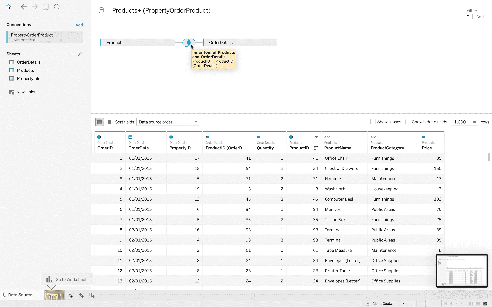
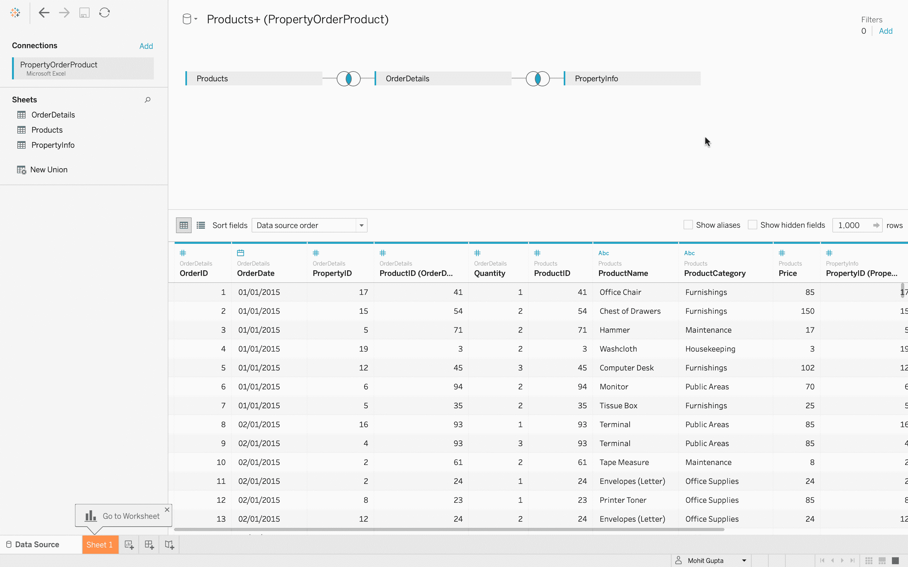
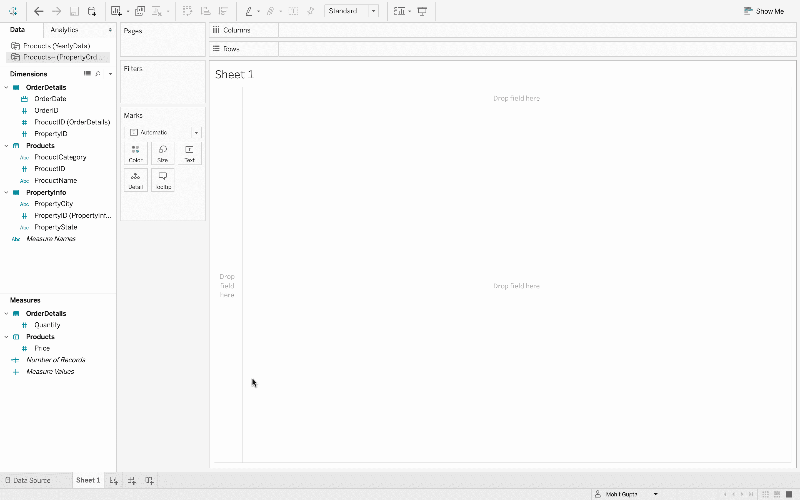
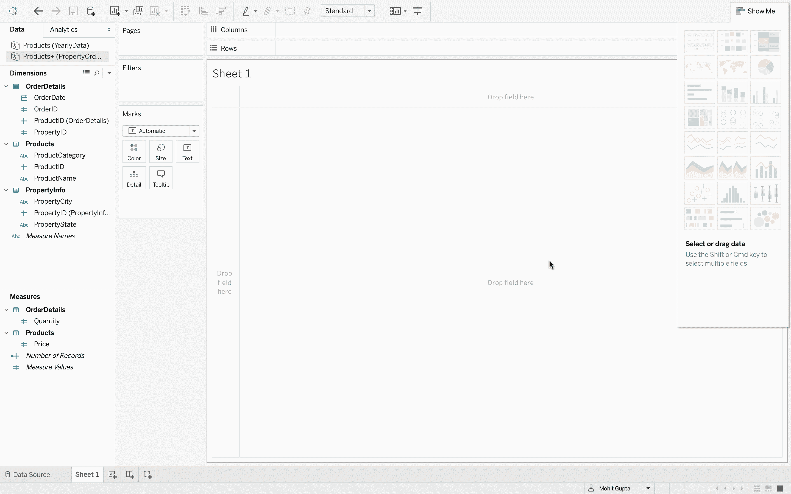
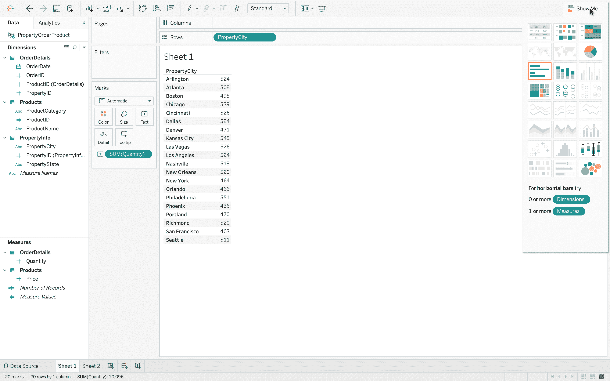
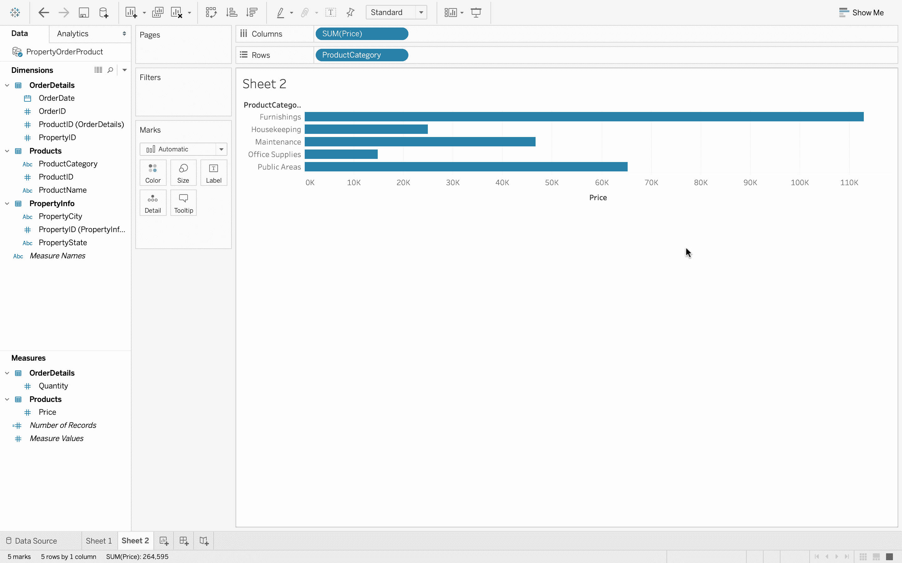
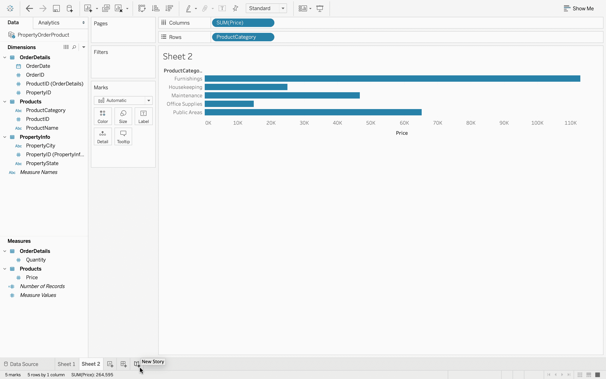
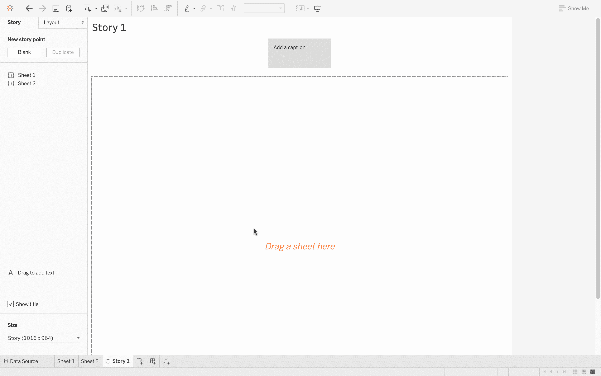
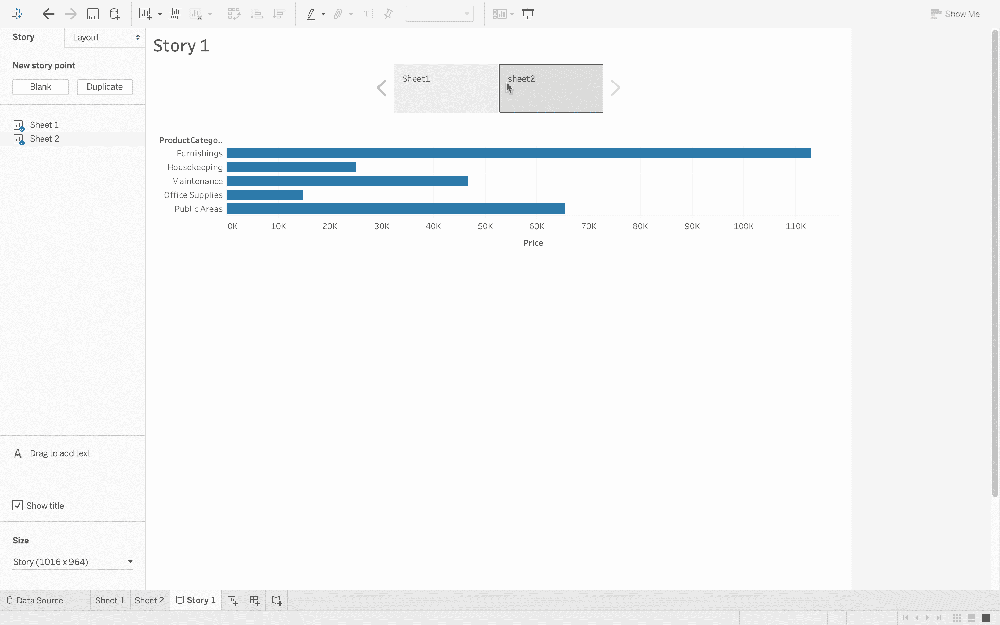
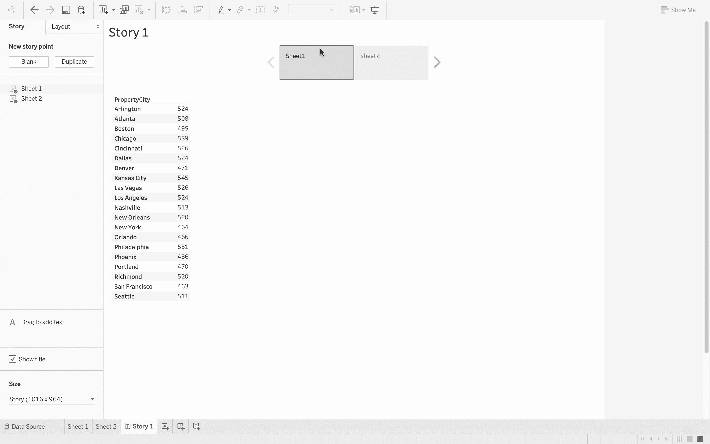

# 场景–构建故事情节

> 原文:[https://www . geesforgeks . org/tableau-building-up-a-story line/](https://www.geeksforgeeks.org/tableau-building-up-a-storyline/)

可视化是商业分析的一部分。但是有效地交流你的发现也是非常重要的。Tableau 10 包含故事，这些故事最初是在版本 8 的更新中引入的。使用故事，您可以在工作簿中创建一系列由工作表组成的故事点。你可以用它们来建立一个关于你的见解的有说服力的叙述。这篇文章将向你展示如何创造故事。

**执行步骤:**

*   在 Tableau 中，连接到数据库。
*   数据源有三个数据文件–*产品、订单明细、属性信息*。这是一个数据文件中存在的三个不同的 excel 表。
    T3】
*   打开*产品*数据文件。
    T3】
*   添加*订单明细*数据文件，它包含每个订单的信息。
    T3】
*   现在，您可以看到两个数据文件中有一个连接。
    
*   如果您将鼠标悬停在连接上，那么您可以看到有一个使用公共键的内部连接，即*产品标识*。内部连接只是意味着有两个文件有一个共同的字段，并且可以很容易地组合起来。
*   接下来，添加 *PropertyInfo* 文件，可以看到它也加入了。
    T3】
*   如果将鼠标指针悬停在上面，则可以清楚地看到 *OrderDetails* 和 *PropertyInfo* 使用键–*property id*进行内部连接。
    
*   现在，数据已经完全准备好进行数据可视化。
    
*   点击*数量*，然后在屏幕的右上角，工具栏的右边，有*给我看看*按钮。使用*演示*选项可以获得可视化效果。
    
*   我们将创建两个观想，如图所示
    
    
*   现在来编一个故事。点击故事按钮，如图所示。
    

*   那是仪表板，你可以看到我们准备的两张表。
    *   将工作表拖放到*“拖动工作表”*区域*   You can clearly see that how well the two sheets are connected in the story line and thus, now it is in a presenatble form.
    

    