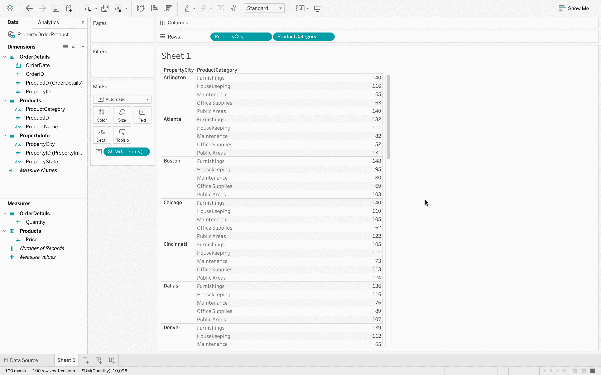

# 表格–改变可视化的顺序

> 原文:[https://www . geesforgeks . org/tableau-变更订单-in-visualization/](https://www.geeksforgeeks.org/tableau-change-the-order-in-visualisation/)

在 Tableau 中创建可视化后，在本文中，我们将学习如何通过操作字段的顺序来更改数据的组织。本文将展示如何在可视化中重新排序和组织字段。

**执行步骤:**

*   在 Tableau 中，连接到数据库。
*   数据源有三个数据文件–*产品、订单明细、属性信息*。这是一个数据文件中存在的三个不同的 excel 表。
    T3】
*   打开*产品*数据文件。
    T3】
*   添加*订单明细*数据文件，它包含每个订单的信息。
    T3】
*   现在，您可以看到两个数据文件中有一个连接。
    
*   如果您将鼠标悬停在连接上，那么您可以看到有一个使用公共键的内部连接，即*产品标识*。内部连接只是意味着有两个文件有一个共同的字段，并且可以很容易地组合起来。
*   接下来，添加 *PropertyInfo* 文件，可以看到它也加入了。
    T3】
*   如果将鼠标指针悬停在上面，则可以清楚地看到 *OrderDetails* 和 *PropertyInfo* 使用键–*property id*进行内部连接。
    
*   现在，数据已经完全准备好进行数据可视化。
    
*   点击*数量*，然后在屏幕的右上角，工具栏的右边，有*给我看看*按钮。使用*演示*选项可以获得可视化效果。
    
*   我会将一个产品类别拖到列区域，为此，我会转到数据区域并将*产品类别*拖到*列区域*，然后我会将*物业城市*拖到这里的行货架上，这是可用的，然后我会将我的数量数据放在表体中。所以我会下到*测量组*，把*数量*拖进去，在那里我有我所有的数据。
    
*   假设我不希望在“列”区域的顶部有类别，而是希望在“行”区域看到我的数据按城市，然后按类别细分。为此，我可以将*产品类别*药丸从“列”货架拖到“行”货架，并将其放在“属性城市”的右侧。继续向下拖动，你可以看到一个向下指向的橙色矩形出现，这表明*产品类别*的位置。所以当我松开鼠标左键时，我可以看到我有我的*房产城*，然后是*产品类别*和数量。所以，这又是一次不同的重组。
    