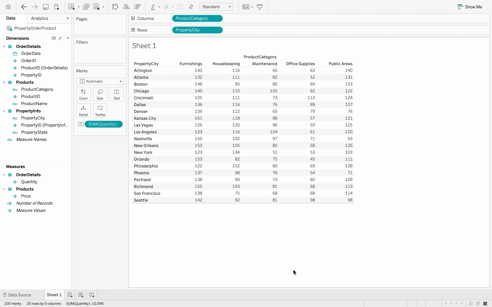
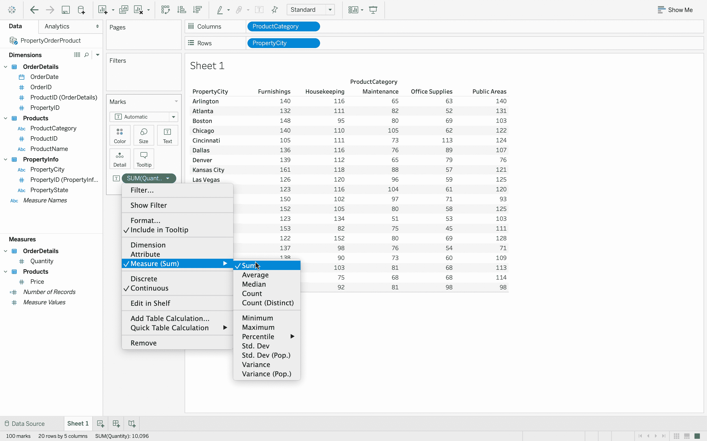

# 表格–更改摘要

> 原文:[https://www.geeksforgeeks.org/tableau-change-the-summary/](https://www.geeksforgeeks.org/tableau-change-the-summary/)

当您创建可视化时，您可能想要总结您的数据，就像用户可能需要数据的总和、订购的产品数量来进行分析一样。例如，平均订购项目数，计算订单的平均成本。本文旨在展示如何更改可视化的摘要操作。

**执行步骤:**

*   在 Tableau 中，连接到数据库。
*   数据源有三个数据文件–*产品、订单明细、属性信息*。这是一个数据文件中存在的三个不同的 excel 表。
    T3】
*   打开*产品*数据文件。
    T3】
*   添加*订单明细*数据文件，它包含每个订单的信息。
    T3】
*   现在，您可以看到两个数据文件中有一个连接。
    
*   如果您将鼠标悬停在连接上，那么您可以看到有一个使用公共键的内部连接，即*产品标识*。内部连接只是意味着有两个文件有一个共同的字段，并且可以很容易地组合起来。
*   接下来，添加 *PropertyInfo* 文件，可以看到它也加入了。
    T3】
*   如果将鼠标指针悬停在上面，则可以清楚地看到 *OrderDetails* 和 *PropertyInfo* 使用键–*property id*进行内部连接。
    
*   现在，数据已经完全准备好进行数据可视化。
    
*   点击*数量*，然后在屏幕的右上角，工具栏的右边，有*给我看看*按钮。使用*演示*选项可以获得可视化效果。
    
*   将一个*产品类别*拖动到列区域，为此转到数据区域，将*产品类别*拖动到*列区域*，然后将*属性城市*拖动到此处可用的行货架，然后将我的数量数据放入表体。所以，下到*测量组*，拖动*数量*进去，你就有了我所有的数据。
    
*   现在我们有一个非常简单的观想。这是一个文本表格，列区域为*产品类别*，行区域为*物业城市*，我们正在查找订购数量的总和。
*   如果你翻看一下标记卡，你可以看到你正在寻找为这些类别中的每一个订购的物品的*数量*的总和。如果您想要更改汇总操作，请将鼠标指针悬停在“总和数量”药丸上，单击出现的向下箭头，然后从菜单中指向“测量”，它当前指示总和。
*   点击那个。当你这样做的时候，你可以看到你有许多不同的总结公式可供我使用。这就是总和，简单地把这些值加在一起，平均值就是平均值，中值就是中间值。
    
*   所以点击平均值，你可以看到每个订单的平均项目数。而且看起来大多数订单平均有两到三个项目。如果想回到 sum，既可以再次从量丸中选择 sum，也可以按控制 Z
    