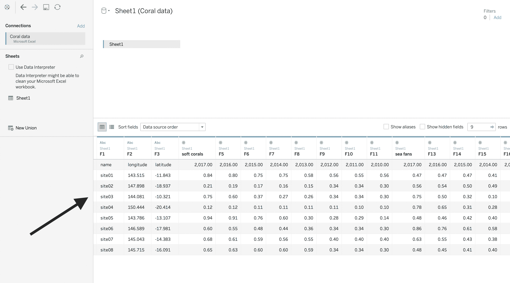
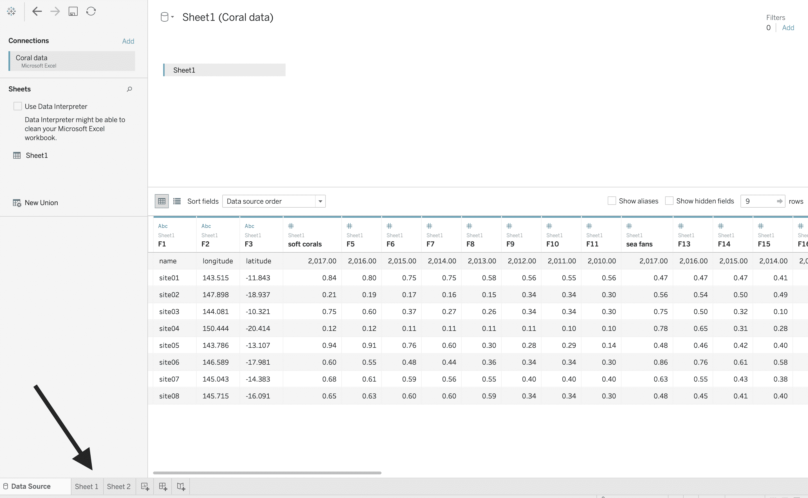
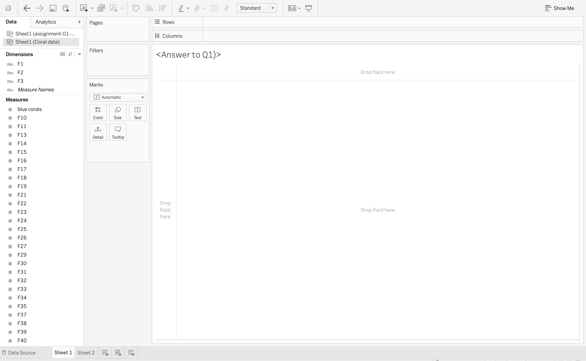

# Tableau–连接到数据源

> 原文:[https://www . geesforgeks . org/tableau-connect-to-a-data-source/](https://www.geeksforgeeks.org/tableau-connect-to-a-data-source/)

Tableau 中的可视化从连接到外部数据源开始。本文解释了如何将 Tableau 连接到任何外部数据源。

**后续步骤–**

*   运行 Tableau。在开始屏幕的左侧，有一个*连接面板*。
*   转到*文件*部分，选择您想要的数据文件类型。让我们选择任何 excel 文件。
    T3】
*   点击*微软 Excel* 选项，会出现一个对话框供用户选择所需的数据文件。如下图所示，我选择了一个数据-' Coral data . xlsx '
    
*   现在，Tableau 将创建到数据文件的连接，如您所见，我们的数据在底部。
    
*   如果您正在连接到一个微软文件，那么它是直接的，但是如果您正在连接到一个微软 SQL 服务器，那么它可能需要一些凭据，如用户名、密码和密码
*   连接到数据文件后，用户可以转到工作表。
    
*   最后，你可以在争论完你的数据之后，进行数据可视化的工作。
    