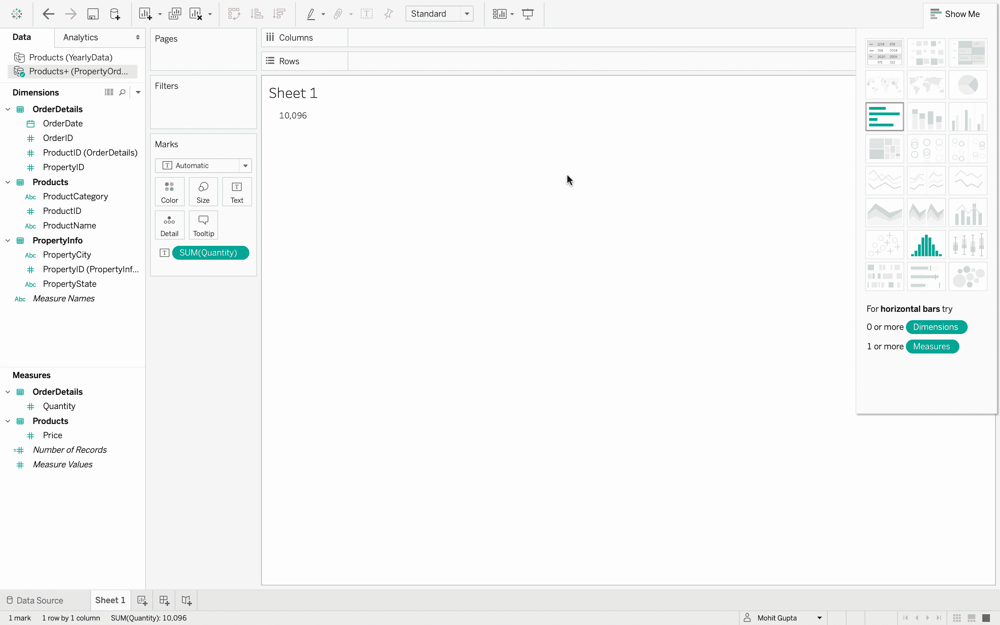
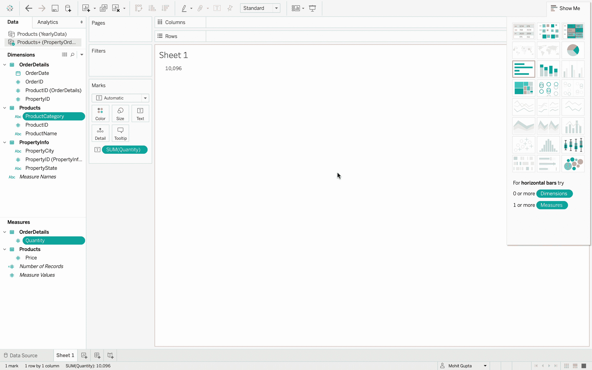
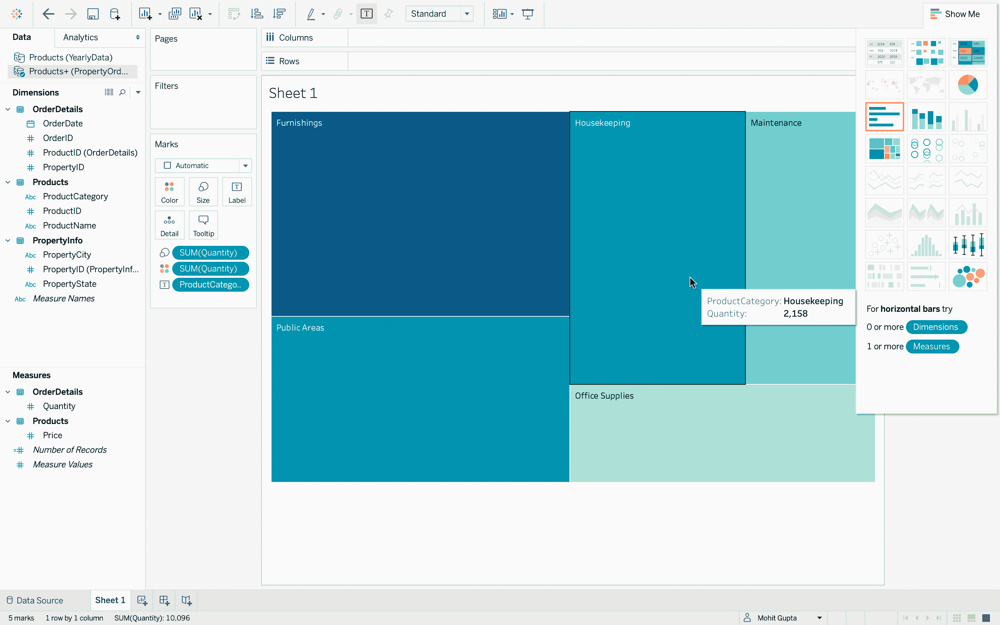
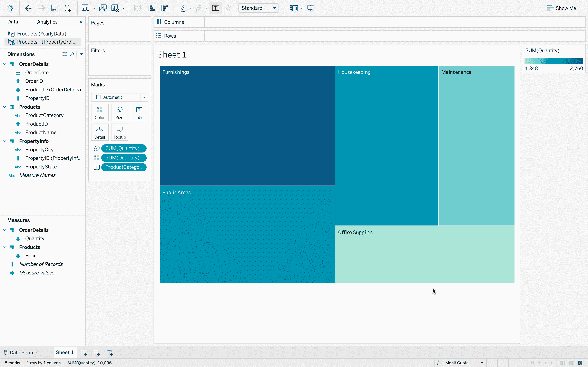

# 表格–创建可视化

> 原文:[https://www.geeksforgeeks.org/tableau-create-visualization/](https://www.geeksforgeeks.org/tableau-create-visualization/)

现在，在格式化或清理数据(如果需要)之后，数据集已经完全准备好可视化，这是使用 Tableau 的主要目的。本文旨在了解如何在 Tableau 中创造一种严肃的观想。

**执行步骤:**

*   在 Tableau 中，连接到数据库。
*   数据源有三个数据文件–*产品、订单明细、属性信息*。这是一个数据文件中存在的三个不同的 excel 表。
    T3】
*   打开*产品*数据文件。
    T3】
*   添加*订单明细*数据文件，它包含每个订单的信息。
    T3】
*   现在，您可以看到两个数据文件中有一个连接。
    
*   如果您将鼠标悬停在连接上，那么您可以看到有一个使用公共键的内部连接，即*产品标识*。内部连接只是意味着有两个文件有一个共同的字段，并且可以很容易地组合起来。
*   接下来，添加 *PropertyInfo* 文件，可以看到它也加入了。
    T3】
*   如果将鼠标指针悬停在上面，则可以清楚地看到 *OrderDetails* 和 *PropertyInfo* 使用键–*property id*进行内部连接。
    
*   现在，数据已经完全准备好进行数据可视化。
    
*   点击*数量*，然后在屏幕的右上角，工具栏的右边，有*给我看*按钮。使用*演示*选项可以获得可视化效果。
    
*   让我们单击一个文本表格选项。
    
*   因为数据有一个衡量标准，基本上是总和，没有子类别，所以所有订购项目的总数量为 10，096 是可见的。所以这不是一个非常有趣的想象。让我们用更多的能量场来创造新的观想。
    
*   选择多个不相邻的字段。我再点击*数量*和*产品类别*。Tableau 将显示更多可创建的可视化效果。
*   它有*产品类别*和*数量*，所以转到“展示给我看”选项卡，单击“树形图”，该图使用颜色和大小来指示最大的数量值。所以很明显*家具*的订购数量最多。然后*公共区域*和*家政*看起来很接近，*维修*第四，办公用品第五。
    
*   *保养*看起来和办公用品差不多大，但是如果再次使用*展示标签*，那么它就隐藏起来了，可以看到*保养*比办公用品稍微大一点。这些是使用“演示”选项卡上的工具快速创建可视化的基础。
    