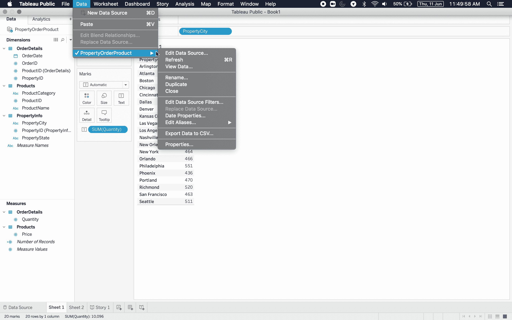
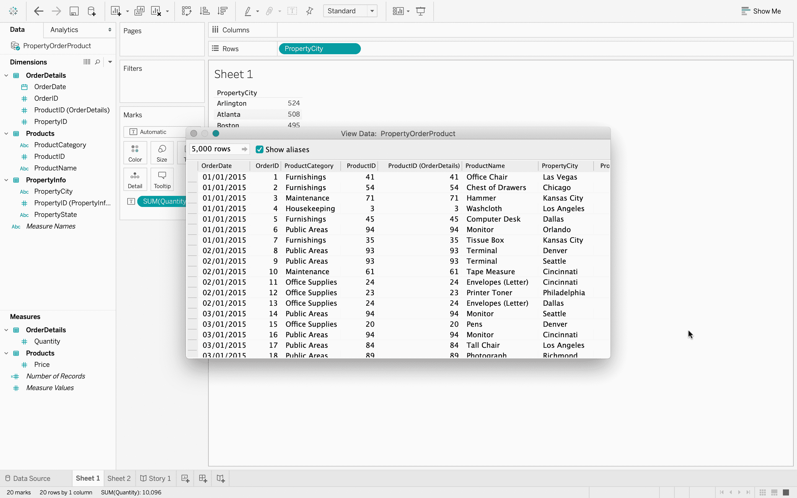
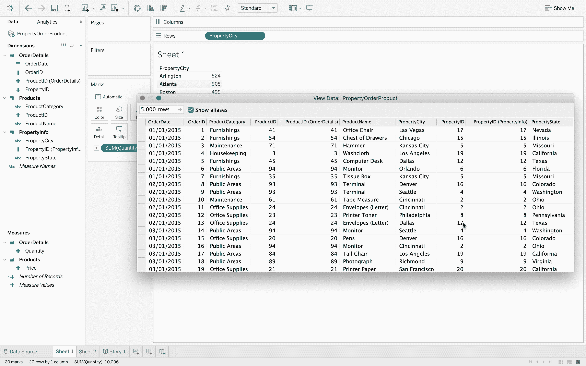
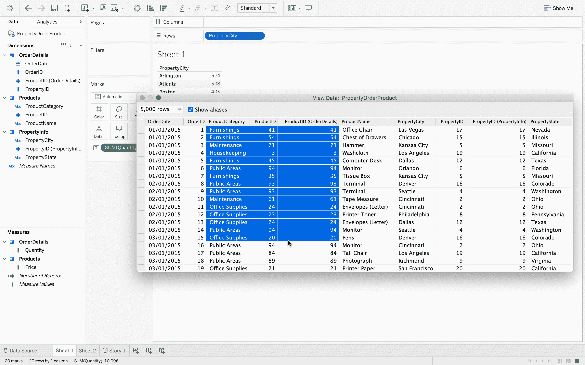

# 表格–在工作表

中显示数据

> 原文:[https://www . geesforgeks . org/tableau-displaying-工作表中的数据/](https://www.geeksforgeeks.org/tableau-displaying-data-in-worksheet/)

在创建可视化之后，或者在创建可视化时，如果您想查看工作表中的数据，那么，在这种情况下，您需要遵循我们将在本文中看到的一些步骤。

**执行步骤:**

*   在 Tableau 中，连接到数据库。
*   数据源有三个数据文件–*产品、订单明细、属性信息*。这是一个数据文件中存在的三个不同的 excel 表。
    T3】
*   打开*产品*数据文件。
    T3】
*   添加*订单明细*数据文件，它包含每个订单的信息。
    T3】
*   现在，您可以看到两个数据文件中有一个连接。
    
*   如果您将鼠标悬停在连接上，那么您可以看到有一个使用公共键的内部连接，即*产品标识*。内部连接只是意味着有两个文件有一个共同的字段，并且可以很容易地组合起来。
*   接下来，添加 *PropertyInfo* 文件，可以看到它也加入了。
    T3】
*   如果将鼠标指针悬停在上面，则可以清楚地看到 *OrderDetails* 和 *PropertyInfo* 使用键–*property id*进行内部连接。
    
*   现在，数据已经完全准备好进行数据可视化。
    
*   点击*数量*，然后在屏幕的右上角，工具栏的右边，有*给我看看*按钮。使用*演示*选项可以获得可视化效果。
    
*   现在，转到数据菜单。向下到菜单底部，单击最后一项。此处显示的具体项目将取决于数据源的名称。
    
*   然后在出现的子菜单中，单击“查看数据”。这样做将显示数据。您可以看到多达 5000 行，或者如果您想看到更多，您可以编辑框中的值。此外，因为有更多的列，您可以通过将窗口拖到一边来扩展它，或者拖动水平滑块。
    
*   该数据源组合了来自几个不同表的数据。这里有我的订单日期和订单标识，如果我仔细查看，我会看到属性标识、属性状态等等。即使在源 excel 文件的不同表中有这些数据点或值。
*   要复制任何数据，请在数据上拖动，一旦选定数据，您就可以单击复制并选择这些值。完成后，您可以单击关闭框关闭该窗口。查看可视化背后的数据会非常有帮助。