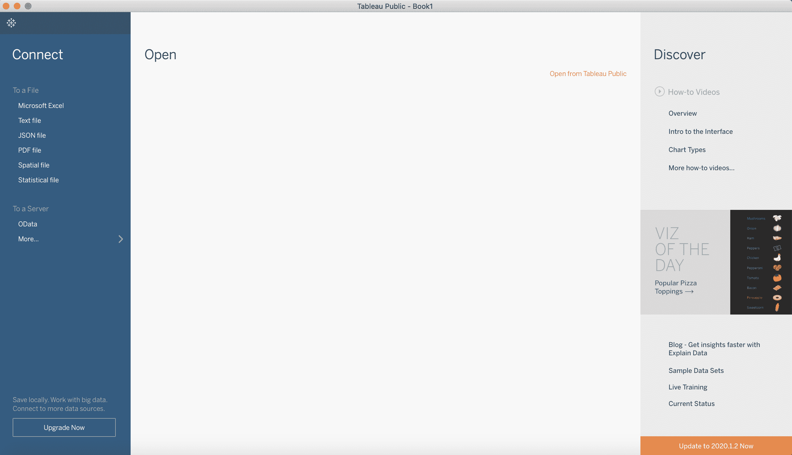
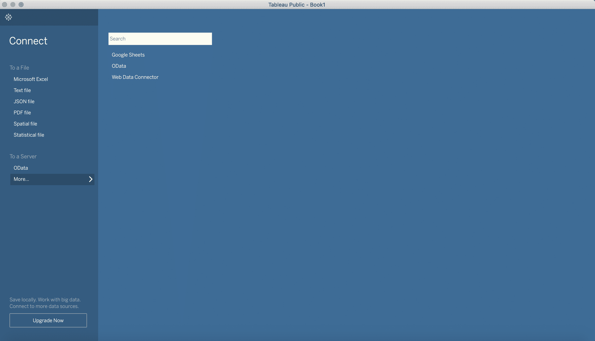
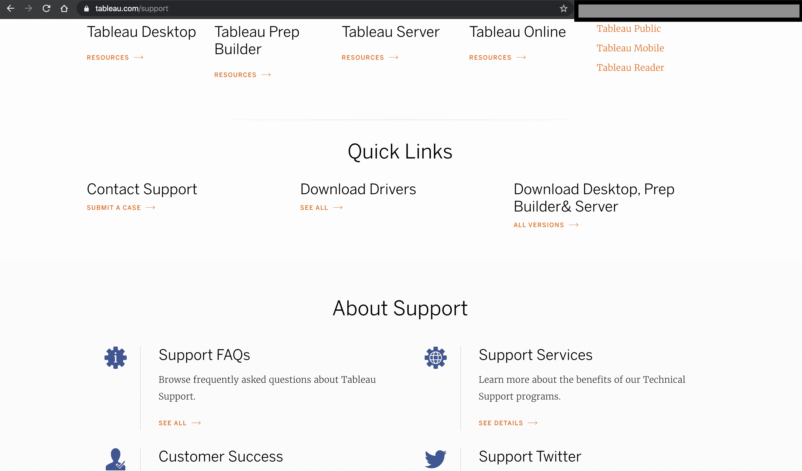
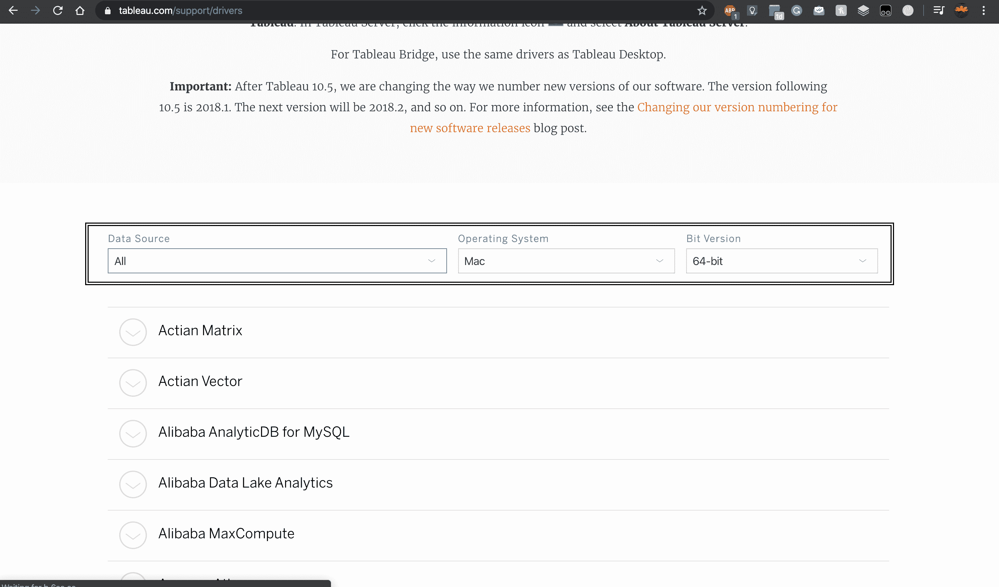

# Tableau 驱动程序–下载并连接

> 原文:[https://www . geesforgeks . org/tableau-drivers-download-and-connect/](https://www.geeksforgeeks.org/tableau-drivers-download-and-connect/)

在使用 Tableau 时，用户可以拥有的一种合适的方式是选择并轻松连接许多不同类型的数据源。如果用户正在使用 Tableau 桌面版，那么它提供了到不同类型数据源的内置连接。

在**连接**部分的左侧可以清楚地看到许多不同的选项。
在这里，用户可以应用许多不同的内置连接选项–

*   Excel 电子表格
*   任何文本文件
*   对象符号文件
*   PDF 文件
*   空间文件
*   统计文件
*   SPSS 或其他程序

用户也可以通过连接驱动程序连接到任何其他数据源。要连接任何驱动程序，用户需要前往 Tableau 网站的**支持页面**，可以前往**下载驱动程序**

在驱动程序下载页面，用户可以通过亚马逊、谷歌分析等数据源进行过滤。您可以根据要求和. bit 版本选择数据。如果用户想下载一个特定的驱动程序集，按照那里给出的说明如何下载数据，你就完成了。

