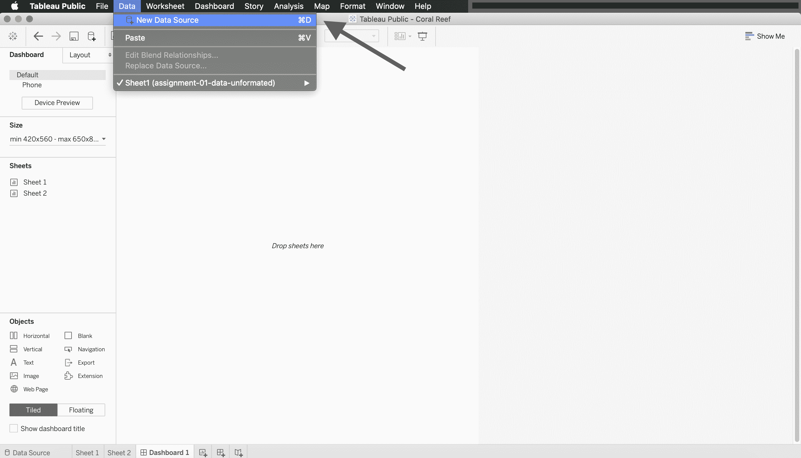
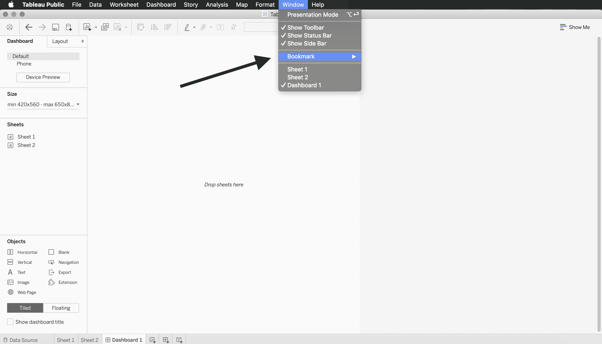

# 表–文件系统

> 原文:[https://www.geeksforgeeks.org/tableau-file-system/](https://www.geeksforgeeks.org/tableau-file-system/)

虽然使用 Tableau 非常容易，但场景背后有很多东西。有许多不同的文件类型支持 Tableau 的流畅工作。这种文件结构使得执行可视化任务变得简单可靠。Tableau 文件的类型如下所示

## 工作簿表格(.twb:

这类文件在没有源数据的情况下存储可视化。这意味着用户可以使用不同的图表将数据可视化，并将其存储在工作簿中，但不能将数据与可视化一起存储。
打开工作簿–转到*文件>打开>选择工作簿*。工作簿也可以显示在您的仪表板上，如下图所示。

## Tableau 数据源(。tds):

它的工作原理与 Tableau 工作簿相反，它存储数据，但只有一个链接，没有附加可视化。它存储密码、服务器地址和访问数据源所需的任何其他信息。

## 书签表(.tbm:

这是一种非常有用的文件类型。它将工作簿的连接存储在另一个 Tableau 工作簿中。因此，如果用户已经在一个工作簿中创建了可视化，那么就没有必要在另一个工作簿中重新创建它。

## 资料萃取表(.TDE(TDE):

它将 Tableau 数据存储为经过过滤和聚合的摘录。因此，即使源数据文件有数千行数据，您也可以存储它的摘要版本。

## 套装程式工作簿表格(.twbx):

它存储提取的数据和可视化，以便在 Tableau 或 Tableau Reader 中查看。