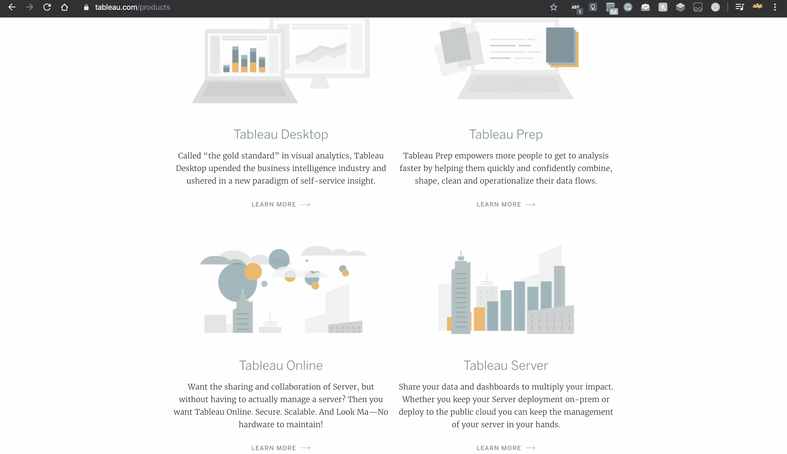
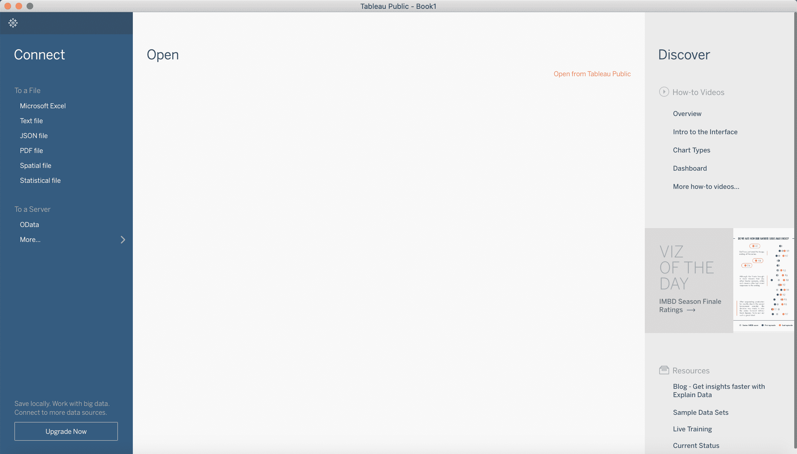

# 表格安装指南

> 哎哎哎:# t0]https://www . geeksforgeeks . org/table-installation-guide/

Tableau 是一个免费软件，它允许用户轻松地创建令人惊叹的交互式可视化，而且不需要任何编程。使用这个工具，人们可以将原始数据简化成更容易理解的形式。Tableau 简单而强大，是商业行业非常流行的数据可视化工具。
人们可以连接到世界各地的作者，并可以在全球平台上共享他们的仪表板和电子表格。从 Tableau 获得的可视化可以很容易地嵌入到网站、社交网络或博客中。

在 Tableau 上工作之前的知识–

*   计算机基础知识:如何运行给定的程序并与任何计算机应用程序交互。
*   电子表格程序经验
*   开放体验和学习

所以，这就是学习 Tableau 有多容易。

**安装–**

*   转到链接–[https://www.tableau.com](https://www.tableau.com)
    

    https://www.tableau.com/

*   转到**产品**，有四个选项:
    

*   **Tableau 桌面:**是个人使用的桌面软件。*   **Tableau Prep :** 它有两个产品——Tableau Prep Builder 和 Tableau Prep Conductor，用于构建数据流并调度、监控和管理整个组织的工作流。
    T3】*   **Tableau Server :** 更像是一个企业应用。
    T3】*   **Tableau Online :** 它是一个公共软件，因此上传到它的任何内容都可以被使用该软件的其他人使用。这意味着你的工作不再是私人的和机密的。
    T3】*   选择 **Tableau 桌面** > **免费试用**。
    *   根据您的系统要求选择软件版本。下载你的免费试用软件。*   If you want to avoid trial then download **Tableau Public**

    现在，Tableau 已安装到您的系统中。
    