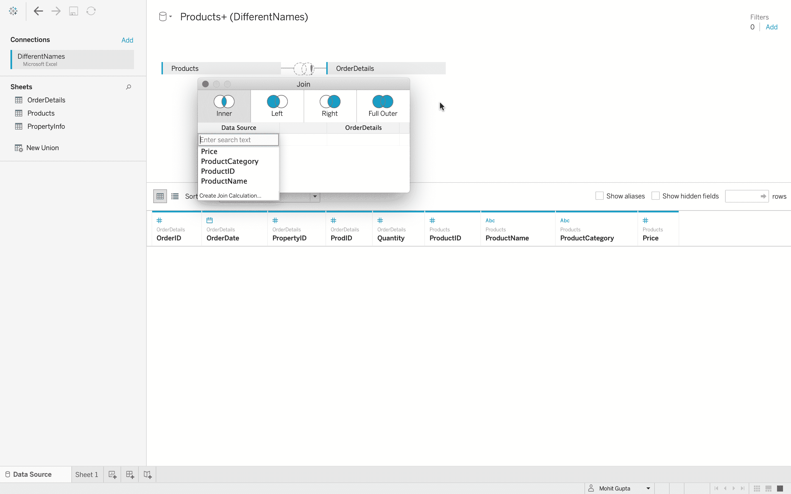

# Tableau–连接标签不一致的数据文件

> 原文:[https://www . geesforgeks . org/tableau-joing-data-files-with-consistent-labels/](https://www.geeksforgeeks.org/tableau-joining-data-files-with-inconsistent-labels/)

设计好的数据有一个基本原则，就是将数据分散开来，这样每个数据表都存储了关于特定业务实体的信息。
假设模型有一套餐厅，分别位于不同的城市。这些餐厅中的每一个都可以有餐厅 ID、餐厅城市和餐厅州。另一张桌子上有整个连锁餐厅的员工名单，并有一个字段指示他们在哪个餐厅工作。因此，可以基于餐厅标识的公共数据属性或字段来链接这两个表(在本例中)。

但有时可能会出现这样的情况，即共有的字段具有不一致的命名，然后数据源不会自动连接。本文旨在说明如何应对这种情况。

**执行步骤:**

*   在 Tableau 中，连接到数据库。
*   数据源有三个数据文件–*产品、订单明细、属性信息*。这是一个数据文件中存在的三个不同的 excel 表。
    T3】
*   打开*产品*数据文件。
    T3】
*   添加*订单明细*数据文件，它包含每个订单的信息。
*   但是现在可以清楚地看到，Tableau 表示在字段名中找不到匹配。
*   实际上，在两个数据源中有一个数据字段具有完全相同的数据。这意味着我们可以为两个数据源创建一个内部连接。
*   点击*产品标识*，然后将鼠标指针悬停在*订单详情*上方。
    
*   点击向下箭头，从这里点击*产品标识*，这只是*产品标识*T4 的简称
*   关闭对话框，现在您可以注意到数据被完美地连接起来了。
    
*   同样，你可以加入你想要的任意多个数据源，现在数据已经完全准备好可视化了。