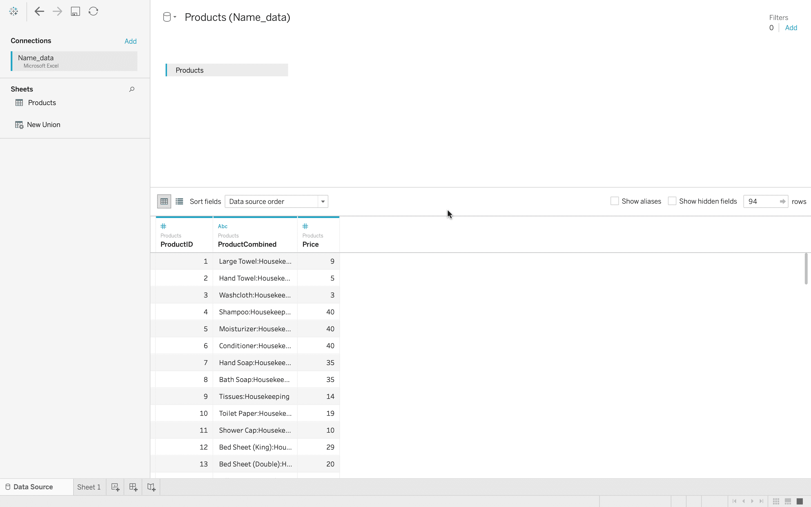
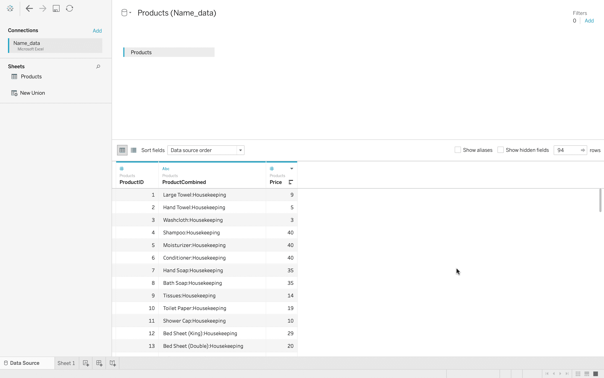
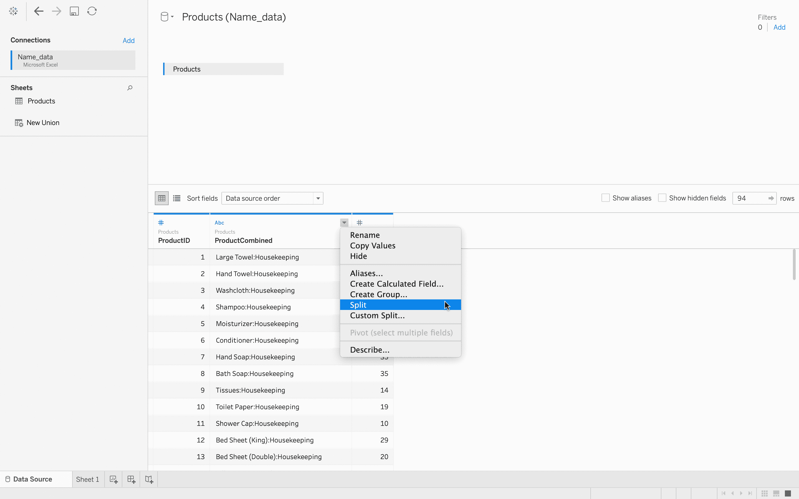
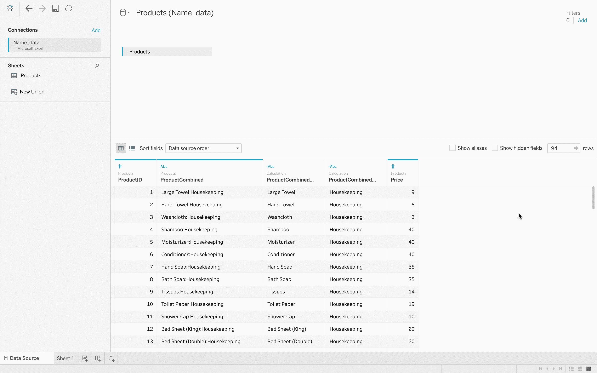
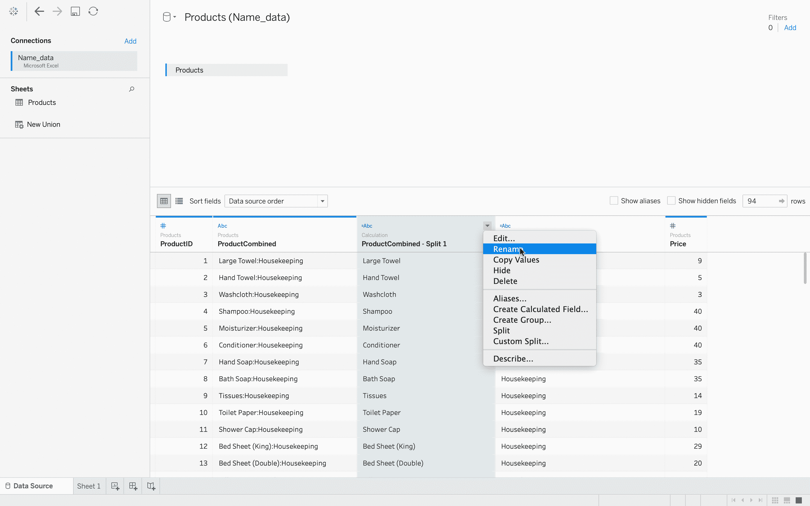
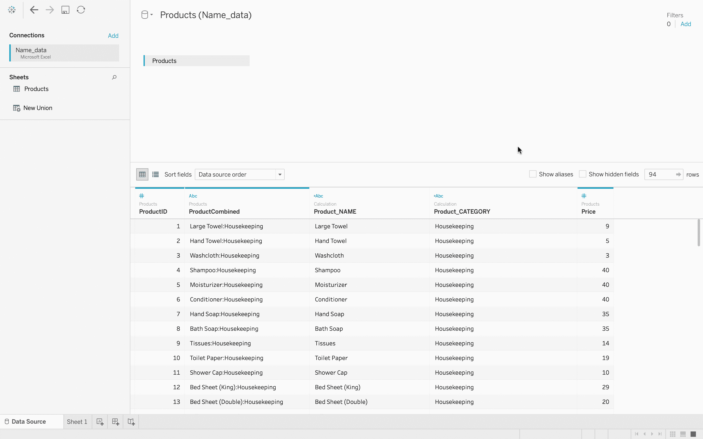

# 表格–将文本拆分为列

> 原文:[https://www . geesforgeks . org/tableau-拆分文本到列/](https://www.geeksforgeeks.org/tableau-split-the-text-to-columns/)

当您处理定义良好的结构化数据时，它会将信息划分为离散的单元。例如，如果您的数据中有一个员工姓名，如果可能的话，您应该将其拆分为名字、中间名和姓氏列。如果需要处理将多个值组合成一列的数据，可以尝试将文本拆分成多列，以便更容易处理。本文旨在展示如何将文本拆分为多列。

**执行步骤:**

*   在 Tableau 中，连接到数据库。
*   Let’s connect to a data as I have shown in the image given below. That’s a Product data named as *Name_data*

    

*   增加“产品组合”列的大小，您可以看到有两个不同的值。首先是某个产品的*名称，比如一个*大毛巾*然后是一个冒号(:)，然后是家政。*家政*其实就是产品所属的品类。所以我们有毛巾做家务，大毛巾和手巾等等。现在我们要把这个*产品组合栏*拆分成两栏。
    *
*   将鼠标指针悬停在*产品组合标题*上，单击右上角的向下箭头，您会看到一个*分割*选项。
*   当您点击拆分选项时，Tableau 会根据您中间的冒号拆分数据，因此它会将其识别为分隔符，现在您有了*产品组合*然后是*产品组合拆分 1* 和*产品组合拆分 2* 。
*   您也可以重命名这些列。
    
*   所以，最后你的数据准备好了，你可以很容易地得到这些数据的可视化。