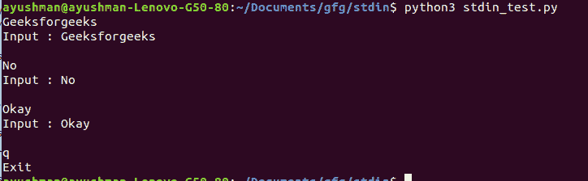
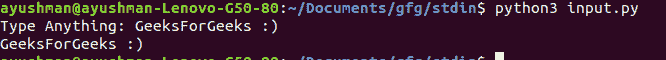
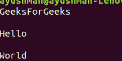
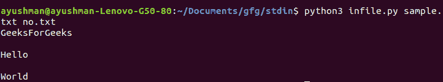

# 从 Python 中的 stdin 获取输入

> 原文:[https://www . geesforgeks . org/take-input-from-stdin-in-python/](https://www.geeksforgeeks.org/take-input-from-stdin-in-python/)

python 中的 **sys** 模块帮助我们访问解释器维护的变量。它还提供了与解释器交互的功能。为了在 Python 中使用**系统**，我们首先导入系统

```py
import sys
```

我们可以通过多种方式从 Python 中的 stdin 获取输入。

*   sys.stdin
*   输入()
*   fileinput.input()

*   **使用 sys.stdin:** **sys.stdin** 可以直接从命令行获取输入。它用于标准输入。它在内部调用 input()方法。它还会在每个句子后面自动添加“\n”。
    **例:**

## 蟒蛇 3

```py
import sys

for line in sys.stdin:
    if 'q' == line.rstrip():
        break
    print(f'Input : {line}')

print("Exit")
```

**输出**T2】



*   **使用 input():** **input()** 可用于在执行程序时以及在执行过程中从用户处获取输入。
    **例:**

## 蟒蛇 3

```py
# this accepts the user's input
# and stores in inp
inp = input("Type anything")

# prints inp
print(inp)
```

**输出:**



*   **使用 fileinput.input():** 如果我们想一次读取多个文件，我们使用 **fileinput.input()** 。有两种方法可以使用 fileinput.input()。要使用这个方法，首先我们需要导入 fileinput。
    **第一种方法:**
    这里，我们在“files”参数中将文件名作为元组传递。然后我们遍历每个文件来读取它。

## 蟒蛇 3

```py
import fileinput

with fileinput.input(files = ('sample.txt', 'no.txt')) as f:
    for line in f:
        print(line)
```

**输出:**



*   **第二个方法:**
    这里，我们在命令行中传递文件名一个 sys 参数。

## 蟒蛇 3

```py
import fileinput

for f in fileinput.input():
    print(f)
```

**输出:**

