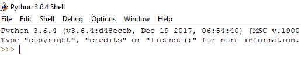
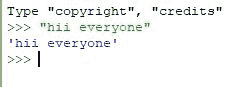

# 用 Python 从控制台获取输入

> 原文:[https://www . geesforgeks . org/从 python 控制台获取输入/](https://www.geeksforgeeks.org/taking-input-from-console-in-python/)

**什么是 Python 中的 Console？** Console(也称为 Shell)基本上是一个命令行解释器，它从用户那里获取输入，即一次一个命令，并对其进行解释。如果它没有错误，那么它运行命令并给出所需的输出，否则显示错误消息。Python 控制台如下所示。



在这里，我们编写命令，要执行该命令，只需按回车键，您的命令将被解释。
要使用 Python 进行编码，您必须了解 Python 中使用的控制台的基础知识。

python 控制台的主要提示是三个大于符号

```
>>>

```

只有在执行完第一个命令后，出现这些提示时，您才可以在 shell 中自由地编写下一个命令。Python 控制台接受您在提示符后用 Python 编写的命令。


**接受来自控制台的输入**
用户在控制台中输入值，然后该值按要求在程序中使用。
为了获取用户的输入，我们使用了一个内置功能*输入()*。

```
# input
input1 = input()

# output
print(input1)
```

我们还可以通过在类型内部指定 input()函数，将该输入类型转换为整数、浮点或字符串。

1.  **将输入类型转换为整数:**在某些情况下，您可能需要从用户/控制台输入整数，下面的代码从控制台获取两个输入(整数/浮点)，并将它们类型转换为整数，然后打印总和。

    ```
    # input
    num1 = int(input())
    num2 = int(input())

    # printing the sum in integer
    print(num1 + num2)
    ```

2.  **将输入类型转换为浮点:**要将输入转换为浮点，以下代码将起作用。

    ```
    # input
    num1 = float(input())
    num2 = float(input())

    # printing the sum in float
    print(num1 + num2)
    ```

3.  **将输入类型转换为字符串:**所有类型的输入都可以转换为字符串类型，无论它们是浮点还是整数。我们使用关键字串进行类型转换。

    ```
    # input
    string = str(input())

    # output
    print(string)
    ```