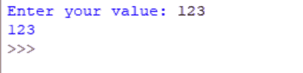
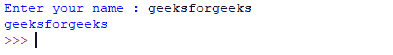

# 用 Python 输入

> 原文:[https://www.geeksforgeeks.org/taking-input-in-python/](https://www.geeksforgeeks.org/taking-input-in-python/)

开发人员经常需要与用户进行交互，要么获取数据，要么提供某种结果。如今，大多数程序使用对话框来要求用户提供某种类型的输入。而 Python 为我们提供了两个从键盘读取输入的内置功能。

***   Enter (prompt)*   原始输入(提示)**

**input ( ) :** 该函数首先从用户处获取输入，然后对表达式求值，这意味着 Python 会自动识别用户输入的是字符串还是数字或列表。如果提供的输入不正确，那么 python 会引发语法错误或异常。例如–

```
# Python program showing 
# a use of input()

val = input("Enter your value: ")
print(val)
```

**输出:**


**输入函数在 Python 中如何工作:**

*   当`input()`功能执行时，程序流程将停止，直到用户给出输入。
*   输出屏幕上要求用户输入输入值的文本或消息显示是可选的，即屏幕上打印的提示是可选的。
*   无论您输入什么作为输入，输入函数都会将其转换为字符串。如果输入整数值仍然 `input()`函数将其转换为字符串。您需要在代码中使用[类型转换](https://www.geeksforgeeks.org/taking-input-from-console-in-python/)将其显式转换为整数。

**代码:**

```
# Program to check input 
# type in Python

num = input ("Enter number :")
print(num)
name1 = input("Enter name : ")
print(name1)

# Printing type of input value
print ("type of number", type(num))
print ("type of name", type(name1))
```

**输出:**


**raw_input ( ) :** 这个函数在旧版本(比如 Python 2.x)中工作。这个函数将从键盘上输入的内容转换成字符串，然后返回到我们想要存储的变量中。例如–

```
# Python program showing 
# a use of raw_input()

g = raw_input("Enter your name : ")
print g
```

**输出:**


这里， ***g*** 是一个获取字符串值的变量，由用户在程序执行过程中键入。通过回车键终止`raw_input()`功能的数据输入。我们也可以使用`raw_input()`输入数字数据。在这种情况下，我们使用类型转换。关于类型铸造的更多细节，请参考[和](https://www.geeksforgeeks.org/taking-input-from-console-in-python/)。

更多信息请参考文章[以列表作为用户](https://www.geeksforgeeks.org/python-get-a-list-as-input-from-user/)的输入。