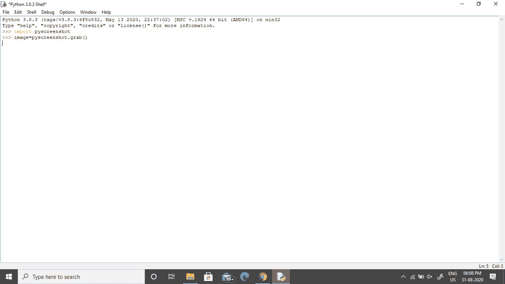
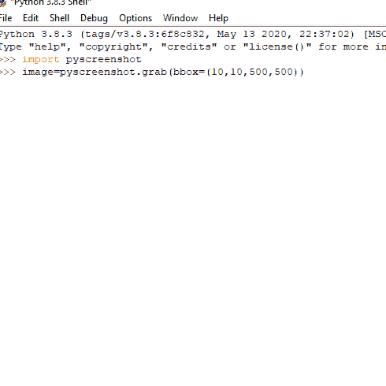

# 使用 Python 中的 pyscreenshot 截图

> 原文:[https://www . geesforgeks . org/截图-使用-py screen-in-python/](https://www.geeksforgeeks.org/taking-screenshots-using-pyscreenshot-in-python/)

Python 提供了多个库来简化我们的工作。这里我们将学习如何使用 Python 截图。Python 为这个任务提供了一个名为**py screen**的模块。它只是一个纯 Python 包装器，是现有后端上的一个薄层。性能和交互性对于这个库并不重要。

### **安装**

在命令提示符下使用下面的命令安装软件包 pyscreenshot。

```py
pip install pyscreenshot
```

### **捕捉全屏**

这里我们将学习使用 pyscreenshot 模块截图的最简单方法。这里我们将使用功能 **show()** 查看截图。

## 蟒蛇 3

```py
# Program to take screenshot

import pyscreenshot

# To capture the screen
image = pyscreenshot.grab()

# To display the captured screenshot
image.show()

# To save the screenshot
image.save("GeeksforGeeks.png")
```

**输出:**



**全萤幕撷取画面**

### **捕捉部分屏幕**

下面是捕捉屏幕部分的简单 Python 程序。这里我们需要提供**抓取()**功能中的像素位置。我们需要以元组的形式传递坐标。

## 蟒蛇 3

```py
# Program for partial screenshot

import pyscreenshot

# im=pyscreenshot.grab(bbox=(x1,x2,y1,y2))
image = pyscreenshot.grab(bbox=(10, 10, 500, 500))

# To view the screenshot
image.show()

# To save the screenshot
image.save("GeeksforGeeks.png")
```

**输出:**



**部分截图**

**要点:**

*   我们需要先安装枕头(PIL)包，然后再安装 py 截图包。
*   在这里，show()函数用作打印，即它显示捕获的屏幕截图。
*   我们需要以元组的形式传递坐标。
*   我们可以将截图保存到文件或 PIL 图像存储器中。