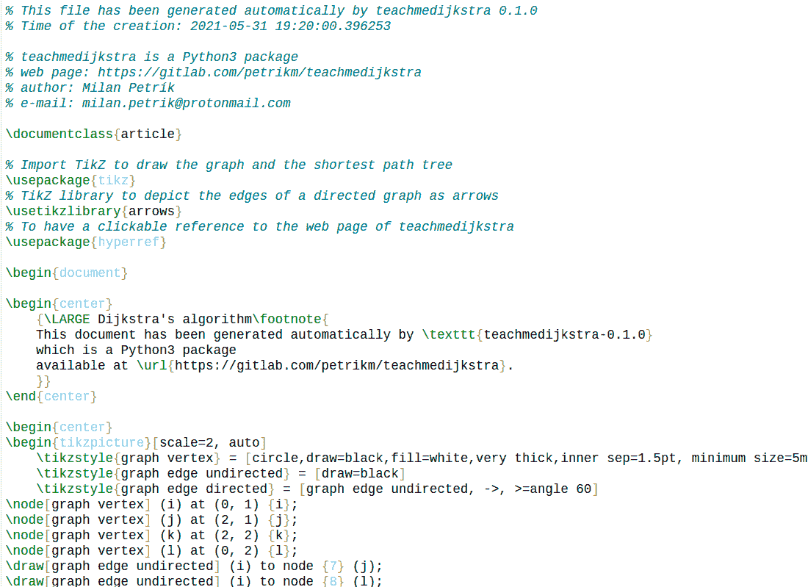
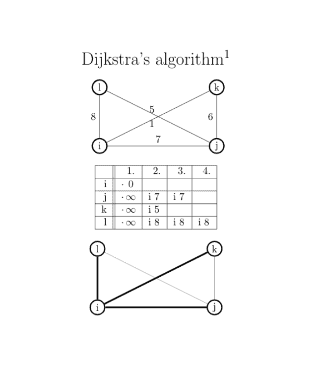
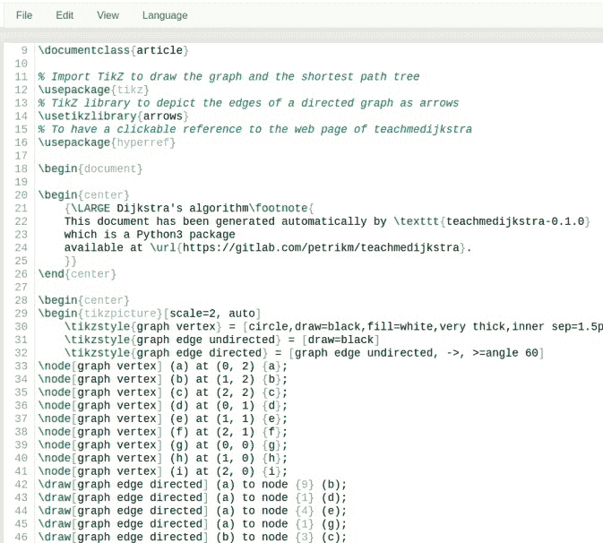
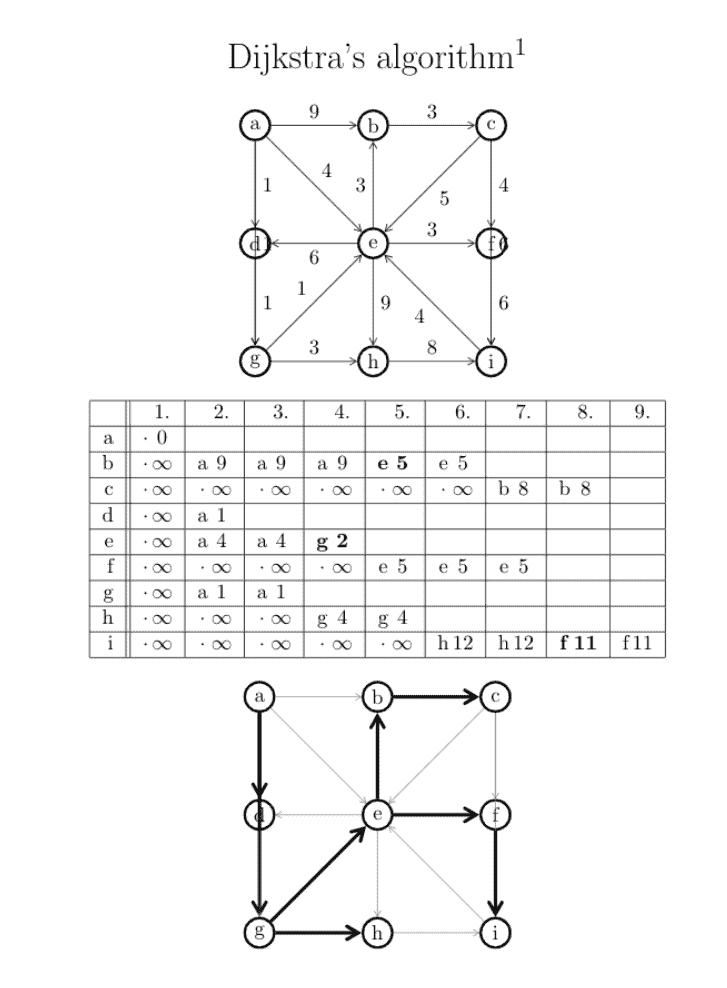

# Python 中的 teachmedijkstra 库

> 原文:[https://www . geesforgeks . org/teachmedijkstra-python 库/](https://www.geeksforgeeks.org/teachmedijkstra-library-in-python/)

Dijkstra 的算法与 [Prim 的最小生成树](https://www.geeksforgeeks.org/prims-minimum-spanning-tree-mst-greedy-algo-5/)算法非常相似。像 Prim 的 MST 一样，我们生成一个给定源作为根的 SPT(最短路径树)。我们维护两个集合，一个集合包含包含在最短路径树中的顶点，另一个集合包含尚未包含在最短路径树中的顶点。在算法的每一步，我们都会找到一个在另一个集合(尚未包括的集合)中的顶点，并且该顶点与源的距离最小。

**teachmedijkstra:** 实用程序库帮助渲染解释了 [Dijkstra 的用于教学目的的 latex 格式的 alogirithm](https://www.geeksforgeeks.org/dijkstras-shortest-path-algorithm-greedy-algo-7/) 。矩阵的行表示图的顶点，列表示解释的每个单位时间步长，得到最短距离算法构造的最短路径树。

### 装置

这个模块没有内置 Python。要安装它，请在终端中键入以下命令。

```
pip install teachmedijkstra
```

安装库后，要继续的步骤是:

*   初始化无向图/有向图
*   图的顶点和边的添加
*   使用 Dijaskstra()，输入创建的有起点的图形。
*   run()，运行算法。
*   最后，生成的乳胶文件可以用需要的名字保存。

### **使用的功能:**

*   **teachemedijkstra。无向图()**:用无向图初始化图形。
*   **graph.addVertex(名称，坐标)**:添加顶点的名称以及它应该属于的图形坐标。
*   **graph.addEdge(strt，end，weight) :** 从一个节点向另一个具有特定权重的节点添加边。
*   **teachemedijkstra。Dijkstra(graph_obj，strt_point)** :用带起点的 graph 实例初始化变量。
*   **dijkstra.run()** :运行 dijkstra 算法。
*   **Dijkstra . savetolatex file**(file_name):以 latex 格式保存 file _ name 中构造的图形。

**例 1:**

## 蟒蛇 3

```
import teachmedijkstra

# getting graph
graph = teachmedijkstra.UndirectedGraph()

# initializing vertices
graph.addVertex("i", (0, 1))
graph.addVertex("j", (2, 1))
graph.addVertex("k", (2, 2))
graph.addVertex("l", (0, 2))

# initializing edges
graph.addEdge("i", "j", 7)
graph.addEdge("i", "l", 8)
graph.addEdge("j", "k", 6)
graph.addEdge("l", "j", 1)
graph.addEdge("k", "i", 5)

# creating graph from i.
dijkstra = teachmedijkstra.Dijkstra(graph, "i")
dijkstra.run()

# saving file
dijkstra.saveToLaTeXFile("undirectedDij.tex")
```

**生产乳胶文件:**



**输出(转换乳胶后):**



**示例 2:有向图**

在这个例子中，我们将用这个模块创建一个有向图。

## 蟒蛇 3

```
import teachmedijkstra

# initializing Directed graph
graph = teachmedijkstra.DirectedGraph()

# initializing vertices
graph.addVertex("a", (0, 2))
graph.addVertex("b", (1, 2))
graph.addVertex("c", (2, 2))
graph.addVertex("d", (0, 1))
graph.addVertex("e", (1, 1))
graph.addVertex("f", (2, 1))
graph.addVertex("g", (0, 0))
graph.addVertex("h", (1, 0))
graph.addVertex("i", (2, 0))

# adding edges
graph.addEdge("a", "b", 9)
graph.addEdge("b", "c", 3)
graph.addEdge("c", "f", 4)
graph.addEdge("e", "f", 3)
graph.addEdge("e", "d", 6)
graph.addEdge("d", "g", 1)
graph.addEdge("g", "h", 3)
graph.addEdge("h", "i", 8)
graph.addEdge("a", "d", 1)
graph.addEdge("e", "b", 3)
graph.addEdge("e", "h", 9)
graph.addEdge("f", "i", 6)
graph.addEdge("a", "e", 4)
graph.addEdge("c", "e", 5)
graph.addEdge("g", "e", 1)
graph.addEdge("i", "e", 4)
graph.addEdge("c", "i", 6)
graph.addEdge("a", "g", 1)

# calling Dijkstra fnc to perform algo.
dijkstra = teachmedijkstra.Dijkstra(graph, "a")
dijkstra.run()

# saving file
dijkstra.saveToLaTeXFile("directedDij.tex")
```

**乳胶产量:**



**输出:**

