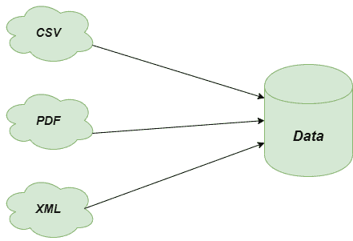
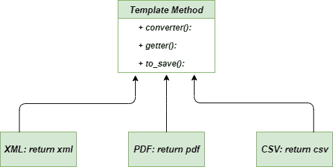

# 模板法–Python 设计模式

> 原文:[https://www . geesforgeks . org/template-method-python-design-patterns/](https://www.geeksforgeeks.org/template-method-python-design-patterns/)

模板方法是一种  ，它定义了操作的框架，并将细节留给子类实现。它的子类可以根据需要覆盖方法实现，但是调用的方式与抽象类定义的方式相同。它是行为设计模式中最容易理解和实现的模式之一。这种方法在框架开发中被大量使用，因为它们允许我们通过进行某些更改在不同的地方重用单个代码。这也导致避免代码重复。

### 不使用模板方法的问题

想象一下，作为一名软件开发人员，你正在开发一个使用数据挖掘技术来分析公司文档数据的聊天机器人应用程序。最初，您的应用程序只能处理 pdf 版本的数据，但后来您的应用程序也需要从其他格式收集和转换数据，如 **XML** 、 **CSV** 等。在为其他格式实现了整个场景之后，您注意到所有的类都有许多相似的代码。像分析和处理这样的部分代码在几乎所有的类中都是相同的，但是它们在处理数据时是不同的。



问题-模板-方法

### 使用模板方法的解决方案

让我们讨论使用模板方法解决上述问题。它建议将代码分解成一系列步骤，并将这些步骤转换成方法，并将系列调用放入 template_function 中。因此，我们单独创建了**模板 _ 函数**，并创建了 **get_xml** 、 **get_pdf** 和 **get_csv** 等方法来分别处理代码。

## 蟒蛇 3

```
""" method to get the text of file"""
def get_text():

    return "plain_text"

""" method to get the xml version of file"""
def get_xml():

    return "xml"

""" method to get the pdf version of file"""
def get_pdf():

    return "pdf"

"""method to get the csv version of file"""
def get_csv():

    return "csv"

"""method used to convert the data into text format"""
def convert_to_text(data):

    print("[CONVERT]")
    return "{} as text".format(data)

"""method used to save the data"""
def saver():

    print("[SAVE]")

"""helper function named as template_function"""
def template_function(getter, converter = False, to_save = False):

    """input data from getter"""
    data = getter()
    print("Got `{}`".format(data))

    if len(data) <= 3 and converter:
        data = converter(data)
    else:
        print("Skip conversion")

    """saves the data only if user want to save it"""
    if to_save:
        saver()

    print("`{}` was processed".format(data))

"""main method"""
if __name__ == "__main__":

    template_function(get_text, to_save = True)

    template_function(get_pdf, converter = convert_to_text)

    template_function(get_csv, to_save = True)

    template_function(get_xml, to_save = True)
```

### 输出

```
Got `plain_text`
Skip conversion
[SAVE]
`plain_text` was processed
Got `pdf`
[CONVERT]
`pdf as text` was processed
Got `csv`
Skip conversion
[SAVE]
`csv` was processed
```

### 类图

以下是模板方法
的类图



类图模板方法

### 优势

*   **等价内容:**通过将超类中的重复代码拉到您想要使用它的地方，可以很容易地考虑它。
*   **灵活性:**它提供了巨大的灵活性，使得子类能够决定如何实现算法的步骤。
*   **继承的可能性:**我们可以重用我们的代码，因为**模板方法**使用了继承，这提供了代码重用的能力。

### 不足之处

*   **复杂代码:**使用模板方法时，代码有时可能会变得足够复杂，以至于即使是编写代码的开发人员也很难理解代码。
*   **限制:**客户端可能会要求扩展版本，因为有时他们会觉得提供的骨架中缺少算法。
*   **违反:**有可能通过使用模板法，你最终可能会违反 [**利科夫替代原则**](https://en.wikipedia.org/wiki/Liskov_substitution_principle) ，这绝对不是一件值得遵循的好事。

### 适应性

*   **客户端扩展:**当您想让客户端使用特定的步骤扩展算法，但不使用算法的整个结构时，总是首选使用这种方法。
*   **相似算法:**当你有很多相似的算法，并且有微小的变化时，使用模板设计模式总是更好，因为如果算法中发生了一些变化，那么你就不必在每个算法中进行改变。
*   **框架的开发:**在开发框架时，强烈建议使用模板设计模式，因为这将有助于我们避免重复代码，并通过进行某些更改来一次又一次地重用这段代码。

**进一步阅读–**[**Java 中的模板方法**](https://www.geeksforgeeks.org/template-method-design-pattern/)