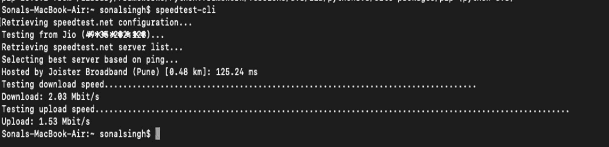
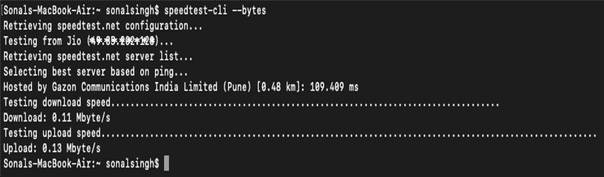
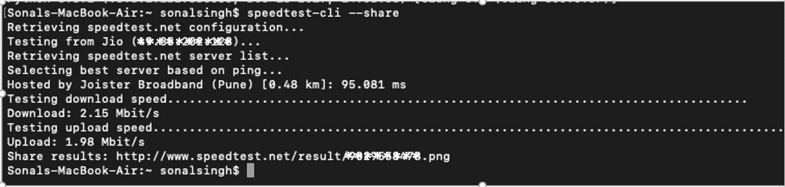
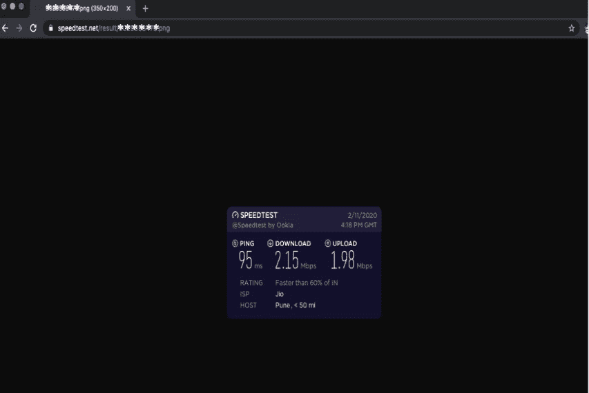
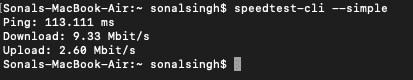
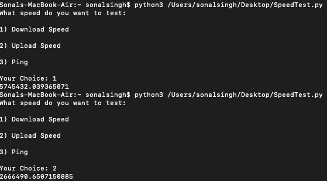
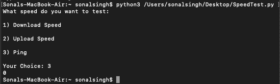
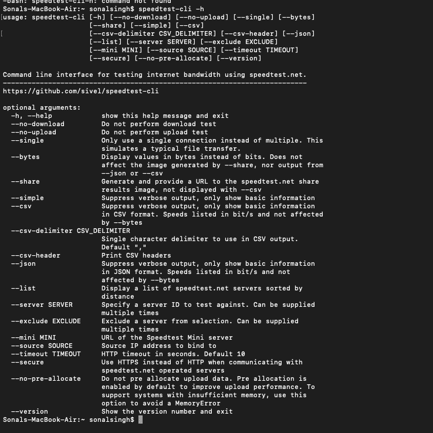
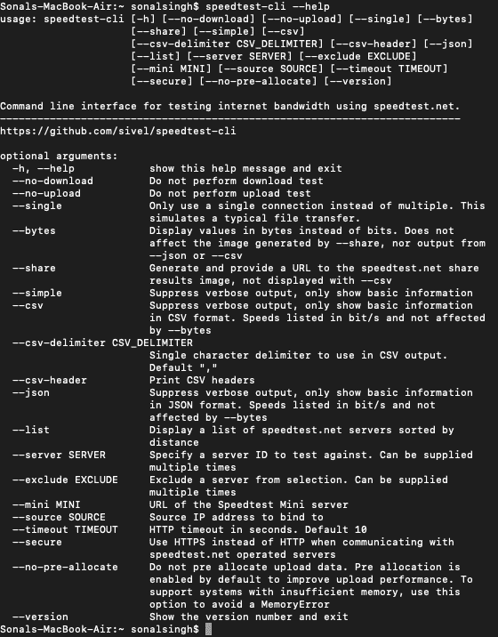

# 用 Python 测试网速

> 原文:[https://www . geesforgeks . org/test-internet-speed-use-python/](https://www.geeksforgeeks.org/test-internet-speed-using-python/)

**先决条件:** [Python 编程语言](https://www.geeksforgeeks.org/python-programming-language/)

Python 是一种广泛使用的高级通用语言。Python 可以用于许多任务，如 web 开发、机器学习、Gui 应用程序。也可以用来测试网速。Python 提供了各种库来做同样的事情。一个这样的库是`speedtest-cli`。这个库是使用 speedtest.net 测试互联网带宽的命令行界面

#### 装置

这个模块没有内置 Python。要安装它，请在终端中键入以下命令。

```py
pip install speedtest-cli

```

安装上述软件包后，可以通过版本检查来检查软件包是否安装正确。可以使用以下命令检查包的版本

```py
speedtest-cli --version

```


#### speed test CLI 程序包

`Speedtest-cli`是命令行界面中使用的模块，用于使用 speedtest.net 测试互联网带宽。要获得兆位的速度，请在终端中键入以下命令。

```py
speedtest-cli

```



上述命令给出的速度测试结果是以兆位为单位的。要获得字节的结果，我们可以使用以下命令。

```py
speedtest-cli --bytes

```



还可以使用此模块检索速度测试结果的图片版本。要执行相同的操作，请在终端中键入以下命令。

```py
speedtest-cli --share

```



它返回一个链接，我们可以在浏览器上访问该链接，并查看各种互联网速度的图形表示。



要打印仅包含 Ping 的速度测试结果的更简单版本，请下载并上传结果，而不是详细输出。

```py
speedtest-cli --simple

```



**用 Python 脚本检查网速**

```py
# Python program to test
# internet speed

import speedtest  

st = speedtest.Speedtest()

option = int(input('''What speed do you want to test:  

1) Download Speed  

2) Upload Speed  

3) Ping 

Your Choice: '''))

if option == 1:  

    print(st.download())  

elif option == 2: 

    print(st.upload())  

elif option == 3:  

    servernames =[]  

    st.get_servers(servernames)  

    print(st.results.ping)  

else:

    print("Please enter the correct choice !") 
```

**输出:**




要获得所有可用选项的列表，请在终端中键入以下命令。

*   ```py
    speedtest-cli -h
    ```

    

*   ```py
    speedtest-cli --help
    ```

    