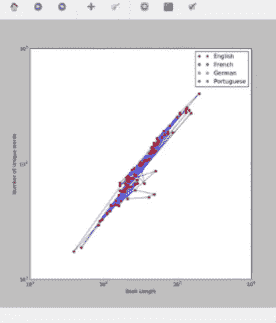
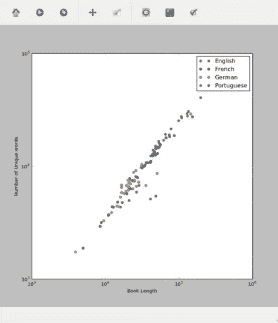

# Python 3 中的文本分析

> 原文:[https://www.geeksforgeeks.org/text-analysis-in-python-3/](https://www.geeksforgeeks.org/text-analysis-in-python-3/)

**图书/文件内容分析**

书面文本中的模式在所有作者或语言中都不相同。这使得语言学家能够研究文本的起源语言或潜在作者，而这些特征并不直接为人所知，如美国独立战争的联邦党人论文。

**目的:**在本案例研究中，我们将检查来自不同作者和不同语言的图书集合中的单本图书的属性。更具体地说，我们将研究书的长度、独特单词的数量，以及这些属性如何通过语言或作者聚集在一起。

**来源:** [古腾堡工程](https://www.gutenberg.org/)是最古老的数字图书图书馆。它旨在对文化作品进行数字化和归档，目前包含 50，000 多本书籍，所有这些书籍以前都已出版，现在都可以通过电子方式获得。从[这里](https://d37djvu3ytnwxt.cloudfront.net/assets/courseware/v1/1d1e264f416e27b22a0b8c970d52f3e3/asset-v1:HarvardX+PH526x+3T2016+type@asset+block/Books_EngFr.zip)下载一些英语&法语书籍，从[这里](https://d37djvu3ytnwxt.cloudfront.net/assets/courseware/v1/9ae1e86b60c734de6665509f7fff25ae/asset-v1:HarvardX+PH526x+3T2016+type@asset+block/Books_GerPort.zip)下载一些葡萄牙语&德语书籍进行分析。将所有这些书放在一个名为 books 的文件夹中，文件夹中有英语、法语、德语& Potugese 子文件夹。

**文本中的词频**

所以我们要建立一个函数来计算文本中的词频。我们将考虑一个示例测试文本，&稍后将用我们刚刚下载的书籍的文本文件替换示例文本。因为我们要计算词频，所以大写字母和小写字母是一样的。我们将整个文本转换成小写并保存。

```
text = "This is my test text. We're keeping this text short to keep things manageable."
text = text.lower()
```

词频可以用多种方式统计。我们要编码，两种这样的方式(只是为了知识)。一个用于循环，另一个使用集合中的计数器，这证明比前一个更快。该函数将返回一个唯一单词的字典&它作为键值对出现的频率。所以，我们编码:

```
from collections import Counter 

# counts word frequency
def count_words(text):                  
    skips = [".", ", ", ":", ";", "'", '"'] 
    for ch in skips: 
        text = text.replace(ch, "") 
    word_counts = {} 
    for word in text.split(" "): 
        if word in word_counts: 
            word_counts[word]+= 1 
        else: 
            word_counts[word]= 1 
    return word_counts 

    # >>>count_words(text) You can check the function 

# counts word frequency using
# Counter from collections 
def count_words_fast(text):     
    text = text.lower() 
    skips = [".", ", ", ":", ";", "'", '"'] 
    for ch in skips: 
        text = text.replace(ch, "") 
    word_counts = Counter(text.split(" ")) 
    return word_counts 

    # >>>count_words_fast(text) You can check the function 
```

**输出:**输出是一个字典，将样本文本的唯一单词作为关键字，每个单词的频率作为值。比较这两个函数的输出，我们得到:

> {“was”:1，“is”:1，“可管理”:1，“to”:1，“things”:1，“保管”:1，“my”:1，“test”:1，“text”:2，“保管”:1，“short”:1，“this”:2 }
> 
> counter({“text”:2，“this”:2，“was”:1，“is”:1，“manageable，“to”:1，“things”:1，“keying”:1，“my”:1，“test”:1，“keying”:1，“short”:1 })

**将书籍读入 Python:** 此后，我们成功地用示例文本测试了我们的词频函数。现在，我们要用我们作为文本文件下载的书籍来测试这些功能。我们将创建一个名为 read_book()的函数，它将用 Python 阅读我们的书籍，并将其保存为变量中的长字符串并返回。函数的参数将是要读取的 book.txt 的位置，并将在调用函数时传递。

```
#read a book and return it as a string
def read_book(title_path):  
    with open(title_path, "r", encoding ="utf8") as current_file:
        text = current_file.read()
        text = text.replace("\n", "").replace("\r", "")
    return text
```

**Total Unique words:** 我们要设计另一个名为 word_stats()的函数，它会以词频字典(count_words_fast()/count_words())的输出为参数。该函数将返回唯一单词的总数(词频字典中的 sum/total 关键字)和一个 dict_values，将它们的总数作为一个元组保存在一起。

```
# word_counts = count_words_fast(text)
def word_stats(word_counts):      
    num_unique = len(word_counts) 
    counts = word_counts.values() 
    return (num_unique, counts) 
```

**调用函数:**所以，最后我们要读一本书，比如《罗密欧与朱丽叶》的英文版，从函数中收集词频、独特词、独特词总数等信息。

```
text = read_book("./Books / English / shakespeare / Romeo and Juliet.txt")

word_counts = count_words_fast(text)         
(num_unique, counts) = word_stats(word_counts)
print(num_unique, sum(counts)) 
```

```
Output: 5118 40776

```

借助我们创建的函数，我们知道《罗密欧与朱丽叶》英文版中有 5118 个独特的单词，独特单词的频率总和总计为 40776 个。我们可以知道哪一个单词在书中出现最多&可以玩不同版本、不同语言的书，借助上述功能了解它们及其统计数据。

**绘制书籍特征**

我们将使用 [matplotlib](https://www.geeksforgeeks.org/graph-plotting-in-python-set-1/) 为所有不同语言的书籍绘制(I)书籍长度 Vs 唯一单词数。我们将导入熊猫来创建一个熊猫数据框架，它将把书籍上的信息作为专栏保存。我们将根据不同的类别对这些栏目进行分类，如“语言”、“作者”、“标题”、“长度”&“独一无二”。要沿 x 轴绘制图书长度，沿 y 轴绘制唯一单词数，我们需要编码:

```
import os 
import pandas as pd 

book_dir = "./Books"
os.listdir(book_dir) 

stats = pd.DataFrame(columns =("language",
                               "author",
                               "title",
                               "length",
                               "unique")) 

# check >>>stats 
title_num = 1
for language in os.listdir(book_dir): 
    for author in os.listdir(book_dir+"/"+language): 
        for title in os.listdir(book_dir+"/"+language+"/"+author):

            inputfile = book_dir+"/"+language+"/"+author+"/"+title 
            print(inputfile) 
            text = read_book(inputfile) 
            (num_unique, counts) = word_stats(count_words_fast(text)) 
            stats.loc[title_num]= language,
            author.capitalize(),
            title.replace(".txt", ""), 
            sum(counts), num_unique 
            title_num+= 1
import matplotlib.pyplot as plt 
plt.plot(stats.length, stats.unique, "bo-") 

plt.loglog(stats.length, stats.unique, "ro") 

stats[stats.language =="English"] #to check information on english books 

plt.figure(figsize =(10, 10)) 
subset = stats[stats.language =="English"] 
plt.loglog(subset.length,
           subset.unique,
           "o",
           label ="English",
           color ="crimson") 

subset = stats[stats.language =="French"] 
plt.loglog(subset.length,
           subset.unique,
           "o",
           label ="French",
           color ="forestgreen") 

subset = stats[stats.language =="German"] 
plt.loglog(subset.length,
           subset.unique,
           "o",
           label ="German",
           color ="orange") 

subset = stats[stats.language =="Portuguese"] 
plt.loglog(subset.length,
           subset.unique,
           "o",
           label ="Portuguese",
           color ="blueviolet") 

plt.legend() 
plt.xlabel("Book Length") 
plt.ylabel("Number of Unique words") 
plt.savefig("fig.pdf") 
plt.show() 
```

**输出:**我们绘制了两幅图，第一幅图将每本不同语言的书&作者简单地表示为一本书。[第一个图形](https://drive.google.com/open?id=0ByqooCIGbyKiRzNKV1NxV1AteGs)中的红点代表一本书，它们由蓝线连接。对数图创建离散点[此处为红色]，线性图创建线性曲线[此处为蓝色]，连接这些点。[第二个图形](https://drive.google.com/open?id=0ByqooCIGbyKiVHQwVEpENkdOb0E)是一个对数图，它将不同语言、不同颜色(红色代表英语、绿色代表法语等)的书籍显示为离散点。
这些图表有助于直观地分析关于不同生动来源书籍的事实。从图表中，我们知道葡萄牙语书籍比德语或英语书籍更长，有更多的独特单词。绘制这样的数据证明对语言学家有很大的帮助。




参考:

*   [edX–HarvardX–使用 Python 进行研究](https://courses.edx.org/courses/course-v1:HarvardX+PH526x+3T2016/info)
*   [类似数据营地练习](https://campus.datacamp.com/courses/using-python-for-research/case-study-2-translations-of-hamlet?ex=1)
*   [下一步:ML-高级](http://dl.acm.org/citation.cfm?id=505283)

本文由 **Amartya Ranjan Saikia** 供稿。如果你喜欢 GeeksforGeeks 并想投稿，你也可以使用[write.geeksforgeeks.org](https://write.geeksforgeeks.org)写一篇文章或者把你的文章邮寄到 review-team@geeksforgeeks.org。看到你的文章出现在极客博客主页上，帮助其他极客。

如果你发现任何不正确的地方，或者你想分享更多关于上面讨论的话题的信息，请写评论。