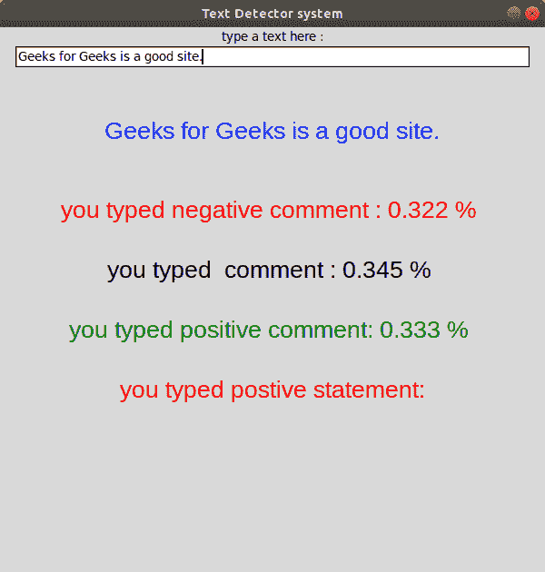
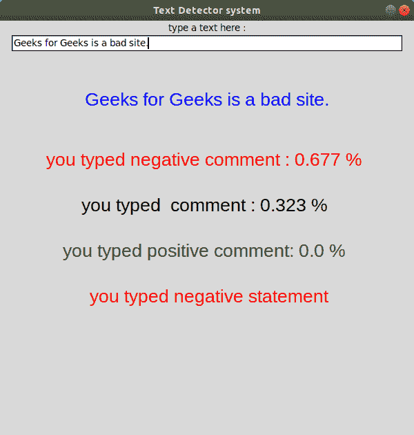

# 使用 Python 进行文本检测

> 原文:[https://www.geeksforgeeks.org/text-detection-using-python/](https://www.geeksforgeeks.org/text-detection-using-python/)

[Python 语言](https://www.geeksforgeeks.org/python-programming-language/)广泛用于现代机器学习和数据分析。人们可以通过 Python 检测图像、语音，甚至可以检测物体。现在，我们将通过将文本分类为正面、负面或中性来检测来自用户的文本是给出正面感觉还是负面感觉。在代码中，使用了**维达情绪分析**和 **Tkinter** 。Tkinter 是一个标准的图形用户界面库，用于创建图形用户界面应用程序。

**蟒蛇需要的装置:**

*   **tkinter:** 该模块用于创建一个简单的 GUI 应用程序。该模块通常预装 Python，但要从外部安装，请在终端中键入以下命令。
    使用 conda 命令。

```
conda install -c anaconda tk
```

Linux 用户也可以使用下面的命令。

```
sudo apt-get install python3-tk
```

*   **nltk:** 该模块用于让计算机理解自然语言。要安装它，请在终端中键入以下命令。
    使用康达。

```
conda install -c anaconda nltk
```

利用皮普。

```
pip install nltk
```

*   **numpy:** 这个模块是用 Python 进行科学计算的基础包。要安装它，请在终端中键入以下命令。
    使用康达。

```
conda install -c conda-forge numpy
```

利用皮普。

```
pip install numpy
```

*   **熊猫:**本模块用于数据分析。它提供了高度优化的性能，后端源代码完全用 C 或 Python 编写。要安装它，请在终端中键入以下命令。
    使用 conda

```
conda install -c anaconda pandas
```

利用皮普。

```
pip install pandas
```

*   **matplotlib:** 这个模块是 Python 中一个惊人的可视化库，用于数组的 2D 图。Matplotlib 是一个建立在 NumPy 数组上的多平台数据可视化库。要安装它，请在终端中键入以下命令。
    使用康达。

```
conda install -c conda-forge matplotlib
```

利用皮普。

```
pip install matplotlib
```

#### VADER 情绪分析

VADER(价感知词典和情感推理机)是一个基于词典和规则的情感分析工具，专门针对社交媒体中表达的情感。VADER 使用了一个组合。情感词典是一个词汇特征列表(例如，单词)，通常根据它们的语义方向将其标记为积极或消极。VADER 不仅告诉我们积极和消极的分数，还告诉我们一种情绪是积极的还是消极的。

**注:**更多信息请参考 [Python |使用 VADER](https://www.geeksforgeeks.org/python-sentiment-analysis-using-vader/) 进行情感分析。

下面是实现。

## 蟒蛇 3

```
import time
import pandas as pd
import numpy as np
import matplotlib.pyplot as plt
from tkinter import *
import tkinter.messagebox
from nltk.sentiment.vader import SentimentIntensityAnalyzer

class analysis_text():

    # Main function in program
    def center(self, toplevel):

        toplevel.update_idletasks()
        w = toplevel.winfo_screenwidth()
        h = toplevel.winfo_screenheight()
        size = tuple(int(_) for _ in
                     toplevel.geometry().split('+')[0].split('x'))

        x = w/2 - size[0]/2
        y = h/2 - size[1]/2
        toplevel.geometry("%dx%d+%d+%d" % (size + (x, y)))

    def callback(self):
        if tkinter.messagebox.askokcancel("Quit",
                                          "Do you want to leave?"):
            self.main.destroy()

    def setResult(self, type, res):

        #calculated comments in vader analysis
        if (type == "neg"):
            self.negativeLabel.configure(text =
                                         "you typed negative comment : "
                                         + str(res) + " % \n")
        elif (type == "neu"):
            self.neutralLabel.configure( text =
                                        "you typed  comment : "
                                        + str(res) + " % \n")
        elif (type == "pos"):
            self.positiveLabel.configure(text
                                        = "you typed positive comment: "
                                         + str(res) + " % \n")

    def runAnalysis(self):

        sentences = []
        sentences.append(self.line.get())
        sid = SentimentIntensityAnalyzer()

        for sentence in sentences:

            # print(sentence)
            ss = sid.polarity_scores(sentence)

            if ss['compound'] >= 0.05 :
                self.normalLabel.configure(text =
                                           " you typed positive statement: ")

            elif ss['compound'] <= - 0.05 :
                self.normalLabel.configure(text =
                                           " you typed negative statement")

            else :
             self.normalLabel.configure(text =
                                        " you normal typed  statement: ")
            for k in sorted(ss):
                self.setResult(k, ss[k])
        print()

    def editedText(self, event):
        self.typedText.configure(text = self.line.get() + event.char)

    def runByEnter(self, event):
        self.runAnalysis()

    def __init__(self):
        # Create main window
        self.main = Tk()
        self.main.title("Text Detector system")
        self.main.geometry("600x600")
        self.main.resizable(width=FALSE, height=FALSE)
        self.main.protocol("WM_DELETE_WINDOW", self.callback)
        self.main.focus()
        self.center(self.main)

        # addition item on window
        self.label1 = Label(text = "type a text here :")
        self.label1.pack()

        # Add a hidden button Enter
        self.line = Entry(self.main, width=70)
        self.line.pack()

        self.textLabel = Label(text = "\n",
                               font=("Helvetica", 15))
        self.textLabel.pack()
        self.typedText = Label(text = "",
                               fg = "blue",
                               font=("Helvetica", 20))
        self.typedText.pack()

        self.line.bind("<Key>",self.editedText)
        self.line.bind("<Return>",self.runByEnter)

        self.result = Label(text = "\n",
                            font=("Helvetica", 15))
        self.result.pack()
        self.negativeLabel = Label(text = "",
                                   fg = "red",
                                   font=("Helvetica", 20))
        self.negativeLabel.pack()
        self.neutralLabel  = Label(text = "",
                                   font=("Helvetica", 20))
        self.neutralLabel.pack()
        self.positiveLabel = Label(text = "",
                                   fg = "green",
                                   font=("Helvetica", 20))
        self.positiveLabel.pack()
        self.normalLabel =Label (text ="",
                                 fg ="red",
                                 font=("Helvetica", 20))
        self.normalLabel.pack()

# Driver code
myanalysis = analysis_text()
mainloop()
```

**输出:**

 