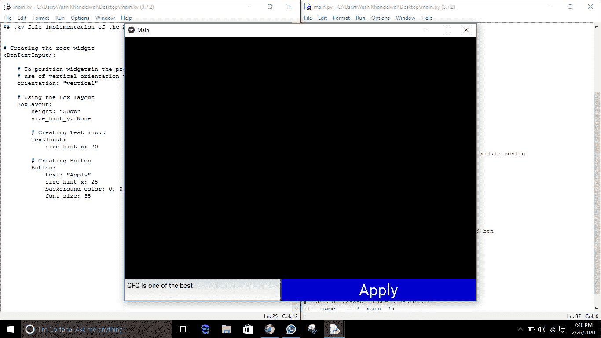

# 文本输入框，带有 kivy 中的验证按钮(使用。kv 档)

> 原文:[https://www . geesforgeks . org/text-input-box-with-a-verification-button-in-kivy-using-kv-file/](https://www.geeksforgeeks.org/text-input-box-with-a-verification-button-in-kivy-using-kv-file/)

Kivy 是 Python 中独立于平台的 GUI 工具。因为它可以在安卓、IOS、linux 和 Windows 等平台上运行。它基本上是用来开发安卓应用程序的，但并不意味着它不能在桌面应用程序上使用。
在本文中，我们将学习如何使用 kivy 添加文本输入按钮。和我们在输入和提交按钮中看到的一样。所以要做到这一点，你首先必须了解 kivy 中的文本输入小部件和按钮。

> **文本输入:**文本输入小部件为可编辑的纯文本提供了一个框。支持 Unicode、多行、光标导航、选择和剪贴板功能。
> **按钮:**按钮是带有相关动作的标签，当按钮被按下(或在点击/触摸后释放)时会触发这些动作。我们可以在按钮后面添加功能，并为按钮设置样式。

```
Basic Approach -

1) import kivy
2) import kivyApp
3) import widget
4) import Boxlayout
5) import textinput and Button
6) Set minimum version(optional)
7) Create Widget class
8) Create App class
9) create .kv file (name same as the app class):
        1) create textinput
        2) create Button
10) return Layout/widget/Class(according to requirement)
11) Run an instance of the class
```

> [Kivy 教程——用例子学习 Kivy。](https://www.geeksforgeeks.org/kivy-tutorial/)

**实施办法**
**主文件**

## 蟒蛇 3

```
# Program to Show how to create textinput 
# with button in kivy using .kv file

##################################################
# import kivy module    
import kivy  

# base Class of your App inherits from the App class.    
# app:always refers to the instance of your application   
from kivy.app import App 

# this restrict the kivy version i.e  
# below this kivy version you cannot  
# use the app or software  
kivy.require('1.9.1')

# Widgets are elements
# of a graphical user interface
# that form part of the User Experience.
from kivy.uix.widget import Widget

# The TextInput widget provides a
# box for editable plain text
from kivy.uix.textinput import TextInput

# BoxLayout arranges widgets in either
# in a vertical fashion that is
# one on top of another or in a horizontal
# fashion that is one after another.  
from kivy.uix.boxlayout import BoxLayout

# to change the kivy default settings we use this module config
from kivy.config import Config

# 0 being off 1 being on as in true / false
# you can use 0 or 1 && True or False
Config.set('graphics', 'resizable', True)

# creating the root widget used in .kv file
class BtnTextInput(BoxLayout):
    pass

# class in which we are creating the Textinput and btn
# in .kv file to be named main.kv
class MainApp(App):
    # defining build()
    def build(self):
        # returning the instance of root class
        return BtnTextInput()

# run function runs the whole program
# i.e run() method which calls the target
# function passed to the constructor.
if __name__ == '__main__':
    MainApp().run()
```

**。千伏文件实施**

## 蟒蛇 3

```
## .kv file implementation of the App class

# Creating the root widget
<BtnTextInput>:

    # To position widgetsin the proper orientation 
    # use of vertical orientation to set all widgets
    orientation: "vertical"

    # Using the Box layout
    BoxLayout:
        height: "50dp"
        size_hint_y: None

        # Creating Test input
        TextInput:
            size_hint_x: 20

        # Creating Button
        Button:
            text: "Apply"
            size_hint_x: 25
            background_color: 0, 0, 1, 1
            font_size: 35
```

**输出:**
**按钮被按下**



**按钮未按下**


**简单查看(关闭)**

