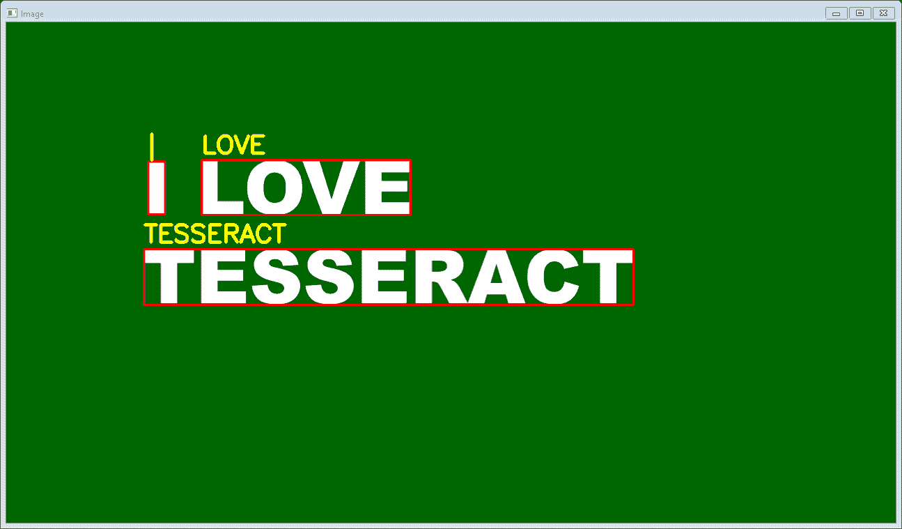

# 使用 Pytesseract 进行文本定位、检测和识别

> 原文:[https://www . geesforgeks . org/text-localization-detection-and-recognition-use-pytesseract/](https://www.geeksforgeeks.org/text-localization-detection-and-recognition-using-pytesseract/)

**小魔方**或**Python-小魔方**是 Python 的光学字符识别(OCR)工具。它将读取和识别图像、车牌等中的文本。python-宇宙魔方实际上是**谷歌宇宙魔方-光学字符识别引擎**的包装类或包。它也是有用的，并被视为一个独立的调用脚本来细化，因为它可以很容易地读取**枕头**和**细尼卡**成像库支持的所有图像类型，主要包括–

*   使用 jpeg 文件交换格式存储的编码图像文件扩展名
*   巴布亚新几内亚
*   可交换的图像格式
*   位图文件的扩展名
*   tiff 等

此外，如果它被用作脚本，Python-tesseract 还将打印识别出的文本，而不是将其写入文件。可以使用 pip 安装 python-tesserrate，如下所示–

```py
pip install pytesseract
```

如果您使用的是阿纳康达云，可以按照如下所示安装 Python-宇宙魔方:-

```py
conda install -c conda-forge/label/cf202003 pytesseract
```

或者

```py
conda install -c conda-forge pytesseract
```

**注意:**在运行下面的脚本之前，应该在系统中安装宇宙魔方。
以下是执行情况。

## 蟒蛇 3

```py
from pytesseract import*
import argparse
import cv2

# We construct the argument parser
# and parse the arguments
ap = argparse.ArgumentParser()

ap.add_argument("-i", "--image",
                required=True,
                help="path to input image to be OCR'd")
ap.add_argument("-c", "--min-conf",
                type=int, default=0,
                help="minimum confidence value to filter weak text detection")
args = vars(ap.parse_args())

# We load the input image and then convert
# it to RGB from BGR. We then use Tesseract
# to localize each area of text in the input
# image
images = cv2.imread(args["image"])
rgb = cv2.cvtColor(images, cv2.COLOR_BGR2RGB)
results = pytesseract.image_to_data(rgb, output_type=Output.DICT)

# Then loop over each of the individual text
# localizations
for i in range(0, len(results["text"])):

    # We can then extract the bounding box coordinates
    # of the text region from  the current result
    x = results["left"][i]
    y = results["top"][i]
    w = results["width"][i]
    h = results["height"][i]

    # We will also extract the OCR text itself along
    # with the confidence of the text localization
    text = results["text"][i]
    conf = int(results["conf"][i])

    # filter out weak confidence text localizations
    if conf > args["min_conf"]:

        # We will display the confidence and text to
        # our terminal
        print("Confidence: {}".format(conf))
        print("Text: {}".format(text))
        print("")

        # We then strip out non-ASCII text so we can
        # draw the text on the image We will be using
        # OpenCV, then draw a bounding box around the
        # text along with the text itself
        text = "".join(text).strip()
        cv2.rectangle(images,
                      (x, y),
                      (x + w, y + h),
                      (0, 0, 255), 2)
        cv2.putText(images,
                    text,
                    (x, y - 10),
                    cv2.FONT_HERSHEY_SIMPLEX,
                    1.2, (0, 255, 255), 3)

# After all, we will show the output image
cv2.imshow("Image", images)
cv2.waitKey(0)
```

**输出:**
执行以下命令查看输出

```py
python ocr.py --image ocr.png 
```



除了输出，我们还将看到如下所示的置信度和命令提示符中的文本–

```py
Confidence: 93
Text: I

Confidence: 93
Text: LOVE

Confidence: 91
Text: TESSERACT
```