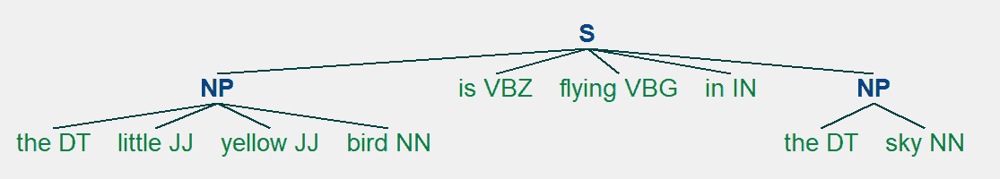

# Python 中的文本预处理|第 2 集

> 原文:[https://www . geesforgeks . org/text-预处理-in-python-set-2/](https://www.geeksforgeeks.org/text-preprocessing-in-python-set-2/)

前提:[NLP 入门](https://www.geeksforgeeks.org/introduction-to-natural-language-processing/)，[Python 中的文本预处理|第 1 集](https://www.geeksforgeeks.org/text-preprocessing-in-python-set-1/)

在[之前的帖子](https://www.geeksforgeeks.org/text-preprocessing-in-python-set-1/)中，我们看到了处理文本数据时的基本预处理步骤。在本文中，我们将研究一些更高级的文本预处理技术。我们可以使用这些技术来获得对我们拥有的数据的更多见解。

让我们导入必要的库。

```py
# import the necessary libraries
import nltk
import string
import re
```

### 词性标注:

词性解释了一个词在句子中的用法。在一个句子中，一个单词可以有不同的上下文和语义。像单词包这样的基本自然语言处理模型无法识别单词之间的这些关系。因此，我们使用词性标注来根据单词在数据中的上下文将单词标记到其词性标注中。它也用于提取单词之间的关系。

```py
from nltk.tokenize import word_tokenize
from nltk import pos_tag

# convert text into word_tokens with their tags
def pos_tagging(text):
    word_tokens = word_tokenize(text)
    return pos_tag(word_tokens)

pos_tagging('You just gave me a scare')
```

**示例:**

> **输入:**“你刚才吓了我一跳”
> **输出:**【(【你】、【PRP】)、(【刚才】、【RB】)、(【给了】、【VBD】)、(【我】、【PRP】)、
> (【a】、【DT】)、(【吓了】、【NN】)

在给定的例子中，PRP 代表人称代词，RB 代表副词，VBD 代表动词过去式，DT 代表限定词，NN 代表名词。我们可以使用佩恩树库标记集获得所有词性标记的细节。

```py
# download the tagset 
nltk.download('tagsets')

# extract information about the tag
nltk.help.upenn_tagset('NN')
```

**示例:**

> **输入:**【NN】
> **输出:** NN:名词、普通、单数或复数
> 普通载体卷心菜指关节掸子赌场阿富汗棚恒温器
> 投资滑梯幽默衰减滑溜风鬣狗超越非人
> 机械师…

### 分块:

组块是从非结构化文本中提取短语并赋予其更多结构的过程。它也被称为浅层解析。它是在词性标注的基础上完成的。它把单词分成“组块”，主要是名词短语。分块是使用正则表达式完成的。

```py
from nltk.tokenize import word_tokenize 
from nltk import pos_tag

# define chunking function with text and regular
# expression representing grammar as parameter
def chunking(text, grammar):
    word_tokens = word_tokenize(text)

    # label words with part of speech
    word_pos = pos_tag(word_tokens)

    # create a chunk parser using grammar
    chunkParser = nltk.RegexpParser(grammar)

    # test it on the list of word tokens with tagged pos
    tree = chunkParser.parse(word_pos)

    for subtree in tree.subtrees():
        print(subtree)
    tree.draw()

sentence = 'the little yellow bird is flying in the sky'
grammar = "NP: {<DT>?<JJ>*<NN>}"
chunking(sentence, grammar)
```

在给定的示例中，语法是使用简单的正则表达式规则定义的。这条规则说，只要组块者发现一个可选限定词(DT)后跟任意数量的形容词(JJ)和一个名词(NN)，就应该形成一个名词短语组块。

像 spaCy 和 Textblob 这样的库更适合分块。

**示例:**

> **输入:**【小黄鸟在天上飞】
> **输出:**
> (S
> (NP the/DT little/JJ 黄/JJ 鸟/NN)
> is/VBZ
> flying/VBG
> IN/IN
> (NP the/DT sky/NN)
> (NP the/DT little/JJ 黄/JJ 鸟/NN)
> (NP the/DT sky/NN)



### 命名实体识别:

命名实体识别用于从非结构化文本中提取信息。它用于将文本中存在的实体分类，如个人、组织、事件、地点等。它给了我们关于文本和不同实体之间关系的详细知识。

```py
from nltk.tokenize import word_tokenize
from nltk import pos_tag, ne_chunk

def named_entity_recognition(text):
    # tokenize the text
    word_tokens = word_tokenize(text)

    # part of speech tagging of words
    word_pos = pos_tag(word_tokens)

    # tree of word entities
    print(ne_chunk(word_pos))

text = 'Bill works for GeeksforGeeks so he went to Delhi for a meetup.'
named_entity_recognition(text)
```

**示例:**

> **Input:** “比尔为 GeeksforGeeks 工作，所以他去德里开会了。”
> **输出:**
> (S
> (PERSON Bill/NNP)
> 作品/VBZ
> for/IN
> (ORGANIZATION geeks forgeeks/NNP)
> so/RB
> 他/PRP
> 去/VBD
> 去/TO
> (GPE 德里/NNP)
> for/IN
> a/DT
> meeting up/NN
> 。/.)