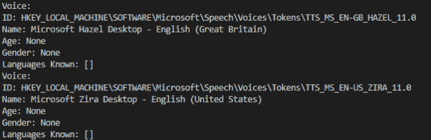

# Python 中的文本到语音转换语音

> 原文:[https://www . geesforgeks . org/text-to-speech-changing-voice-in-python/](https://www.geeksforgeeks.org/text-to-speech-changing-voice-in-python/)

在 python 中，有几种 API 可以将文本转换为语音。一个这样的应用编程接口是 Python 文本到语音应用编程接口，通常被称为`pyttsx3` 应用编程接口。`pyttsx3` 是一个非常容易使用的工具，可以将输入的文本转换成音频。

**安装**

要安装`pyttsx3` API，打开终端并写入

```
pip install pyttsx3

```

该库依赖于 win32，因此我们在执行程序时可能会遇到错误。为了避免这种情况，只需在您的环境中安装`pypiwin32` 。

```
pip install pypiwin32

```

pyttsx3 中的一些重要功能包括:

*   **pyttsx 3 . init([driver name:string，debug:bool])**–获取对将使用给定驱动程序的引擎实例的引用。如果请求的驱动程序已经被另一个引擎实例使用，则返回该引擎。否则，会创建一个新的引擎。
*   **获取属性(名称:字符串)**–获取引擎属性的当前值。
*   **设置属性(名称、值)**–对设置引擎属性的命令进行排队。新属性值影响在此命令后排队的所有话语。
*   **say(文本:unicode，名称:string)**–将命令排队以说出话语。根据队列中该命令之前设置的属性输出语音。
*   **运行和等待()**–在处理所有当前排队的命令时阻塞。适当地调用引擎通知的回调。当此调用之前排队的所有命令都从队列中清空时返回。

现在我们都准备编写一个将文本转换为语音的示例程序。

```
# Python program to show
# how to convert text to speech
import pyttsx3

# Initialize the converter
converter = pyttsx3.init()

# Set properties before adding
# Things to say

# Sets speed percent 
# Can be more than 100
converter.setProperty('rate', 150)
# Set volume 0-1
converter.setProperty('volume', 0.7)

# Queue the entered text 
# There will be a pause between
# each one like a pause in 
# a sentence
converter.say("Hello GeeksforGeeks")
converter.say("I'm also a geek")

# Empties the say() queue
# Program will not continue
# until all speech is done talking
converter.runAndWait()
```

**输出:**

> 上述程序的输出将是一个声音，表示“你好，极客们”和“我也是一个极客”。

## 改变声音

假设，你想把产生的声音从男性变成女性。你是怎么做的？让我们看看。
你会注意到，当你运行上面的代码来实现文本到语音的转换时，响应的声音是一个男性的声音。要更改语音，您可以通过从引擎获取`voices` 属性来获取可用语音列表，并且您可以根据系统中可用的语音来更改语音。

要获取声音列表，请编写以下代码。

```
voices = converter.getProperty('voices')

for voice in voices:
    # to get the info. about various voices in our PC 
    print("Voice:")
    print("ID: %s" %voice.id)
    print("Name: %s" %voice.name)
    print("Age: %s" %voice.age)
    print("Gender: %s" %voice.gender)
    print("Languages Known: %s" %voice.languages)
```

**输出:**


要更改声音，请使用`setProperty()`方法设置声音。上面找到的语音标识用于设置语音。
下面是变声器的实现。

```
voice_id = "HKEY_LOCAL_MACHINE\SOFTWARE\Microsoft\Speech\Voices\Tokens\TTS_MS_EN-US_ZIRA_11.0"

# Use female voice
converter.setProperty('voice', voice_id)

converter.runAndWait()
```

现在你可以随时随地切换声音。您可以尝试运行 for 循环，为不同的声音分配不同的语句。运行代码，享受结果。