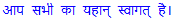

# 从英语到印度语言的文本音译–使用印度语音译

> 原文:[https://www . geesforgeks . org/text-音译-从英语到印度语-使用-indic-音译/](https://www.geeksforgeeks.org/text-transliteration-from-english-to-indian-languages-using-indic-transliteration/)

**音译**是将一个单词从一种语言的字母表转移到另一种语言的过程。音译帮助人们在外语中发音单词和名字。非拉丁文字语言的人用自己的语言也很有用，因为用拉丁语打字更方便。

**示例:**

```
Input : namaskaara
Output : 
Transliterating from English(Latin) to Hindi(Devanagari)

Input : namaskaara
Output : 
Transliterating from English(Latin) to Telugu(Telugu)

```

为了实现拉丁到印度文字的音译，我们将使用`**indic-transliteration**`模块。

**安装:**

```
pip install indic-transliteration
```

我们将使用`indic-transliteration`模块的 **`sanscript`** 类的 **`transliterate` ()** 方法。

## 音译()

> **语法:**音译(文本，罗马化 _style，脚本)
> 
> **参数:**
> **测试:**将文本翻译为
> **罗马化 _style :** 有以下罗马化样式:
> 
> *   HK = 'hk '
> *   iast = ' iast '
> *   itrans = ' itrans '
> *   OPTITRANS = 'optitrans '
> *   加尔各答= '加尔各答'
> *   SLP 1 =‘SLP 1’
> *   战地之家=“战地之家”
> *   WX = 'wx '
> 
> **脚本:**要音译成的脚本。以下脚本可用:
> 
> *   孟加拉语
> *   梵文字母
> *   古吉拉特语
> *   卡纳达语。亦称 KANARESE
> *   马拉雅拉姆语
> *   泰卢固语
> *   泰米尔人
> *   奥德拉的
> *   古尔穆基/旁遮普/潘贾比
> 
> **返回:**音译文本的字符串。

**例 1:** 从拉丁文音译为梵文。

```
# import the module
from indic_transliteration import sanscript
from indic_transliteration.sanscript import transliterate

# the text to be transliterated
text = "Apa sabhii kaa yahaan svaagat hai."

# printing the transliterated text
print(transliterate(text, sanscript.ITRANS, sanscript.DEVANAGARI))
```

**输出:**


**例 2:** 从拉丁语音译为古吉拉特语。

```
# import the module
from indic_transliteration import sanscript
from indic_transliteration.sanscript import transliterate

# the text to be transliterated
text = "Suprabhaata"

# printing the transliterated text
print(transliterate(text, sanscript.IAST, sanscript.GUJARATI))
```

**输出:**
