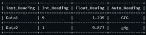
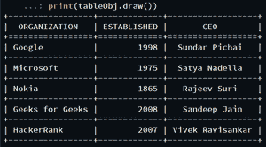

# Python 中的 TextTable 模块

> 原文:[https://www.geeksforgeeks.org/texttable-module-in-python/](https://www.geeksforgeeks.org/texttable-module-in-python/)

它是一个 python 模块，帮助我们在终端上打印表格。它是用 ASCII 代码读写文本表格的基本 python 模块之一。旨在使界面尽可能类似 Python 中的 *csv* 模块。*文本表格*模块支持固定大小的表格(其中列大小是预先确定的)和动态大小的表格(其中可以添加或删除列)。

**安装:**

```py
pip install texttable

```

**分步方法:**

*   导入所需模块。

## 蟒蛇 3

```py
# Import required module
import texttable
```

*   创建一个 *texttable()* 的对象

## 蟒蛇 3

```py
# Creating object
tableObj = texttable.Texttable(self,max width)

# max_width must be an integer,whose value is maximum width of the table
# if set to 0, size is unlimited (self adjustible according to text inside cell),
# therefore cells won't be wrapped so it's recommended to use 0
```

*   使用 *set_cols_align()* 方法创建列。

## 蟒蛇 3

```py
# Creating columns
tableObj.set_cols_align(["l", "l", "r", "c"])

# Set the desired columns alignment:
# "l" refers to column flushed left
# "c" refers to  column centered
# "r" refers to column flushed right
```

*   使用 *set_cols_dtype()* 设置每列的数据类型。但是，这一步是可选的。

## 蟒蛇 3

```py
# Set datatype
tableObj.set_cols_dtype(["t", "i", "f", "a"])

# texttable objects supports five types of data types:
# "t" refers to text
# "f" refers to decimal
# "e" refers to exponent
# "i" refers to integer
# "a" refers to automatic
```

*   使用 *set_cols_valign()* 调整列。

## 蟒蛇 3

```py
# Adjust Columns
tableObj.set_cols_valign(["t", "t", "m", "b"])

# Set the desired columns vertical alignment the elements of the 
# array should be either "t", "m" or "b":
# "t" refers to column aligned on the top of the cell
# "m" refers to column aligned on the middle of the cell
# "b" refers to column aligned on the bottom of the cell        
```

*   使用 *add_rows()* 方法在表格中插入行

## 蟒蛇 3

```py
# Adding rows
table.add_rows([
        ["Text_Heading", "Int_Heading", "Float_Heading", "Auto_Heading"],
        ["Data1", 9, 1.23456789, "GFG"],
        ["Data2", 1, 9.87654321, "g4g"],
        ])

# add_rows(self, rows, header=True):
# The 'rows' argument can be either an iterator returning arrays, or a
# by-dimensional array.
# 'header' specifies if the first row should be used as the header of the table
```

*   使用 *draw()* 方法显示表格。

## 蟒蛇 3

```py
print(tableObj.draw())
```

表格插图如下所示:



**以下是基于上述方法的程序:**

## 蟒蛇 3

```py
# Import required module
import texttable

# Create texttable object
tableObj = texttable.Texttable()

# Set columns
tableObj.set_cols_align(["l", "r", "c"])

# Set datatype of each column
tableObj.set_cols_dtype(["a", "i", "t"])

# Adjust columns
tableObj.set_cols_valign(["t", "m", "b"])

# Insert rows
tableObj.add_rows([
        ["ORGANIZATION", "ESTABLISHED", "CEO"],
        ["Google", 1998, "Sundar Pichai"],
        ["Microsoft", 1975, "Satya Nadella"],
        ["Nokia", 1865, "Rajeev Suri"],
        ["Geeks for Geeks", 2008, "Sandeep Jain"],
        ["HackerRank", 2007, "Vivek Ravisankar"]
        ])

# Display table
print(tableObj.draw())
```

**输出:**

