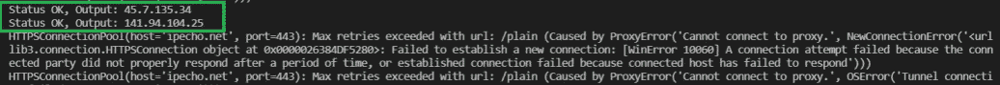

# 网页抓取代理完整指南

> 原文:[https://www . geeksforgeeks . org/网络抓取代理完整指南/](https://www.geeksforgeeks.org/the-complete-guide-to-proxies-for-web-scraping/)

在计算机网络中，代理服务器是一种服务器应用程序或设备，充当从提供资源的服务器中寻找资源的客户端请求的中介。

由于网页抓取需要从一个 IP 地址向服务器发出大量请求，服务器可能会检测到太多请求，并可能会阻止该 IP 地址以停止进一步抓取。为了避免阻塞，使用了代理，随着 IP 地址的改变，抓取将继续工作，不会引起任何问题。这也有助于隐藏机器的 IP 地址，因为它创造了匿名性。

### 代理类型

代理有三种类型。

*   **数据中心代理:**这些代理来自云服务提供商，有时会被标记为多人使用，但由于它们更便宜，可以为网页抓取活动带来一个代理池。
*   **住宅 IP 代理:**这些代理包含来自本地 ISP 的 IP 地址，所以站长无法检测出是刮刀还是真人在浏览网站。与数据中心代理相比，它们非常昂贵，可能会引起法律上的同意，因为所有者并不完全知道您是否将他们的 IP 用于网页抓取目的。
*   **移动 IP 代理:**这些代理是私有移动设备的 IP，工作方式类似于住宅 IP 代理。它们非常昂贵，可能会引起法律同意，因为设备所有者并不完全知道您是否正在使用他们的 GSM 网络进行网络抓取，因为它们是由移动网络运营商提供的。

### 管理代理池

*   **识别禁令**–代理应该能够检测各种类型的阻止方法，并修复潜在的问题，即验证码、重定向、阻止、重影等。
*   **重试错误**–如果当前代理存在任何连接问题、阻塞、验证码等，请使用不同的代理服务器重试请求。
*   **控制代理**–很少有具有认证的网站要求保持会话具有相同的 IP，否则如果代理服务器发生任何变化，可能需要再次进行认证。
*   **添加延迟**–随机化延迟并应用良好的节流，这样网站就不会检测到您正在进行抓取。
*   **地理位置**–很少有网站可能需要来自特定国家的 IP，因此代理池应该包含来自给定地理位置的代理集。

不建议使用公共代理，因为它们质量低，并且被认为是危险的，因为如果没有正确配置 SSL 证书，它们会感染机器，甚至会公开网页抓取活动。

如果预算较低，并且需要共享的 IP 池，则通常使用共享代理。如果预算更高，性能是重中之重，那么专用代理池就是解决之道。

### **代理旋转**

从单个 IP 地址发送太多请求清楚地表明您正在自动处理 HTTP/HTTPS 请求，网站管理员肯定会阻止您的 IP 地址以停止进一步的抓取。最好的替代方法是创建一个代理池，并在单个代理服务器发出一定数量的请求后迭代/循环它们。

这减少了 IP 阻塞的机会，并且刮刀不受影响。

> 代理= {'http://78.47.16.54:80 '，' http://203.75.190.21:80 '，' http://77.72.3.163:80'}

### 如何在请求模块中使用代理？

*   导入[请求](https://www.geeksforgeeks.org/python-requests-tutorial/)模块。
*   创建一个代理池，然后循环/迭代它们。
*   通过将代理作为参数传递给网址，使用 ***requests.get()*** 发送 **GET** 请求。
*   如果没有连接错误，则返回当前会话的代理服务器地址。

**程序:**

## 蟒蛇 3

```py
import requests

# Initialise proxy and url.
proxy = 'http://114.121.248.251:8080'
url = 'https://ipecho.net/plain'

# Send a GET request to the url and
# pass the proxy as parameter.
page = requests.get(url,
                    proxies={"http": proxy, "https": proxy})

# Prints the content of the requested url.
print(page.text)
```

**输出:**

> 114.121.248.251

同样的方法可以应用于多个代理，下面给出了相同的实现。

**程序:**

## 蟒蛇 3

```py
# Import the required Modules
import requests

# Create a pool of proxies
proxies = {
    'http://114.121.248.251:8080',
    'http://222.85.190.32:8090',
    'http://47.107.128.69:888',
    'http://41.65.146.38:8080',
    'http://190.63.184.11:8080',
    'http://45.7.135.34:999',
    'http://141.94.104.25:8080',
    'http://222.74.202.229:8080',
    'http://141.94.106.43:8080',
    'http://191.101.39.96:80'
}

url = 'https://ipecho.net/plain'

# Iterate the proxies and check if it is working.
for proxy in proxies:
    try:

        # https://ipecho.net/plain returns the ip address
        # of the current session if a GET request is sent.
        page = requests.get(
          url, proxies={"http": proxy, "https": proxy})

        # Prints Proxy server IP address if proxy is alive.
        print("Status OK, Output:", page.text)

    except OSError as e:

        # Proxy returns Connection error
        print(e)
```

**输出:**



请求模块中的代理