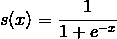

# python 中的 theano

> 原文:[https://www.geeksforgeeks.org/theano-in-python/](https://www.geeksforgeeks.org/theano-in-python/)

**antao**是一个 Python 库，允许我们如此高效地评估包括多维数组在内的数学运算。它主要用于构建深度学习项目。它在图形处理器上比在中央处理器上运行得更快。安诺实现了高速度，这使得 C 实现在涉及大量数据的问题上面临着激烈的竞争。它可以利用图形处理器的优势，这使得它在某些特定情况下比中央处理器上的 C 语言性能好得多。
它知道如何获取结构，并将它们转换成使用 numpy 和一些本机库的非常高效的代码。它主要用于处理深度学习中使用的大型神经网络算法所需的计算类型。这就是为什么，它是深度学习领域非常受欢迎的图书馆。

**如何安装安诺:**

```
pip install theano
```

我们需要使用的几个符号在安诺的**张量**子包中。我们经常用一个方便的名字导入这样的包，比如说，t。

```
from theano import *
import theano.tensor as T
```

**为什么是 antao Python 库:**
antao 是 numpy 和 sympy 的一种混合，试图将两者结合成一个强大的库。antio 的一些优点如下:

*   **稳定性优化:**茶氨酸可以找出一些不稳定的表达式，可以用更稳定的手段来评估它们
*   **执行速度优化:**如前所述，an ano 可以利用最近的 GPU，在你的 CPU 或 GPU 中执行部分表达式，比 Python 快很多
*   **符号分化:**安诺足够聪明，可以自动创建符号图来计算梯度

**antao 的基础知识:**
antao 是一个 Python 库，允许您高效地定义、优化和评估涉及多维数组的数学表达式。一些示例实现如下。

**减去两个标量:**

## 计算机编程语言

```
# Python program showing
# subtraction of two scalars

import theano
from theano import tensor

# Declaring variables
a = tensor.dscalar()
b = tensor.dscalar()

# Subtracting
res = a - b
# Converting it to a callable object
# so that it takes matrix as parameters
func = theano.function([a, b], res)

# Calling function
assert 20.0 == func(30.5, 10.5)
```

它不会提供任何输出，因为两个数字的断言与给定的数字相匹配，因此它会得到一个真值。

**添加两个标量:**

## 计算机编程语言

```
# Python program showing
# addition of two scalars

# Addition of two scalars
import numpy
import theano.tensor as T
from theano import function

# Declaring two variables
x = T.dscalar('x')
y = T.dscalar('y')

# Summing up the two numbers
z = x + y

# Converting it to a callable object
# so that it takes matrix as parameters
f = function([x, y], z)
f(5, 7)
```

**输出:**

```
array(12.0)
```

**添加两个矩阵:**

## 计算机编程语言

```
# Python program showing
# addition of two matrices

# Adding two matrices
import numpy
import theano.tensor as T
from theano import function
x = T.dmatrix('x')
y = T.dmatrix('y')
z = x + y
f = function([x, y], z)

f([[30, 50], [2, 3]], [[60, 70], [3, 4]])
```

**输出:**

```
array([[ 90.,  120.],
       [ 5.,  7.]])
```

**逻辑函数使用 an ao:**
让我们尝试计算逻辑曲线，该曲线由:
给出



**逻辑函数:**

## 计算机编程语言

```
# Python program to illustrate logistic
# sigmoid function using theano
# Load theano library

import theano
from theano import tensor

# Declaring variable
a = tensor.dmatrix('a')

# Sigmoid function
sig = 1 / (1 + tensor.exp(-a))

# Now it takes matrix as parameters
log = theano.function([a], sig)

# Calling function
print(log([[0, 1], [-1, -2]]))
```

**输出:**

```
[[0.5           0.73105858
0.26894142      0.11920292]]
```

antao 是一个基础库，主要用于深度学习的研发，直接创建深度学习模型或通过 Keras 等便捷库。它支持卷积网络和递归网络，以及两者的组合。