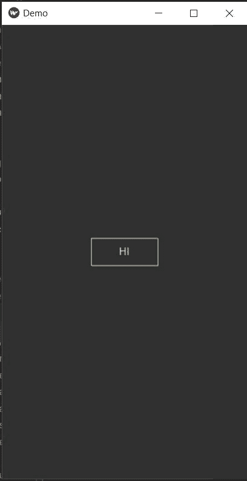
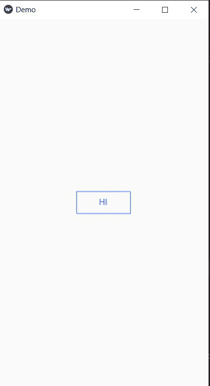
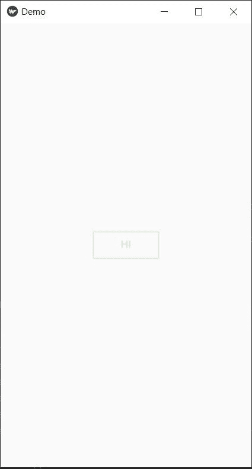
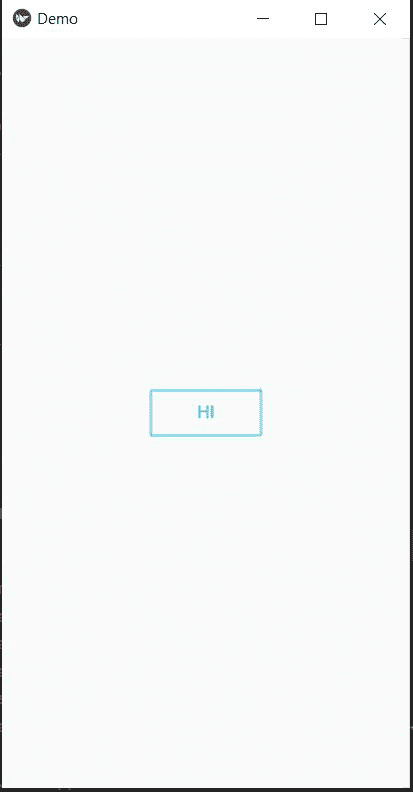

# KivyMD 中的主题和调色板

> 原文:[https://www . geesforgeks . org/themes-and-color-palettes-in-kivymd/](https://www.geeksforgeeks.org/themes-and-color-palettes-in-kivymd/)

KivyMD 是 Kivy 框架的扩展。KivyMD 是一个材料设计小部件的集合，用于制作移动应用程序的图形用户界面框架 Kivy。它类似于 Kivy 框架，但提供了更具吸引力的 GUI。在本文中，我们将在 KivyMD 中看到主题和调色板。

### KivyMD 中的主题:

为了使我们的应用程序更具吸引力和简单易用，我们可以为我们的应用程序使用主题和不同的颜色。为了改变主题颜色，应用模块内置了主题功能。

主题:它有两种选择——深色和浅色

> **语法:** self.theme_cls.theme_style=“暗”或“亮”

**代码:**

## 蟒蛇 3

```py
# importing all necessary modules
# like MDApp, MDLabel Screen, MDTextField
# and MDRectangleFlatButton
from kivymd.app import MDApp
from kivymd.uix.screen import Screen
from kivymd.uix.button import MDRectangleFlatButton

# creating Demo Class(base class)
class Demo(MDApp):

    def build(self):
        screen = Screen()

        # adding theme_color
        self.theme_cls.theme_style="Dark"

        btn = MDRectangleFlatButton(text="HI", pos_hint={
                                    'center_x': 0.5, 'center_y': 0.5},
                                    on_release=self.btnfunc)
        # adding widgets to screen
        screen.add_widget(btn)

        # returning the screen
        return screen

    # defining a btnfun() for the button to
    # call when clicked on it
    def btnfunc(self, obj):
        print("button is pressed!!")

if __name__ == "__main__":
    Demo().run()
```

**输出:**



**现在，让我们看看我们将改变一个浅色的主题背景:**

## 蟒蛇 3

```py
# importing all necessary modules
# like MDApp, MDLabel Screen, MDTextField
# and MDRectangleFlatButton
from kivymd.app import MDApp
from kivymd.uix.screen import Screen
from kivymd.uix.button import MDRectangleFlatButton

# creating Demo Class(base class)
class Demo(MDApp):

    def build(self):
        screen = Screen()

        # adding theme_color
        self.theme_cls.theme_style = "Light"

           # defining Button with all the parameters
        btn = MDRectangleFlatButton(text="HI", pos_hint={
            'center_x': 0.5, 'center_y': 0.3},
                                    on_release=self.btnfunc)
        # adding widgets to screen
        screen.add_widget(btn)

        # returning the screen
        return screen

    # defining a btnfun() for the button to
    # call when clicked on it
    def btnfunc(self, obj):
        print("button is pressed!!")

if __name__ == "__main__":
    Demo().run()
```

**输出:**



### 更改主要调色板颜色:

为了改变颜色，应用模块有内置的功能主题。

*   theme_cls.primary_palette:它有多种颜色。它接受一串颜色名称。
*   主题 _cls.primary_hue:它定义了颜色的不透明度，浅色为 100，深色为 A700。

> **语法:**theme _ cls . primary _ palette =颜色名称字符串(Eg-“蓝色”)
> 
> theme _ cls.primary _ hue =颜色的不透明度

**示例 1:** 这里我们将使用绿色和不透明 100 进行着色

## 蟒蛇 3

```py
# importing all necessary modules
# like MDApp, MDLabel Screen, MDTextField
# and MDRectangleFlatButton
from kivymd.app import MDApp
from kivymd.uix.screen import Screen
from kivymd.uix.button import MDRectangleFlatButton

# creating Demo Class(base class)
class Demo(MDApp):

    def build(self):
        screen = Screen()

        # adding theme_color
        self.theme_cls.primary_palette = "Green"
        self.theme_cls.primary_hue = "100"
        self.theme_cls.theme_style = "Light"

        btn = MDRectangleFlatButton(text="HI", pos_hint={
            'center_x': 0.5, 'center_y': 0.5},
                                    on_release=self.btnfunc)
        # adding widgets to screen
        screen.add_widget(btn)

        # returning the screen
        return screen

    # defining a btnfun() for the button to
    # call when clicked on it
    def btnfunc(self, obj):
        print("button is pressed!!")

if __name__ == "__main__":
    Demo().run()
```

**输出:**



**示例 2:** 青色和不透明 A700

## 蟒蛇 3

```py
# importing all necessary modules
# like MDApp, MDLabel Screen, MDTextField
# and MDRectangleFlatButton
from kivymd.app import MDApp
from kivymd.uix.screen import Screen
from kivymd.uix.button import MDRectangleFlatButton

# creating Demo Class(base class)
class Demo(MDApp):

    def build(self):
        screen = Screen()

        # adding theme_color
        self.theme_cls.primary_palette = "Cyan"
        self.theme_cls.primary_hue = "A700"
        self.theme_cls.theme_style = "Light"

        btn = MDRectangleFlatButton(text="HI", pos_hint={
            'center_x': 0.5, 'center_y': 0.5},
                                    on_release=self.btnfunc)
        # adding widgets to screen
        screen.add_widget(btn)

        # returning the screen
        return screen

    # defining a btnfun() for the button to
    # call when clicked on it
    def btnfunc(self, obj):
        print("button is pressed!!")

if __name__ == "__main__":
    Demo().run()
```

**输出:**

