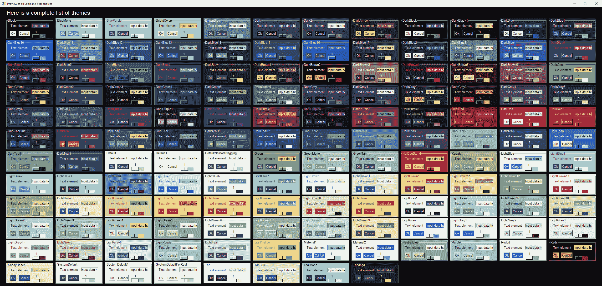

# PySimpleGUI 中的主题

> 原文:[https://www.geeksforgeeks.org/themes-in-pysimplegui/](https://www.geeksforgeeks.org/themes-in-pysimplegui/)

主题用于设计漂亮的窗户。它给用户一个选择，用颜色在图形用户界面上展示他的创造力。用一行代码就可以完成图形用户界面窗口的着色。

```
sg.theme('Dark Amber 5')

```

**注:** **暗琥珀色**为主题名称， **5** 为版本或补丁。

我们调用主题属性，它可以设置创建图形用户界面窗口时使用的颜色。它可以用来给文本、背景、输入字段、按钮等着色。我们可以看到主题的预览，进行这个调用来生成可用主题的预览:

```
import PySimpleGUI as sg

sg.theme_previewer()
```

**输出:**


### 主题列表和获取主题名称

除了拥有这些主题，人们不再需要指定确切的字符串来拥有他/她想要的主题。现在你可以添加空格，改变大小写，甚至移动单词，你仍然会得到正确的主题。例如主题**“暗琥珀 2”**也可以指定为**“暗琥珀 2”**。如果你记不住名字而出错，你肯定会在控制台上得到一个可用选项的文本列表。您也可以通过调用主题列表来获取主题列表

**示例:**

```
import PySimpleGUI as sg

theme_name_list = sg.theme_list()
print(theme_name_list)
```

**输出:**

> [‘黑色’、‘blue mono’、‘blue purple’、‘brightness’、‘black’、‘dark blue’、‘dark 2’、‘dark amber’、‘dark black’、‘dark black 1’、‘dark blue 1’、‘darkblue 1’、‘darkblue 1’、‘darkblue 11’、‘dark blue 12’、‘darkblue 13’、‘darkblue 14’、‘darkblue 15’、‘darkblue 16’、‘darkblue 17’、‘dark blue 2’、‘dark blue 3’、‘dark blue 4’、‘dark blue 5’、‘dark blue 6’、‘dark blue 7’、‘dark blue 8’、‘dark blue 9’、‘dark brown 1’、‘dark brown 2’、‘DarkBrown3 “Kayak”、“LightBlue1”、“light blue 1”、“LightBlue2”、“LightBlue3”、“LightBlue4”、“LightBlue5”、“LightBlue6”、“LightBlue7”、“LightBrown1”、“LightBrown10”、“LightBrown11”、“LightBrown12”、“LightBrown13”、“LightBrown2”、“LightBrown3”、“LightBrown4”、“LightBrown5”、“LightBrown6”、“LightBrown7”、“LightBrown8”、“LightBrown9”、“LightGray1”、“LightGreen1”、“LightGreen10”、“LightGreen2”、“LightGreen3”、“LightGreen4”、“LightGreen5”、“LightGreen6”

让我们看看 Python 代码，它用于改变用内置的 PySimpleGUI 主题动态创建的 GUI 的主题。

下面是实现。

```
# import PySimpleGUI
import PySimpleGUI as sg

# Choose a Theme for the Layout
sg.theme('DarkTeal9')

layout = [[sg.Text('List of InBuilt Themes')],
          [sg.Text('Please Choose a Theme  to see Demo window')],
          [sg.Listbox(values = sg.theme_list(),
                      size =(20, 12),
                      key ='-LIST-',
                      enable_events = True)],
          [sg.Button('Exit')]]

window = sg.Window('Theme List', layout)

# This is an Event Loop
while True:  
    event, values = window.read()

    if event in (None, 'Exit'):
        break

    sg.theme(values['-LIST-'][0])
    sg.popup_get_text('This is {}'.format(values['-LIST-'][0]))

# Close
window.close()
```

**输出:**

<video class="wp-video-shortcode" id="video-411173-1" width="665" height="374" preload="metadata" controls=""><source type="video/webm" src="https://media.geeksforgeeks.org/wp-content/uploads/20200512190753/python-pysimlegui-themes.webm?_=1">[https://media.geeksforgeeks.org/wp-content/uploads/20200512190753/python-pysimlegui-themes.webm](https://media.geeksforgeeks.org/wp-content/uploads/20200512190753/python-pysimlegui-themes.webm)</video>