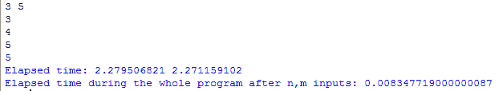

# Python 中的 time.perf_counter()函数

> 原文:[https://www . geesforgeks . org/time-perf _ counter-function-in-python/](https://www.geeksforgeeks.org/time-perf_counter-function-in-python/)

As 时间模块提供各种与时间相关的功能。因此有必要导入时间模块，否则会出错，因为 perf_counter()的定义存在于时间模块中。
**perf_counter()函数**总是以秒为单位返回时间的浮点值。返回性能计数器的值(以分数秒为单位)，即具有最高可用分辨率的时钟，用于测量短持续时间。它包括睡眠期间经过的时间，并且是全系统的。返回值的引用点是未定义的，因此只有连续调用的结果之间的差异是有效的。在这两者之间，我们可以使用 **time.sleep()** 和类似的功能。
**代码#1:** 了解 *perf_counter* 的用法。

## 蟒蛇 3

```
# Python program to show time by perf_counter()
from time import perf_counter

# integer input from user, 2 input in single line
n, m = map(int, input().split())

# Start the stopwatch / counter
t1_start = perf_counter()

for i in range(n):
    t = int(input()) # user gave input n times
    if t % m == 0:
        print(t)

# Stop the stopwatch / counter
t1_stop = perf_counter()

print("Elapsed time:", t1_stop, t1_start)

print("Elapsed time during the whole program in seconds:",
                                        t1_stop-t1_start)
```

**输出:**



**pref_counter_ns():**
它总是以纳秒为单位给出时间的整数值。类似于 perf_counter()，但返回时间为纳秒。
**代码# 2:**perf _ counter _ ns 的用法以及如何实现。

## 蟒蛇 3

```
# Python program to show time by
# perf_counter_ns()
from time import perf_counter_ns

# integer input from user, 2 input in single line
n, m = map(int, input().split())

# Start the stopwatch / counter
t1_start = perf_counter_ns()

for i in range(n):
    t = int(input()) # user gave input n times
    if t % m == 0:
        print(t)

# Stop the stopwatch / counter
t1_stop = perf_counter_ns()

print("Elapsed time:", t1_stop, 'ns', t1_start, 'ns')

print("Elapsed time during the whole program in ns after n, m inputs:",
       t1_stop-t1_start, 'ns')
```

**输出:**


比较程序的两个输出，perf_counter()以秒为单位返回，pers_counter_ns()以纳秒为单位返回。
**perf _ counter()的优势:**T3】1。perf_counter()会给你比 time.clock()函数更精确的值。
2。从 Python3.8 开始，time.clock()函数将被删除，并将使用 perf_counter。
3。我们可以计算以秒和纳秒为单位的时间的浮点值和整数值。