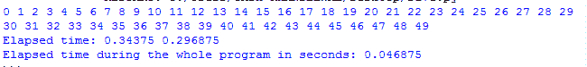
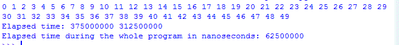

# Python 中的 time.process_time()函数

> 原文:[https://www . geesforgeks . org/time-process _ time-function-in-python/](https://www.geeksforgeeks.org/time-process_time-function-in-python/)

`**time.process_time()**`函数总是以秒为单位返回时间的浮点值。返回当前进程的系统和用户 CPU 时间之和的值(以分数秒为单位)。它不包括睡眠期间经过的时间。返回值的引用点是未定义的，因此只有连续调用的结果之间的差异是有效的。

由于**时间模块**提供各种与时间相关的功能。因此有必要导入时间模块，否则会因为`time module`中存在`time.process_time()`的定义而出错。

**示例:**了解 process_time()的用法。

```
# Python program to show time by process_time() 
from time import process_time

# assigning n = 50 
n = 50 

# Start the stopwatch / counter 
t1_start = process_time() 

for i in range(n):
    print(i, end =' ')

print() 

# Stop the stopwatch / counter
t1_stop = process_time()

print("Elapsed time:", t1_stop, t1_start) 

print("Elapsed time during the whole program in seconds:",
                                         t1_stop-t1_start) 
```

**输出:**


**process_time_ns():**
它总是以纳秒为单位给出时间的整数值。类似于 process_time()，但返回时间为纳秒。这只是基本区别。

**例:**了解`process_time_ns()`的用法。

```
# Python program to show time by process_time_ns() 
from time import process_time_ns

n = 50 

# Start the stopwatch / counter
t1_start = process_time_ns() 

for i in range(n):
    print(i, end =' ') 

print() 

# Stop the stopwatch / counter
t1_stop = process_time_ns()

print("Elapsed time:", t1_stop, t1_start)

print("Elapsed time during the whole program in nanoseconds:",
                                            t1_stop-t1_start) 
```

**输出:**


**注意:** `process_time()`与`pref_counter()`有很大不同，因为`perf_counter()`用睡眠时间计算程序时间，如果有任何中断，但 *process_counter* 只计算系统和进程期间的 CPU 时间，不包括睡眠时间。

**process _ time()的优势:**
1。process_time()提供当前进程的系统和用户 CPU 时间。
2。我们可以计算以秒和纳秒为单位的时间的浮点值和整数值。
3。每当需要计算特定进程的 CPU 所用时间时使用。