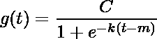
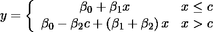
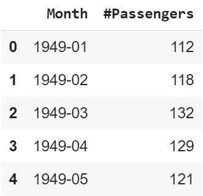
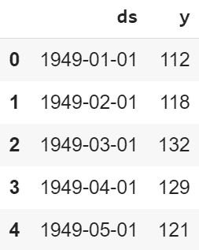
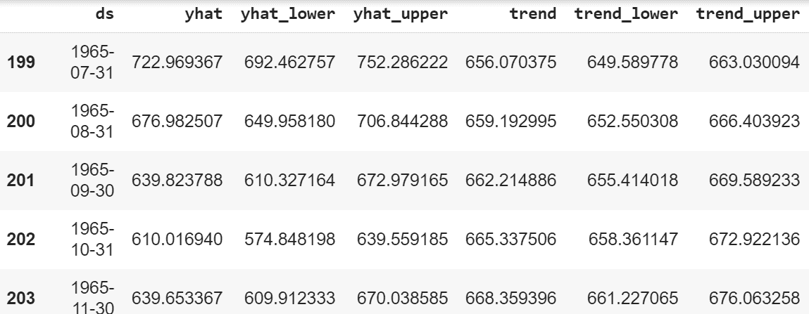
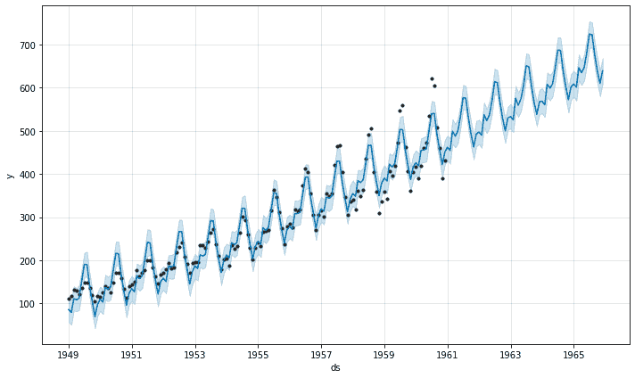
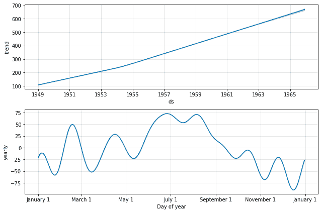
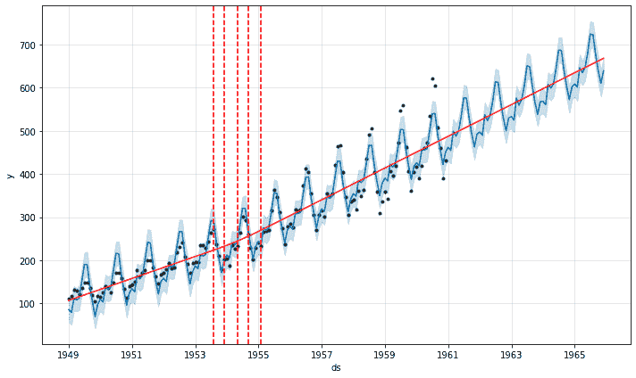

# 使用脸书先知的时间序列分析

> 原文:[https://www . geesforgeks . org/时序-分析-使用-facebook-prophet/](https://www.geeksforgeeks.org/time-series-analysis-using-facebook-prophet/)

预言家是一个来自脸书的开源工具，用于预测时间序列数据，帮助企业了解并可能预测市场。它基于一个可分解的可加性模型，其中非线性趋势与季节性相适应，它还考虑了假期的影响。在我们直接进入编码之前，让我们学习理解这一点所需的某些术语。

**趋势:**
趋势显示了数据在很长一段时间内增加或减少的趋势，它过滤掉了季节变化。

**季节性:**
季节性是指在短时间内发生的变化，其重要性不足以被称为“趋势”。

**理解先知模型**
模型的总体思路类似于[广义可加模型](https://en.wikipedia.org/wiki/Generalized_additive_model)。如上所述，“先知方程”适合趋势、季节性和节假日。这是由，

<center>**y(t) = g(t) + s(t) + h(t) + e(t)**</center>

哪里，

*   g(t)指趋势(长期变化)
*   s(t)指季节性(周期性或短期变化)
*   h(t)指假期对预测的影响
*   e(t)指的是特定于企业、个人或环境的无条件变化。它也被称为误差项。
*   y(t)是预测值。

这似乎很容易，那么**为什么我们需要像预言家这样的工具来帮助我们进行预测呢？**
我们需要它是因为，尽管基本的可分解可加模型看起来很简单，但其中各项的计算却是高度数学化的，如果你不知道自己在做什么，可能会导致做出错误的预测，这可能会在现实世界中产生严重影响。为了自动化这个过程，我们将使用先知。

然而，为了理解这个过程背后的数学和预言家实际上是如何工作的，让我们看看它是如何预测数据的。
Prophet 为我们提供了两种模型(不过，更新的模型可以根据具体需求进行编写或扩展)。一个是**逻辑增长模型**，另一个是**分段线性模型**。默认情况下，预言家使用分段线性模型，但可以通过指定模型进行更改。选择一个模式是微妙的，因为它取决于各种因素，如公司规模、增长率、商业模式等。如果要预测的数据具有饱和和非线性数据(非线性增长，达到饱和点后，几乎没有增长或收缩，仅显示一些季节性变化)，则逻辑增长模型是最佳选择。然而，如果数据显示线性属性，并且在过去有增长或收缩趋势，那么分段线性模型是更好的选择。

使用以下统计方程拟合逻辑增长模型，

(1) 

哪里，

*   c 是运载能力
*   k 是增长率
*   m 是一个偏移参数

使用以下统计方程拟合分段线性模型，

(2) 

其中 c 是趋势变化点(它定义了趋势的变化)。？是趋势参数，可以根据预测要求进行调整。

**下载数据集:**
现在让我们用一个真实的例子来运用这些知识。考虑航空乘客数据集(请打开下面的链接并保存。
[CSV 文件](https://raw.githubusercontent.com/rahulhegde99/Time-Series-Analysis-and-Forecasting-of-Air-Passengers/master/airpassengers.csv)

上述数据集包含 1949 年 1 月至 1960 年 12 月美国的航空乘客人数。数据的频率是 1 个月。现在让我们尝试建立一个模型，使用时间序列分析来预测未来五年的乘客数量。

### 装置

为数据操作和数据框架数据结构安装熊猫。

```
pip install pandas

```

安装预言家进行时间序列分析和预测。

```
pip install fbprophet

```

**注意:**如果不想在本地安装模块，可以使用 Jupyter Notebooks 或 Google Colab。
**实现:**
**代码:导入所有需要的模块**

```
import pandas as pd
from fbprophet import Prophet
from fbprophet.plot import add_changepoints_to_plot
```

**代码:阅读。先前下载的 csv 文件并显示它。**

```
data = pd.read_csv('https://raw.githubusercontent.com/rahulhegde99/Time-Series-Analysis-and-Forecasting-of-Air-Passengers/master/airpassengers.csv')
data.head()
```

**输出:**

<center></center>

脸书先知预测数据只有当它是在一个特定的格式。包含数据的数据框应具有保存为时间序列数据的 *ds* 和待预测数据的 *y* 的列。这里时间序列是*月*列，待预测数据是*#乘客*列。让我们用新的列名和相同的数据创建一个新的数据框架。另外， *ds* 应该是日期时间格式。

**代码:**

```
df = pd.DataFrame()
df['ds'] = pd.to_datetime(data['Month'])
df['y'] = data['#Passengers']
df.head()
```

<center></center>

**代码:初始化一个模型，并使我们的数据框 *df* 适合它。**

```
m = Prophet()
m.fit(df)
```

我们希望我们的模型能够预测未来 5 年，也就是到 1965 年。我们的数据频率是 1 个月，因此对于 5 年来说，是 12*5=60 个月。因此，我们需要在一个数据框中添加 60 到更多行的月度数据。
**代号:**

```
future = m.make_future_dataframe(periods=12 * 5, freq='M')
```

现在在*未来*数据帧中，我们只有 *ds* 值，我们应该预测 *y* 值。
**代码:**

```
forecast = m.predict(future)
forecast[['ds', 'yhat', 'yhat_lower', 'yhat_upper', 'trend', 'trend_lower', 'trend_upper']].tail()
```

<center>

</center>

在表 *ds* 中，我们知道，是时间序列数据。 *yhat* 为预测值， *yhat_lower* 和 *yhat_upper* 为不确定度水平(基本上是指预测值和实际值可以在不确定度水平的范围内变化)。接下来我们有*趋势*显示数据的长期增长、萎缩或停滞，*趋势 _ 下降*和*趋势 _ 上升*是不确定性水平。

**编码:绘制预测数据。**

```
fig1 = m.plot(forecast)
```

下图显示了基本预测。浅蓝色为不确定度等级(*yhat _ upper**yhat _ lower*)，深蓝色为预测( *yhat* )，黑点为原始数据。我们可以看到预测数据和实际数据非常接近。在过去的五年中，没有“实际”数据，但是观察我们的模型在有数据的年份中的表现，可以有把握地说预测接近准确。

<center></center>

```
fig2 = m.plot_components(forecast)
```

下图显示了时间序列数据的趋势和季节性(一年)。我们可以看到有增加的趋势，这意味着航空乘客的数量随着时间的推移而增加。如果我们看一下季节图，我们可以看到 6 月和 7 月是特定年份乘客最多的时间。

<center></center>

```
fig = m.plot(forecast)
a = add_changepoints_to_plot(fig.gca(), m, forecast)
```

添加变化点以指示趋势快速增长的时间。红色虚线表示乘客趋势发生快速变化的时间。

<center></center>

**Footnotes:**
Thus, we have seen how we can design a prediction model using Facebook Prophet with only a few lines of code which would have been very difficult to implement using traditional machine learning algorithms and mathematical and statistical concepts alone.