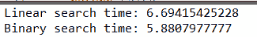
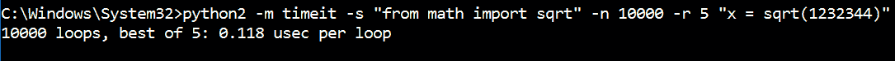
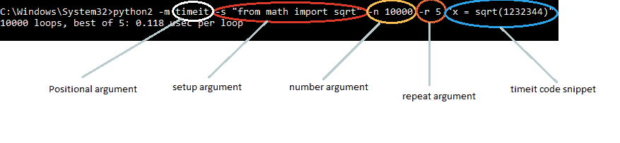

# Python 中的 Timeit 示例

> 原文:[https://www.geeksforgeeks.org/timeit-python-examples/](https://www.geeksforgeeks.org/timeit-python-examples/)

本文将向您介绍一种测量 python 代码片段执行时间的方法。
我们将使用一个内置的 python 库 [timeit](https://docs.python.org/2/library/timeit.html) 。
这个模块提供了一个简单的方法来查找 Python 代码的小部分的执行时间。

**为什么计时？**

*   嗯，用一个简单的时间模块怎么样？只需要把代码执行前后的时间省下来减去就可以了！但是这种方法并不精确，因为可能会有一个后台进程暂时运行，这会中断代码的执行，并且小代码片段的运行时间会有很大的变化。
*   timeit 运行您的代码片段数百万次(默认值为 1000000 ),因此您可以获得统计上最相关的代码执行时间度量！
*   timeit 它使用起来非常简单，有一个命令行界面和一个可调用的界面。

所以现在，让我们开始探索这个方便的图书馆吧！

模块功能 **timeit.timeit(stmt，设置，定时器，数字)**接受四个参数:

*   **stmt** 是你要衡量的语句；它默认为“通过”。
*   **设置**，这是您在运行 **stmt** 之前运行的代码；它默认为“通过”。
    我们通常用它来导入代码所需的模块。
*   **计时器**这是一个**计时器。定时器**对象；它通常有一个合理的默认值，所以你不必担心它。
*   **数字**是您希望运行 **stmt** 的执行次数。

其中 **timeit.timeit()** 函数返回执行代码所用的秒数。

**例 1**
我们先来看一个基本的例子。

## 蟒蛇 3

```
# importing the required module
import timeit

# code snippet to be executed only once
mysetup = "from math import sqrt"

# code snippet whose execution time is to be measured
mycode = '''
def example():
    mylist = []
    for x in range(100):
        mylist.append(sqrt(x))
'''

# timeit statement
print (timeit.timeit(setup = mysetup,
                     stmt = mycode,
                     number = 10000))
```

*   上述程序的输出将是传递给 **timeit.timeit()** 函数的代码片段 10000 次迭代的执行时间(以秒为单位)。
    **注意:** *注意输出的是代码片段的**次数**次迭代的执行时间，而不是单次迭代。对于单次迭代执行。时间，输出时间除以**号**。*
*   这个节目相当直白。我们需要做的就是将代码作为字符串传递给 **timeit.timeit()** 函数。
*   建议将导入语句和其他静态代码段保留在 setup 参数中。

**例 2**
我们来看另一个实际例子，我们将比较两种搜索技术，即**二分搜索法**和**线性搜索**。
同样，这里我演示了另外两个特性， **timeit.repeat** 函数和调用我们程序中已经定义的函数。

## 蟒蛇 3

```
# importing the required modules
import timeit

# binary search function
def binary_search(mylist, find):
    while len(mylist) > 0:
        mid = (len(mylist))//2
        if mylist[mid] == find:
            return True
        elif mylist[mid] < find:
            mylist = mylist[:mid]
        else:
            mylist = mylist[mid + 1:]
    return False

# linear search function
def linear_search(mylist, find):
    for x in mylist:
        if x == find:
            return True
    return False

# compute binary search time
def binary_time():
    SETUP_CODE = '''
from __main__ import binary_search
from random import randint'''

    TEST_CODE = '''
mylist = [x for x in range(10000)]
find = randint(0, len(mylist))
binary_search(mylist, find)'''

    # timeit.repeat statement
    times = timeit.repeat(setup = SETUP_CODE,
                          stmt = TEST_CODE,
                          repeat = 3,
                          number = 10000)

    # printing minimum exec. time
    print('Binary search time: {}'.format(min(times)))       

# compute linear search time
def linear_time():
    SETUP_CODE = '''
from __main__ import linear_search
from random import randint'''

    TEST_CODE = '''
mylist = [x for x in range(10000)]
find = randint(0, len(mylist))
linear_search(mylist, find)
    '''
    # timeit.repeat statement
    times = timeit.repeat(setup = SETUP_CODE,
                          stmt = TEST_CODE,
                          repeat = 3,
                          number = 10000)

    # printing minimum exec. time
    print('Linear search time: {}'.format(min(times))) 

if __name__ == "__main__":
    linear_time()
    binary_time()
```

*   上述程序的输出将是列表中的最小值**乘以**。
    示例输出是这样的:



*   下面展示如何使用命令行
*   **timeit.repeat()** 函数接受一个额外的参数， **repeat** 。输出将是重复指定次数的所有代码运行的执行时间列表。
*   在 setup 参数中，我们传递了:

```
from __main__ import binary_search
from random import randint
```

*   这将导入已经在程序中定义的函数定义 **binary_search** 和 **random** 库函数 **randint** 。
*   不出所料，我们注意到二分搜索法的执行时间明显低于线性搜索！

**示例 3**
最后，我在下面演示如何利用 **timeit** 模块的命令行界面:



在这里，我分别解释每个术语:



因此，这是对 **timeit** 模块及其实际应用的简短而简洁的介绍。
当 python 程序员需要快速浏览代码片段的执行时间时，这是一个非常方便的工具。

本文由**尼克尔·库马尔**供稿。如果你喜欢极客博客并想投稿，你也可以用 write.geeksforgeeks.org 写一篇文章或者把你的文章邮寄到 review-team@geeksforgeeks.org。看到你的文章出现在极客博客主页上，帮助其他极客。
如果你发现任何不正确的地方，或者你想分享更多关于上面讨论的话题的信息，请写评论。