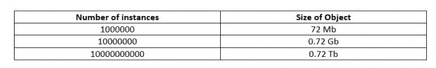
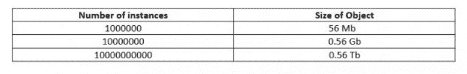
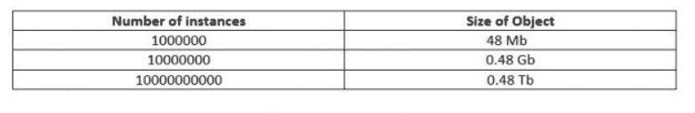
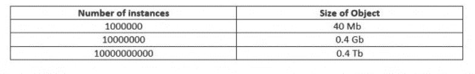

# 减小 Python 对象大小的技巧

> 原文:[https://www . geesforgeks . org/tips-to-reduce-python-object-size/](https://www.geeksforgeeks.org/tips-to-reduce-python-object-size/)

与 C 或 C++等编程语言相比，我们都知道 Python 的一个非常常见的缺点。它的速度要慢得多，不太适合执行内存密集型任务，因为 Python 对象会消耗大量内存。在处理某些任务时，这可能会导致内存问题。当内存在执行过程中因任务而过载，程序开始冻结或表现不自然时，我们称之为内存问题。

让我们看看一些方法，我们可以有效地使用这些内存，并减少对象的大小。

## 使用内置词典:

我们都非常熟悉 Python 中的[字典](https://www.geeksforgeeks.org/python-dictionary/)数据类型。这是一种以键和值的形式存储数据的方式。但是说到内存管理，字典并不是最好的。事实上，这是最糟糕的。让我们看一个例子:

```py
# importing the sys library
import sys 

Coordinates = {'x':3, 'y':0, 'z':1}

print(sys.getsizeof(Coordinates))
```

**Output:**

```py
288

```

我们看到数据类型字典的一个实例需要 288 个字节。因此，当我们有许多实例时，它将消耗大量的内存:

因此，我们得出结论，字典不适合处理内存高效的程序。

## 使用元组:

元组非常适合存储不可变的数据值，并且与字典相比，在减少内存使用方面也非常有效:

```py
import sys

Coordinates = (3, 0, 1)

print(sys.getsizeof(Coordinates))
```

**Output:**

```py
72

```

为简单起见，我们假设指数 *0，1，2* 分别代表 *x，y，z* 。因此，从 288 字节，我们下降到 72 字节，只是使用元组而不是字典。还是效率不高。如果我们有大量实例，我们仍然需要大量内存:


## 使用类别:

通过在类内部安排代码，与使用字典和元组相比，我们可以显著减少内存消耗。

```py
import sys

class Point:

    # defining the coordinate variables
    def __init__(self, x, y, z):
        self.x = x
        self.y = y
        self.z = z

Coordinates = Point(3, 0, 1)
print(sys.getsizeof(Coordinates))
```

**Output:**

```py
56

```

我们看到同一个程序现在需要 56 个字节，而不是以前的 72 个字节。变量 x、y 和 z 各消耗 8 个字节，其余 32 个字节由 Python 的内部代码消耗。如果我们有更多的实例，我们有以下分布–


因此，我们得出结论，在节省内存方面，类比字典和元组占优势。

**侧注:**Function sys . getsizeof(object[，default])规范说:“只核算直接归属于对象的内存消耗，不核算其所指对象的内存消耗。”

所以在你的例子中:

```py
class Point:

    def __init__(self, x, y, z):
        self.x = x
        self.y = y
        self.z = z

Coordinates = Point(3, 0, 1)
```

对象坐标的有效内存使用量为:
sys.getsizeof(坐标)+
sys.getsizeof(坐标. x) +
sys.getsizeof(坐标. y) +
sys.getsizeof(坐标. z) =
= 56 + 28 + 24 + 28 =
= 136

请参考[https://docs.python.org/3/library/sys.html](https://docs.python.org/3/library/sys.html)。

## 使用 recordclass:

`Recordclass`是一个相当新的 Python 库。它支持 Python 中没有的记录类型。由于`recordclass` 是麻省理工学院授权的第三方模块，我们需要通过在终端中键入以下内容来首先安装它:

```py
pip install recordclass
```

让我们使用`recordclass` 看看它是否进一步有助于减少内存大小。

```py
# importing the installed library
import sys
from recordclass import recordclass 

Point = recordclass('Point', ('x', 'y', 'z'))

Coordinates = Point(3, 0, 1)
print(sys.getsizeof(Coordinates))
```

**输出:**

```py
48
```

因此`recordclass` 的使用进一步将一个实例所需的内存从 56 字节减少到 48 字节。如果我们有大量实例，这将是分布:


## 使用数据对象:

在前面的例子中，当使用`recordclass`时，甚至垃圾值也被收集，从而浪费了不必要的内存。这意味着仍有优化的空间。那正是数据对象开始使用的时候。dataobject 功能属于 recordclass 模块，它的一个特点是不会产生任何垃圾值。

```py
import sys
from recordclass import make_dataclass

Position = make_dataclass('Position', ('x', 'y', 'z'))
Coordinates = Position(3, 0, 1)

print(sys.getsizeof(Coordinates))
```

**输出:**

```py
40
```

最后，我们看到大小从每个实例 48 字节减少到每个实例 40 字节。因此，当内存利用率最低时，我们发现 dataobjects 是组织代码的最有效方式。
