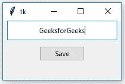
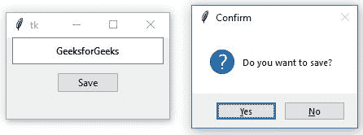
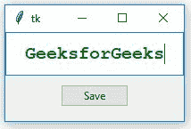

# Tkinter |使用 ttk 为输入文本添加样式。入口小部件

> 原文:[https://www . geesforgeks . org/tkinter-向输入文本添加样式-使用-ttk-entry-widget/](https://www.geeksforgeeks.org/tkinter-adding-style-to-the-input-text-using-ttk-entry-widget/)

[Tkinter](https://www.geeksforgeeks.org/python-gui-tkinter/) 是一个 GUI(图形用户界面)模块，广泛用于创建 GUI 应用程序。它与 Python 本身一起出现。

**入口小部件**用于从用户处获取入口。它可以被创建如下-

```
 entry = ttk.Entry(master, option = value, ...) 
```

**代码#1:** 创建条目小部件并从用户处获取输入(仅获取字符串数据)。

```
# importing tkinter
from tkinter import * 
from tkinter import ttk
from tkinter.messagebox import askyesno

# creating root
root = Tk()

# specifying geometry
root.geometry('200x100')

# This is used to take input from user
# and show it in Entry Widget.
# Whatever data that we get from keyboard
# will be treated as string.
input_text = StringVar()

entry1 = ttk.Entry(root, textvariable = input_text, justify = CENTER)

# focus_force is used to take focus
# as soon as application starts
entry1.focus_force()
entry1.pack(side = TOP, ipadx = 30, ipady = 6)

save = ttk.Button(root, text = 'Save', command = lambda : askyesno(
                                'Confirm', 'Do you want to save?'))
save.pack(side = TOP, pady = 10)

root.mainloop()
```

**输出:**




在上面的输出中，只要您运行代码，就会出现一个[Tkit](https://www.geeksforgeeks.org/python-gui-tkinter/)窗口，并且入口小部件已经聚焦，这意味着我们不必将焦点放在入口区域。
当我们按下[按钮](https://www.geeksforgeeks.org/python-creating-a-button-in-tkinter/)时，会出现一条确认信息，提示是否要保存文字(不会保存文字，仅用于显示按钮的功能)。

**代码#2:** 在条目小部件中为输入的文本添加样式。

```
# importing tkinter
from tkinter import * 
from tkinter import ttk
from tkinter.messagebox import askyesno

# creating root
root = Tk()
root.geometry('200x100')

input_text = StringVar()

# This class is used to add styling
# to any widget which are available
style = ttk.Style()
style.configure('TEntry', foreground = 'green')

entry1 = ttk.Entry(root, textvariable = input_text, justify = CENTER,
                                     font = ('courier', 15, 'bold'))   
entry1.focus_force()
entry1.pack(side = TOP, ipadx = 30, ipady = 10)

save = ttk.Button(root, text = 'Save', command = lambda : askyesno(
                                 'Confirm', 'Do you want to save?'))
save.pack(side = TOP, pady = 10)

root.mainloop()
```

**输出:**

在上面的输出中，您可能会注意到字体的颜色发生了变化，字体系列发生了变化，文本的大小比正常情况下更大，以及文本以粗体显示。这是因为我们正在给输入文本添加样式。