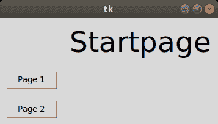
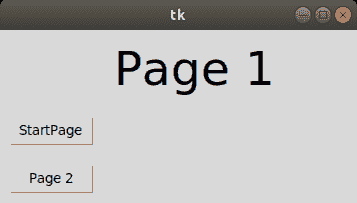

# 使用应用程序在不同的页面框架之间切换

> 原文:[https://www . geesforgeks . org/tkinter-应用程序在不同页面框架之间切换/](https://www.geeksforgeeks.org/tkinter-application-to-switch-between-different-page-frames/)

**先决条件:**[Python GUI–tkinter](https://www.geeksforgeeks.org/python-gui-tkinter/)T4】

有时，我们需要创建一个带有几个弹出对话框的应用程序，即页面框架。以下是创建多个 Tkinter 页面框架并链接它们的一步一步的过程！这可以作为更复杂的 python 图形用户界面应用程序的样板，例如为实验、教室等虚拟实验室创建界面。

以下是步骤:

*   创建三个不同的页面。这里我们有三个不同的页面，起始页作为主页，第一页和第二页。
*   为每个页面框架创建一个容器。
*   我们有四节课。首先是 tkinterApp 类，我们已经初始化了三个框架，并定义了一个函数 show_frame，每次用户点击按钮时都会调用这个函数。
*   开始页面很简单，有两个按钮可以转到第 1 页和第 2 页。
*   第 1 页有两个按钮，一个用于第 2 页，另一个用于返回起始页。
*   第 2 页还有两个按钮，一个用于第 1 页，另一个用于返回开始页。
*   这是一个在 This 框架之间导航的简单应用程序。
*   这可以作为更复杂应用程序的样板，并且可以添加几个特性。

该应用程序以开始页面作为第一页，如类 tkinterApp 所示。在 StartApp 中，这里有两个按钮。点击一个按钮，您将进入相应的页面。您可以向这些页面添加图像和图形，并添加复杂的功能。页面也有两个按钮。每次按下按钮，就会调用 show_frame，显示相应的页面。
下面是实现。

## 蟒蛇 3

```
import tkinter as tk
from tkinter import ttk

LARGEFONT =("Verdana", 35)

class tkinterApp(tk.Tk):

    # __init__ function for class tkinterApp
    def __init__(self, *args, **kwargs):

        # __init__ function for class Tk
        tk.Tk.__init__(self, *args, **kwargs)

        # creating a container
        container = tk.Frame(self) 
        container.pack(side = "top", fill = "both", expand = True)

        container.grid_rowconfigure(0, weight = 1)
        container.grid_columnconfigure(0, weight = 1)

        # initializing frames to an empty array
        self.frames = {} 

        # iterating through a tuple consisting
        # of the different page layouts
        for F in (StartPage, Page1, Page2):

            frame = F(container, self)

            # initializing frame of that object from
            # startpage, page1, page2 respectively with
            # for loop
            self.frames[F] = frame

            frame.grid(row = 0, column = 0, sticky ="nsew")

        self.show_frame(StartPage)

    # to display the current frame passed as
    # parameter
    def show_frame(self, cont):
        frame = self.frames[cont]
        frame.tkraise()

# first window frame startpage

class StartPage(tk.Frame):
    def __init__(self, parent, controller):
        tk.Frame.__init__(self, parent)

        # label of frame Layout 2
        label = ttk.Label(self, text ="Startpage", font = LARGEFONT)

        # putting the grid in its place by using
        # grid
        label.grid(row = 0, column = 4, padx = 10, pady = 10)

        button1 = ttk.Button(self, text ="Page 1",
        command = lambda : controller.show_frame(Page1))

        # putting the button in its place by
        # using grid
        button1.grid(row = 1, column = 1, padx = 10, pady = 10)

        ## button to show frame 2 with text layout2
        button2 = ttk.Button(self, text ="Page 2",
        command = lambda : controller.show_frame(Page2))

        # putting the button in its place by
        # using grid
        button2.grid(row = 2, column = 1, padx = 10, pady = 10)

# second window frame page1
class Page1(tk.Frame):

    def __init__(self, parent, controller):

        tk.Frame.__init__(self, parent)
        label = ttk.Label(self, text ="Page 1", font = LARGEFONT)
        label.grid(row = 0, column = 4, padx = 10, pady = 10)

        # button to show frame 2 with text
        # layout2
        button1 = ttk.Button(self, text ="StartPage",
                            command = lambda : controller.show_frame(StartPage))

        # putting the button in its place
        # by using grid
        button1.grid(row = 1, column = 1, padx = 10, pady = 10)

        # button to show frame 2 with text
        # layout2
        button2 = ttk.Button(self, text ="Page 2",
                            command = lambda : controller.show_frame(Page2))

        # putting the button in its place by
        # using grid
        button2.grid(row = 2, column = 1, padx = 10, pady = 10)

# third window frame page2
class Page2(tk.Frame):
    def __init__(self, parent, controller):
        tk.Frame.__init__(self, parent)
        label = ttk.Label(self, text ="Page 2", font = LARGEFONT)
        label.grid(row = 0, column = 4, padx = 10, pady = 10)

        # button to show frame 2 with text
        # layout2
        button1 = ttk.Button(self, text ="Page 1",
                            command = lambda : controller.show_frame(Page1))

        # putting the button in its place by
        # using grid
        button1.grid(row = 1, column = 1, padx = 10, pady = 10)

        # button to show frame 3 with text
        # layout3
        button2 = ttk.Button(self, text ="Startpage",
                            command = lambda : controller.show_frame(StartPage))

        # putting the button in its place by
        # using grid
        button2.grid(row = 2, column = 1, padx = 10, pady = 10)

# Driver Code
app = tkinterApp()
app.mainloop()
```

**输出:**





<video class="wp-video-shortcode" id="video-406337-1" width="640" height="360" preload="metadata" controls=""><source type="video/mp4" src="https://media.geeksforgeeks.org/wp-content/uploads/20210214173844/FreeOnlineScreenRecorderProject2.mp4?_=1">[https://media.geeksforgeeks.org/wp-content/uploads/20210214173844/FreeOnlineScreenRecorderProject2.mp4](https://media.geeksforgeeks.org/wp-content/uploads/20210214173844/FreeOnlineScreenRecorderProject2.mp4)</video>