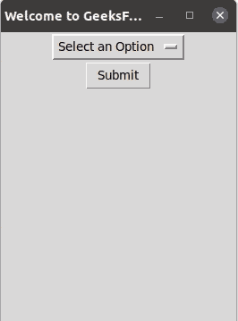

# tkinter–选项菜单小部件

> 哎哎哎:# t0]https://www . geeksforgeeks . org/tkinter-option menu widget/

**先决条件:** [Python GUI -tkinter](https://www.geeksforgeeks.org/python-gui-tkinter/)

构建基于图形用户界面的应用程序最流行的 Python 模块之一是 Tkinter 模块。它附带了许多功能，如按钮、文本框、标签，用于图形用户界面应用程序，这些被称为小部件。在本文中，我们将了解什么是选项菜单小部件以及何时使用它。

## **什么是选项菜单小部件？**

OptionMenu 基本上是一个下拉菜单或弹出菜单，通过点击或键盘事件显示一组对象，并允许用户一次选择一个选项。

**进场:**

1.  导入 Tkit 模块。
2.  创建默认窗口
3.  创建一个在下拉菜单/弹出菜单中显示的选项列表。
4.  使用创建变量。方法来跟踪在选项菜单中选择的选项。为其设置默认值。
5.  创建选项菜单小部件，并将创建的选项列表和变量传递给它。

**下面是实现:**

## 蟒蛇 3

```py
# Import the tkinter module
import tkinter

# Create the default window
root = tkinter.Tk()
root.title("Welcome to GeeksForGeeks")
root.geometry('700x500')

# Create the list of options
options_list = ["Option 1", "Option 2", "Option 3", "Option 4"]

# Variable to keep track of the option
# selected in OptionMenu
value_inside = tkinter.StringVar(root)

# Set the default value of the variable
value_inside.set("Select an Option")

# Create the optionmenu widget and passing 
# the options_list and value_inside to it.
question_menu = tkinter.OptionMenu(root, value_inside, *options_list)
question_menu.pack()

# Function to print the submitted option-- testing purpose

def print_answers():
    print("Selected Option: {}".format(value_inside.get()))
    return None

# Submit button
# Whenever we click the submit button, our submitted
# option is printed ---Testing purpose
submit_button = tkinter.Button(root, text='Submit', command=print_answers)
submit_button.pack()

root.mainloop()
```

**输出:**



**说明:**

在输出图形用户界面窗口中，创建了一个选项菜单小部件，它包含给定的默认值“选择一个选项”。单击时，它会显示包含给定选项列表的下拉列表。