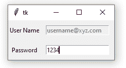

# Tkinter–只读入口小部件

> 原文:[https://www . geesforgeks . org/tkinter-只读-入口-小部件/](https://www.geeksforgeeks.org/tkinter-read-only-entry-widget/)

Python 有许多开发图形用户界面应用程序的框架，如 PyQT、Kivy、Jython、WxPython、PyGUI 和 Tkinter。Python [tkinter](https://www.geeksforgeeks.org/python-gui-tkinter/) 模块提供了多种选项来开发基于 GUI 的应用程序。Tkinter 是开源的，可以在 Python 许可下获得。Tkinter 提供了开发图形用户界面应用程序的最简单和最快的方法。Tkinter 支持不同的小部件，其中 Entry 小部件用于接受用户的输入。然而，在某些情况下，某个文本需要为只读格式，以防止用户更改。这可以通过入口小部件和入口小部件下的各种可用选项来实现。

在本文中，我们将看到 this 变量的使用。Python 变量可以用于 Tkinter 小部件，但不能提供 Tkinter 变量提供的灵活性。 [Tkinter 变量](https://www.geeksforgeeks.org/tracing-tkinter-variables-in-python/)有一个称为“跟踪”的独特功能，可用于跟踪对相关变量所做的更改。这对于跟踪工作时对变量的意外更改非常有用。下面的代码演示了如何使用 Tkinter 创建只读的 Entry 小部件。

1.  **导入 tkinter module**

```
import tkinter
```

*   **导入 tkinter 子模块**

    ```
    from tkinter import *
    ```

    *   **Creating the parent widget**

    ```
    root = Tk()
    ```

    **语法:** Tk(screenName=None，baseName=None，className='Tk '，useTk=1)
    **参数:**在本例中，Tk 类是不带参数实例化的。
    **说明:**
    该方法创建一个顶部有关闭、最大化和最小化按钮的空白父窗口。

    *   **Creating Labels for the entry widgets and positioning the labels in the parent widget**

    ```
    L1 = Label(root, text="User Name")
    L1.grid(row=0, column=0)
    L2 = Label(root, text="Password")
    L2.grid(row=1, column=0)
    ```

    **语法:**标签(主，* *选项)
    **参数:**

    *   **主控:**父窗口(根)充当主控。
    *   **选项:**Label()方法支持的选项有文本、锚点、bg、位图、bd、光标、字体、fg、高度、宽度、图像、对齐、浮雕、padx、pady、textvariable、下划线和 wraplength。这里，文本选项用于显示条目小部件的名称。

    **说明:**
    标签小部件用于显示小部件对应的文本或图像。可以使用标签小部件支持的其他选项进一步格式化屏幕上显示的文本。

    **语法:**网格(* *选项)
    **参数:**

    *   **选项:**grid()方法下可用的选项，可用于改变小部件在父小部件中的位置，包括 row、rowspan、columnspan、padx、pady、ipadx、ipady 和 sticky。

    **解释:**
    grid()方法将父窗口拆分为行和列，就像二维表格一样。这里 grid()方法指定了标签小部件在父窗口上的位置。

    *   **Creating a Tkinter variable for the Entry widget**

    ```
    mystr = StringVar()
    ```

    **语法:**string var()
    T3】参数:构造函数不接受参数。若要设置该值，请使用 set()方法。
    **说明:**
    StringVar 是 Tkinter 内置的变量类之一。StringVar()的默认值是空字符串“”。

    *   **设置字符串值**

```
mystr.set('username@xyz.com')
```

**语法:**集合(字符串)
T3】参数:

*   **字符串:**表示与小部件(此处为“条目”小部件)相关联的文本

**说明:**
由于 StringVar 类构造函数在对象创建过程中不接受任何参数，因此使用 set()方法来更改 StringVar 类变量的值。每当需要更改字符串值并且更改的值自动反映在关联的小部件中时，就会调用此方法。

*   **Creating Entry widget**

    > entry = Entry(textvariable=mystr，state=DISABLED)。grid(row=0，column=1，padx=10，pady = 10)
    > mystr . set(' username @ XYZ . com ')
    > passwd = Entry()。网格(行=1，列=1，padx=10，pady=10)

    **语法:**入口(主，* *选项)
    **参数:**

    *   **master:** 代表父 widget(此处为 root)。
    *   **选项:【Entry 小部件下可用的选项有 bg、bd、command、cursor、font、exportselection、alignment、relief、highlightcolor、fg、selectbackground、selectforeground、selectborderwidth、show、xscrollcommand、state、textvariable 和 width。**

    **解释:**
    这个方法在父小部件上创建一个 Entry 小部件。条目小部件“条目”处于禁用状态，这意味着它处于只读模式，用户无法更改。但是，入口小部件“passwd”处于正常状态，接受来自用户的输入，如果需要，可以对其进行更改。grid()方法将条目小部件定位在父小部件中。

    *   **Run the application**

    ```
    mainloop()
    ```

    **语法:** mainloop()
    **解释:**
    main loop()基本上就像一个无限循环。它用于运行应用程序。

    **完成程序**

    ```
    import tkinter
    from tkinter import *

    root = Tk()

    L1 = Label(root, text="User Name")
    L1.grid(row=0,column=0)
    L2 = Label(root, text="Password")
    L2.grid(row=1,column=0)

    mystr = StringVar()
    mystr.set('username@xyz.com')

    entry = Entry(textvariable=mystr, 
                  state=DISABLED).grid(row=0,
                                       column=1,
                                       padx=10,
                                       pady=10)

    passwd = Entry().grid(row=1,column=1,
                          padx=10,pady=10)
    mainloop()
    ```

    **输出**
    