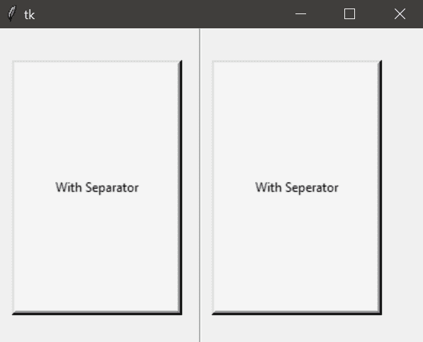
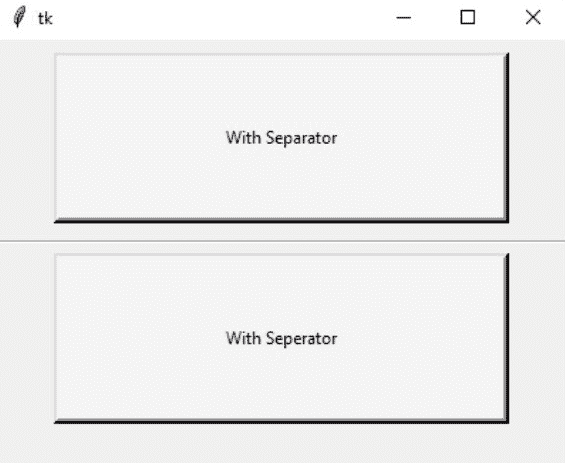
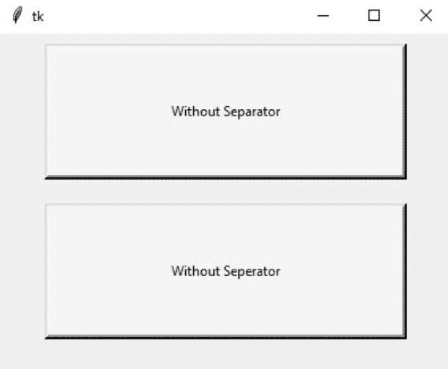

# tkinter─分离器元件

> 原文:[https://www.geeksforgeeks.org/tkinter-separator-widget/](https://www.geeksforgeeks.org/tkinter-separator-widget/)

*Tkinter* 支持多种小部件，让 GUI 越来越有吸引力和功能性。分隔符小部件用于划分 *tkinter* 小部件，如*标签、按钮*等。使用这个小部件，我们可以使我们的设计更加吸引人和直观。现在我们将看到如何实现这个小部件。

**语法:**

> **分离器(**主**、**东方 **)**
> 
> **参数:**
> 
> *   **主:**父小部件或主 Tk()对象
> *   **方向:**垂直或水平

### 以下是描述在 Tkinter 中使用分隔符小部件的程序:

**垂直方向:**

## 蟒蛇 3

```
# Python program to
# Illustrate Separator
# widget

# Import required modules
from tkinter import *
from tkinter import ttk

# Main tkinter window
x = Tk()
x.geometry("400x300")

# Label Widget
b = Label(x, bg="#f5f5f5", bd=4, relief=RAISED, text="With Separator")
b.place(relx=0.03, rely=0.1, relheight=0.8, relwidth=0.4)

# Separator object
separator = ttk.Separator(x, orient='vertical')
separator.place(relx=0.47, rely=0, relwidth=0.2, relheight=1)

# Label Widget
a = Label(x, bg="#f5f5f5", bd=4, relief=RAISED, text="With Separator")
a.place(relx=0.5, rely=0.1, relheight=0.8, relwidth=0.4)

mainloop()
```

**输出:**



在上面的程序中，将只生成不带分隔符的垂直输出。然而，一个没有分隔符的 *tkinter* 窗口看起来是这样的:


**水平方向:**

## 蟒蛇 3

```
# Python program to
# Illustrate Separator
# widget

# Import required modules
from tkinter import *
from tkinter import ttk

# Main tkinter window
x = Tk()
x.geometry("400x300")

# Label Widget
b = Label(x, bg="#f5f5f5", bd=4, relief=RAISED, text="With Separator")
b.place(relx=0.1, rely=0.05, relheight=0.4, relwidth=0.8)

# Separator object
separator = ttk.Separator(x, orient='horizontal')
separator.place(relx=0, rely=0.47, relwidth=1, relheight=1)

# Label Widget
a = Label(x, bg="#f5f5f5", bd=4, relief=RAISED, text="With Separator")
a.place(relx=0.1, rely=0.5, relheight=0.4, relwidth=0.8)

mainloop()
```

**输出:**



在上面的程序中，将只生成不带分隔符的水平输出。然而，一个没有分隔符的 *tkinter* 窗口看起来是这样的:

