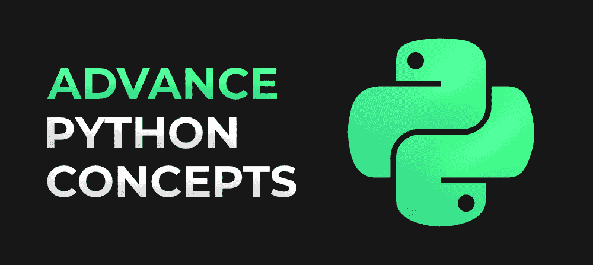

# 您必须了解的十大高级 Python 概念

> 原文:[https://www . geesforgeks . org/top-10-advance-python-concepts-你必须知道的/](https://www.geeksforgeeks.org/top-10-advance-python-concepts-that-you-must-know/)

Python 是一种高级的、面向对象的编程语言，由于它的通用性、动态性、健壮性以及易于学习，最近被许多学生和专业人士所采用。不仅如此，它现在是仅次于 JavaScript 的第二受欢迎和首选的语言，可以用于几乎所有技术领域，无论是机器学习、数据科学、web 开发、分析、自动化、测试、人工智能等等。

[**【学习 Python】**](https://www.geeksforgeeks.org/best-way-to-start-learning-python-a-complete-roadmap/)与其他高级、面向对象的编程语言(如 Java 或 c++)相比很容易，但它有一些高级概念，在开发健壮、简洁、高度优化、高效和规范化的代码时会派上用场。在代码中使用这些概念，您将能够减少代码中的错误并提高效率，从而使您成为经验丰富的 Python 程序员。所以让我们一个一个来看这些概念，详细了解一下！

### [1。地图功能](https://www.geeksforgeeks.org/python-map-function/)

Python 有一个名为 *map()* 的内置函数，它允许我们在不显式使用循环构造的情况下处理 iterable 中的所有元素。使用时，它返回一个 map 对象，该对象又是一个迭代器。这个映射对象是通过将指定的函数应用于 iterable 中的每个项目而获得的结果。

> **函数定义–**必需 _ 答案=映射(函数，可迭代)

***map()函数接受两个参数:***

*   第一个参数是一个函数，它将应用于可迭代表中的每个元素。
*   第二个参数是函数要映射到的可迭代本身。

### 2.[刀具](https://www.geeksforgeeks.org/python-itertools/)

Python 有一个叫做 itertools 的令人惊叹的标准库，它提供了许多函数，这些函数有助于编写干净、快速和内存高效的代码，这是由于懒惰的评估造成的。这是一个 Python 模块，实现了各种迭代器构建块，它们一起形成了“迭代器代数”，这使得用 Python 语言高效构建工具成为可能。itertools 中的函数处理迭代器本身，而迭代器又返回更复杂的迭代器。itertools 中函数的一些例子有:count()、cycle()、repeat()、累加()、乘积()、置换()、组合()等。每个人都有自己的一套论点，并根据这些论点进行操作。与使用传统代码时获得的结果相比，生成结果的速度要快得多。

### 3.[λ功能](https://www.geeksforgeeks.org/python-lambda-anonymous-functions-filter-map-reduce/)

Python 的 lambda 函数是小型匿名函数，因为它们没有名称，并且包含在一行代码中。关键字“def”用于定义 Python 中的函数，但是 lambda 函数是由关键字“lambda”定义的。它们可以接受任意数量的参数，但表达式的数量只能是一个。对于简单的逻辑操作，它使代码简洁易读，并且最好在只需要使用函数一次时使用。

> **功能定义–**必需 _ 答案=λ..参数:表达式

### 4.[异常处理](https://www.geeksforgeeks.org/python-exception-handling/)

异常是程序执行时发生的错误类型，它改变了程序的正常流程。一个例子可以是将一个数除以零，或者引用一个超出可迭代范围的索引。所以我们用*试试*、*除了*、*T5、*最后*来处理 Python 中的异常。关键字 try 用于包装一个可能抛出错误的代码块，*除外*用于包装一个异常时要执行的代码块并处理错误，*最后*让我们无论如何都要执行代码。*

### 5.[装修商](https://www.geeksforgeeks.org/decorators-in-python/)

装饰器是 Python 元编程的一部分，用于向现有代码添加附加功能，而不会在编译时改变原始结构。它更像是 Python 中的一个常规函数，可以被调用并返回一个可调用的。它接受一个函数，通过添加功能来修改它，然后返回它。

### 6.[收藏](https://www.geeksforgeeks.org/python-collections-module/)

Python 中的集合是通用的内置容器，如集合、元组、字典和列表。Python collections 是一个实现专用容器数据类型的模块。集合包括 namedtuple()函数，它是一个用命名字段创建元组子类的函数，OrderedDict 是一个 Dict 子类，它记住了由于 Python dict 没有排序而添加的顺序条目，Counter 用于计数 hashable 对象，ChainMap 用于创建多个映射的单个视图，等等。

### 7.[发电机](https://www.geeksforgeeks.org/generators-in-python/)

Python 中的生成器是一种特殊类型的函数，它不是返回单个值，而是返回一个迭代器对象，该对象是一系列值。这是一个创建自己的迭代器函数的实用程序。关键字 yield 用在*生成器*函数中，而不是暂停其执行的*返回*关键字。yield 和 return 之间的区别在于 return 会终止函数，但是 yield 只会暂停函数的执行，并且每次都会返回与之对应的值。

### 8.[魔法方法](https://www.geeksforgeeks.org/dunder-magic-methods-python/)

魔术方法也被称为 Dunder(或双下划线)方法，是内部调用的特殊类型的函数。它们以双下划线开始和结束。一些例子包括 __add__()，__abs__()，__round__()，__floor__()，__str__()，__trunc__()，_ _ lshift _ _()等。表达式**数字+ 5** 与数字相同。__add__(5)这是由其他方法或动作在内部调用的。您可以直接使用这些函数，因为这将减少代码的运行时间，因为现在由于直接使用，我们将减少每次的函数调用。

### 9.[穿线](https://www.geeksforgeeks.org/multithreading-python-set-1/)

线程是可由操作系统调度的最小单元或进程。Python 包含线程类，它有助于多线程编程。多线程主要用于在很大程度上加速计算，因为现在将有多个线程执行任务。要在 Python 中实现线程，您需要使用*线程*模块(因为*线程*模块已被弃用)。

### 10.[正则表达式](https://www.geeksforgeeks.org/ruby-regular-expressions/)

Python 正则表达式或 RegEx 是包含特定字符作为匹配模式的表达式。它用于检查一个字符串或一组字符串是否包含特定的模式。它非常强大、优雅、简洁，而且速度很快。要使用 Python 的正则表达式，需要导入 *re* 模块，该模块包含帮助模式匹配的函数，如 findall()、search()、split()等。

这些是作为一名经验丰富的 Python 开发人员必须了解的顶级高级 Python 概念。这些不仅会让你成为一名优秀的程序员和开发人员，还会提高代码的可读性，让它变得更快。