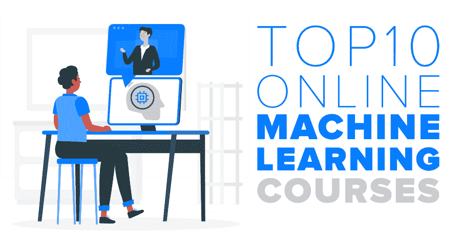

# 2020 年机器学习十大在线课程

> 原文:[https://www . geesforgeks . org/top-10-2020 年机器学习在线课程/](https://www.geeksforgeeks.org/top-10-online-courses-for-machine-learning-in-2020/)

机器学习是当今计算机科学中最受欢迎的领域！它是新兴技术之一，不同行业的许多公司都采用了它。所以如果你想学习这项技术，这并不令人震惊。但是，如果你不想上大学，因为你是一个工作的专业人士，或者不想花很多钱获得学位，不要担心！Coursera、edX、Udemy 等平台上有很多**在线课程**。来自世界上最好的大学，由知名人士执教。

可以轻松学习 [**【机器学习】**](https://www.geeksforgeeks.org/machine-learning/) 的基础知识，然后在项目中实现这些概念。如果你想找份新工作或转行，或者只是想学点新东西，这些课程可以成为你很好的垫脚石！这篇文章展示了一些最受欢迎的课程。您可能需要付费才能获得完成课程的官方证书，但您可以免费获取所有课程材料。所以现在让我们来看看这些课程吧！

### [1。斯坦福大学机器学习(Coursera)](https://www.coursera.org/learn/machine-learning)

这是网上最有名的机器学习课程！该课程由百度前首席科学家、谷歌大脑深度学习项目主任吴恩达教授，旨在教授机器学习算法的理论方面以及实际实现。本机器学习课程涵盖一元线性回归、多元线性回归、逻辑回归、正则化、神经网络、支持向量机、无监督学习等。你可以用 Octave 或者 MATLAB 来学习。本课程为期 11 周，涵盖了机器学习的多个方面和应用。您还可以学习将这些学习算法应用于计算机视觉、数据库挖掘、文本理解、创建机器人等。完成本课程后，您将获得一份可共享证书，可显示在您的简历或领英个人资料中。

### [2。通过深度学习实现深度学习专业化](https://www.coursera.org/specializations/deep-learning)

这是吴恩达在您完成机器学习课程后提供的深度学习高级专业。这将教你更多关于深度学习的话题，如卷积网络、递归神经网络、长短期记忆(LSTM)、自然语言处理等。本课程还将提供深度学习中许多顶级领导者的个人故事和职业建议，这将丰富您的经验。这个深度学习专业有 5 门课程，包括神经网络和深度学习、改进深度神经网络、构造机器学习项目、卷积神经网络和序列模型。您还将在自动驾驶、医疗保健、自然语言处理、音乐生成等许多不同领域创建深度学习模型。完成专业课程中的每一门课程后，您将获得一份可共享证书，该证书可以显示在您的简历或 LinkedIn 个人资料中。

### [3。IBM (Coursera)用 Python 进行机器学习](https://www.coursera.org/learn/machine-learning-with-python)

本课程旨在教您使用 Python 进行机器学习。首先，您将学习机器学习的基础知识及其在现实世界中的应用，然后继续学习机器学习算法，如回归、分类、聚类算法。本课程分为六周，每周重点介绍机器学习、回归算法(包括线性、非线性、简单和多元回归)、分类算法(包括 SVM、决策树、KNN、逻辑回归等)。，聚类算法，包括层次聚类，基于分区的聚类，基于密度的聚类，推荐系统，最后一周包含一个最终项目，将利用你所学的一切。完成本课程后，您将获得一份可共享证书，可显示在您的简历或领英个人资料中。

### [4。华盛顿大学机器学习专业(Coursera)](https://www.coursera.org/specializations/machine-learning)

该机器学习专业旨在使用理论知识和实际案例研究来教授最大似然方法，这些案例研究将教你回归算法、分类算法、聚类算法、信息检索等。因此，这个专业将教你创建智能应用程序，分析大型数据集等。利用机器学习的力量。该专业分为四门课程，包括机器学习基础、使用预测房价的案例研究教授的回归、使用情绪分析的案例研究教授的分类以及使用类似文档发现的案例研究教授的聚类和检索。该专业大约需要 7 个月的时间来完成，完成每门课程后，您将获得一份可共享证书，该证书可以显示在您的简历或领英个人资料中。

### [5。ColumbiaX (edX)的数据科学和分析机器学习](https://www.edx.org/course/machine-learning-for-data-science-and-analytics)

哥伦比亚大学的这门课程旨在教你机器学习的基础及其不同的算法。它还将允许您通过理解机器学习的原理，使用预测分析获得现实问题的解决方案。本课程将重点介绍机器学习算法，如单变量线性回归、多变量线性回归、逻辑回归、支持向量机、无监督学习等。以及如何通过数据分析和使用主题建模来进行数据预测，以发现大量数据中隐藏的意义。在本课程结束时，您将获得 edX 和 ColumbiaX 颁发的教师签名证书，以展示您在数据科学和分析机器学习方面的知识。

### [6。IBM (edX)用 Python 进行机器学习](https://www.edx.org/course/machine-learning-with-python-a-practical-introduct)

本课程旨在教您使用 Python 进行机器学习。首先，您将使用 Python 学习机器学习的基础知识，并使用在线实验室将这些理论知识转化为实践技能。本课程分为五周，每周重点介绍机器学习、回归算法(包括线性、非线性和模型评估方法)、分类算法(包括 K 近邻、逻辑回归、决策树、支持向量机等)。无监督学习，包括层次聚类、K-Means 聚类和基于密度的聚类和推荐系统。在本课程结束时，您将获得 edX 和 IBM 颁发的教师签名证书，以展示您使用 Python 进行机器学习的知识。

### [7。HarvardX 机器学习(edX)](https://www.edx.org/course/data-science-machine-learning)

本课程旨在通过创建一个电影推荐系统来教你机器学习的基础知识以及不同的学习算法、主成分分析和正则化。您还将学习数据分析和培训数据，以获得有用的见解。本课程将重点介绍机器学习算法，如单变量线性回归、多变量线性回归、逻辑回归、支持向量机、无监督学习等。以及教你交叉验证以避免过度训练数据。在本课程结束时，您将获得 edX 和 HarvardX 颁发的教师签名证书，以展示您在数据科学和分析机器学习方面的知识。

### [8。微软机器学习原理(edX)](https://www.edx.org/course/principles-of-machine-learning-python-edition-2)

本课程教你机器学习的基本原理，这些原理是用理论来教授的，然后是使用创建和部署机器学习模型的实践经验。您可以使用 Python 和 Azure Notebooks 来构建这些模型并获得数据洞察。本课程介绍机器学习，让您熟悉数据探索、数据准备、机器学习算法(包括监督和非监督学习)以及提高模型性能。在本课程结束时，您将获得 edX 和微软颁发的教师签名证书，以展示您在数据科学和分析机器学习方面的知识。

### [9。机器学习 A-Z:实践 Python&R In Data Science(Udemy)](https://www.udemy.com/course/machinelearning/)

顾名思义，这门课程旨在从 A-Z 开始教你机器学习和数据科学的基础知识！这门课程非常适合想学习机器学习和数据科学的学生，或者想在这些领域发展的专业人士。机器学习 A-Z 教授 Python 和 R 上的机器学习，侧重于更具体的主题，如深度学习、强化学习、自然语言处理等。本课程的内容结构包括数据预处理、回归、分类、聚类、关联规则学习、强化学习、自然语言处理、深度学习、降维和模型选择与增强等主题。完成课程后，您将获得一份结业证书，该证书可以显示在您的简历、LinkedIn 个人资料等上。

### [10。数据科学和机器学习 Python 训练营(Udemy)](https://www.udemy.com/course/python-for-data-science-and-machine-learning-bootcamp/)

数据科学和机器学习 Python 训练营将教你如何使用数据科学和机器学习 Python 以及各种 Python 库。您将使用熊猫进行数据分析，SciKit-Learn 进行机器学习，Seaborn 进行数据可视化绘图，Spark 进行大数据分析，Plotly 进行交互式动态可视化，Matplotlib 进行 Python 绘图 [NumPy](https://www.geeksforgeeks.org/numpy-in-python-set-1-introduction/) 进行数值数据，等等。您还将学习各种机器学习算法，如逻辑回归、线性回归、随机森林和决策树、支持向量机、神经网络等。以及数据库的 SQL。本课程是 Udemy 上最详细的数据科学和机器学习课程之一，每节课有 100 多节高清视频课和详细的代码笔记本。完成课程后，您将获得结业证书，证明您在数据科学和机器学习方面的知识。