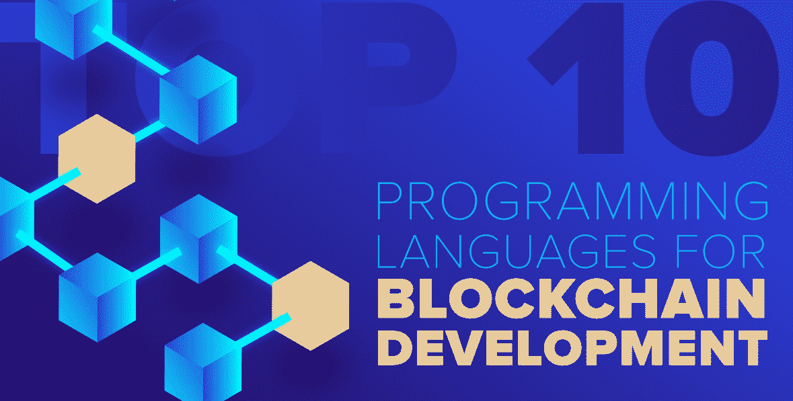

# 区块链开发十大编程语言

> 原文:[https://www . geeksforgeeks . org/top-10-面向区块链的编程语言-发展/](https://www.geeksforgeeks.org/top-10-programming-languages-for-blockchain-development/)

你有没有想过区块链的突然出现和流行？这是什么？嗯，区块链顾名思义就是区块链！只是这里的“块”是用密码学连接起来的数字信息。这些块中的每一个都包含一个链接到前一个块的**加密散列函数**，一个**时间戳**，以及块中的**数字信息**。这些块的结构使得修改数据非常困难，因此它们在保证安全性的同时确保了透明度。

[区块链](https://www.geeksforgeeks.org/blockchain-technology-introduction/) 实际上是安全的代名词，因为篡改这些区块几乎是不可能的！这使得这项技术在银行、金融等领域非常受欢迎。事实上，区块链最初是在比特币的实现中流行起来的。毕竟，人们希望他们的钱尽可能安全！所以目前，区块链开发者的需求量很大。学习**区块链开发的顶级编程语言**肯定会让你比其他开发人员有优势，所以这就是本文的全部内容。

### 1。 [C++](https://www.geeksforgeeks.org/c-programming-language/)

C++在整个科技界都很流行，即使在区块链技术中也是如此！C++之所以在区块链如此受欢迎，是因为它具有多种功能，如移动语义、对内存的原始控制、高级多线程以及其他面向对象的功能，如函数重载、运行时多态性等。这些不同的[c++](https://www.geeksforgeeks.org/object-oriented-programming-in-cpp/)的 OOPS 特性让区块链开发人员可以在单个模块中轻松地将数据和功能塑造在一起，就像区块链用密码链塑造区块一样。事实上，C++也像比特币一样受到区块链的欢迎，比特币是一种加密货币，区块链的第一个实现最初是用 C++编写的。

### 2。 [巨蟒](https://www.geeksforgeeks.org/python-programming-language/)

Python 正在迅速成为世界上最流行的编程语言，如果你是 Python 的新开发人员，那么它可能是最适合你的区块链语言。Python 的一个问题是，它是一种解释语言，这给区块链中复杂的加密操作带来了一些问题。然而，Python 是一种面向对象的语言，有助于管理许多与性能相关的开销。Python 的另一个好处是，开发人员可以用任何冗长的编码快速原型化他们的想法。Python 也有巨大的开源支持，这使得它非常适合区块链。几乎在区块链开发中遇到的每一个问题，网上都有很多 Python 库、插件和其他资源。

### 3。 [爪哇](https://www.geeksforgeeks.org/java/)

Java 在普及性和实用性上与 C++形成了激烈的竞争。区块链技术也是如此！Java 有丰富的应用编程接口，包括许多 Java 类、包、接口等。这对于构建不需要知道其内部实现的应用程序非常有用。此外，Java 在区块链中特别有用的一个特性是它的可移植性。Java 程序可以移植到不同的平台上，因为它的 WORA(“一次编写，随处运行”)功能。这些程序不依赖于特定于系统的体系结构，因为它们使用通用 JVM(Java 虚拟机)来执行。这种可移植性以及 Java 的其他流行特性使其非常适合区块链。

### 4。坚固性

Solidity 是发展最快的区块链编程语言之一，它是为编写在 Ethereum 虚拟机(EVM)上运行的智能合约而创建的。它是由基于区块链的分布式计算平台和操作系统 Ethereum 开发的。由于实体是在牢记区块链的情况下创建的，因此它适合解决区块链开发人员面临的许多问题。Solidity 的开发类似于 ECMAScript 语法，但它具有变量返回类型、静态类型等特性。因此，如果你想特别关注区块链的深度开发，这是一门很好的学习语言。

### 5 号。关闭

Vyper 是一种新的区块链编程语言，它源自 Python 3。所以 Vyper 语法也是有效的 Python 3 语法，尽管 Vyper 没有 Python 的所有特性。Vyper 是作为 Solidity 的替代品而创建的。它通常用于 以太虚拟机(【EVM】)， 就像 Solidity 一样。然而，Vyper 的控制结构与 Solidity 不同，它处理安全问题的方式也不同。Vyper 还取消了 Solidity 中的许多 OOPS 功能以及其他功能，如无限循环、修饰符、递归调用等。这有助于避免由于这些特性而出现的安全问题。所以如果你想要一种区块链开发语言来编写智能合约，那就去看看 Vyper 吧！

### 6。 [格朗](https://www.geeksforgeeks.org/golang/)

Go 是构建快速高效区块链系统的优秀编程语言。它是创建超级分类帐结构的最佳语言，这是为区块链开发应用程序的基础。由于 Go 是静态类型的，并且是一种编译过的编程语言，所以它非常适合区块链编码。它还具有增强性能的其他特性，如泛型、类和继承、构造函数、注释、异常等。围棋也是一门简单的语言，很容易学会。这是显而易见的，因为在 Go 语言网络上大约有 80 多万开发人员。

### 7。 [C#](https://www.geeksforgeeks.org/csharp-programming-language/)

C#在语法上与 Java 和 C++相似，因此作为区块链编程语言是理想的。虽然 C#最初只是作为微软的一种语言创建的，但现在它非常流行，被认为是区块链最好的编程语言之一。开源开发人员可以使用 C#轻松创建一个高度可移植的代码，该代码将在所有设备和多个操作系统上运行，如 Windows、Linux、Mac、Android 等。此外，由于 C#是一种 OOPs 编程语言，区块链开发人员在开发下一个区块链时可以获得最大的性能。用 C#编写的项目包括 Stratis，一个区块链即服务提供商，允许企业在区块链平台上轻松创建应用程序。

### 8 . [JavaScript](https://www.geeksforgeeks.org/javascript-tutorial/)

JavaScript 是最流行的网络语言，得益于 NodeJS 这种 JavaScript 运行时环境，JavaScript 也很受 Blockchain 开发人员的欢迎。他们可以用 JavaScript 构建功能强大且富有创造力的区块链应用程序，因为它已经安装在大多数系统上。这是 JavaScript 相对于其他编程语言的一大优势，因为每个网络系统都在一定程度上使用 JavaScript。因此，开发人员在使用 JavaScript 时不需要担心集成问题，他们可以只关注区块链的应用程序逻辑。这方面的一个例子是 Lisk 侧链开发工具包(SDK)，它允许开发人员构建、发布和分发他们用 JavaScript 编写的区块链应用程序。

### 9。简约

Simplicity 是一种高级区块链开发语言，是为智能合约而创建的。事实上，无论是对于专业程序员还是开源开发者来说，写智能合约都是最好的编程语言之一。简单性也侧重于减少对比特币脚本的复杂和低级理解。由于它对比特币开发人员隐藏了低级逻辑组件，因此 Simplicity 增加了开发人员的工作能力，这有助于创建更快的开发周期。简单性也与 Elements 平台兼容，Elements 平台是一个开源的区块链平台，具有侧链功能。因此，在元素上构建侧链的区块链开发人员也可以使用许多简单的功能和特性。

### 10.罗朗

Rholang 是开发智能合约的优秀编程语言。这种语言采用的是函数式方法，而不是面向对象的方法，这对于解决许多区块链问题非常有帮助。这是它受欢迎的原因之一。Rholang 应用程序将整个程序评估为一系列函数，并按顺序求解。这与像 C 或 Python 这样使用变量存储数据并随时间改变变量值的语言明显不同。因此，Rholang 有一个函数式编程范式，而不是面向对象的编程范式，它是这一类别中最流行的区块链开发语言。