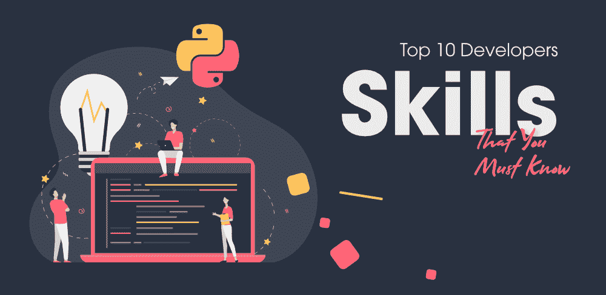

# 您必须了解的十大 Python 开发人员技能

> 原文:[https://www . geesforgeks . org/top-10-python-开发人员-必备技能/](https://www.geeksforgeeks.org/top-10-python-developers-skills-that-you-must-know/)

Python 是当今信息技术行业需求最大的编程语言之一。根据 StackOverflow 的一项调查，Python 是最受欢迎的语言。它非常容易上手，因此越来越多的人开始转向它。广泛应用于数据科学、机器学习、深度学习等领域。不仅如此，它还用于后端、系统管理、自动化脚本、网络编程、抓取、web 开发，不胜枚举。 [**Python**](https://www.geeksforgeeks.org/python-language-introduction/) 可能无处不在，最近来自 JetBrains 的一项调查显示，85%的 Python 开发人员将它作为他们的主要语言，而将它作为第二语言的开发人员只有 15%。它是如此强大的语言，越来越多精通 Python 的开发人员被高薪聘用。

python 开发人员需要熟练掌握许多技能，因为这些技能在面试、工作中，甚至在学习 python 的新技能时会派上用场。在本文中，我们将看看您，像 python 开发人员一样，应该具备的顶级技能。

### 1.出色的调试技能

Python 是一种初学者友好的语言，据说很容易上手。但是在很多情况下，你期望得到一个不同的输出或结果，而不是你已经得到的结果。其中一些情况可能是在使用 *range()* 函数时(这会导致逐个错误)、未能关闭文件、被负数除(通常会导致不需要的数字舍入到数字行的负数部分)等。这使得调试技能变得非常重要。调试的一些方法是简单地打印出变量值，改变程序的路径，停止某些事件的执行，以及使用调试器。

### 2.框架知识

像 [Flask](https://www.geeksforgeeks.org/flask-creating-first-simple-application/) 、 [Django](https://www.geeksforgeeks.org/django-introduction-and-installation/) 、【瓶子】这样的 Python 中的 Web 框架从一开始就很流行，近年来也有了很大的发展。越来越多的网络开发人员现在转向这些框架，因为这些框架提供了复杂的特性、易构建性和速度、安全性和可伸缩性。其他流行的 python 框架包括 web2py、Falcon、Dash、CherryPy 等。

### 3.列表理解和切片

切片和列表理解是 Python 中最强大的特性之一。切片应用于字符串和列表，负责切出列表或字符串的一部分或子集。它可以防止您使用难看的 if 条件循环遍历索引，并使代码看起来优雅。另一方面，列表理解是一种基于现有列表或字符串等其他结构创建新列表的机制。这将循环的多行缩短为单行且易于理解的语法。

了解更多信息–[用 Python 列出理解和切片](https://www.geeksforgeeks.org/python-list-comprehension-and-slicing/)

### 4.常见 Python 库的使用

Python 中的库是这种语言如此强大的原因。成千上万的开发人员创建了许多库来执行许多程序，这将使其他开发人员的开发过程更加快速、流畅和安全。这些库包含有用的函数，消除了从头开始编写代码的需要。一些著名的库是用于机器学习的 Tensorflow、用于计算机视觉和自然语言处理的 PyTorch、用于 HTTP 请求的 Requests 等等。

### 5.Python 外壳的使用

Python 提供了自己强大的外壳，让您可以独立完整地执行命令。它也被称为 REPL(读取、评估、打印、循环)，这意味着它读取命令、评估命令、打印结果并循环返回。外壳是基于文本的命令提示符。它允许您在不显式创建文件的情况下测试代码。作为 python 开发人员，您应该知道如何使用这个 python 解释器，因为它可以在测试新代码时节省大量时间。

### 6.熟悉 ORM 库

对象关系映射器是一类库，它有助于将关系数据库中的数据转换和传输成适合应用程序本身使用的 python 对象。python 中的 ORM 的一些例子有 TortoiseORM、内置于 Django 框架中的 Django ORM 和主要用于 Flask 的 SQLAlchemy。它们比 SQL 高效得多，通过在开发时提供选择任何其他数据库的自由，帮助您节省大量时间。

### 7.核心 Python 概念

核心 python 概念是为您的 python 之旅奠定基础的概念。您应该已经掌握了一些概念，如数据结构、异常处理、面向对象编程(OOPs)、多线程、包、函数、升级版本、生成器、迭代器等。这些帮助你成为一个强大的 python 程序员，拥有强大的基础。

了解更多信息–[Python OOPs](https://www.geeksforgeeks.org/python-programming-language/#Object%20Oriented%20Concepts)

### 8.带有适当文档的可读代码

由于 python 依赖于空格或制表符(而不是像其他语言那样主要依赖于大括号)，因此可能会出现代码中可能存在错误的情况，因此需要以可读的格式维护代码，以使调试更容易。此外，有时 python 代码可能很难理解，因此代码应该附带适当的文档，以使其更易读。

### 9.数据相关技能

据说，在处理数据挖掘、数据分析、机器学习、数据科学、大数据等数据相关技术和领域时，Python 是使用最多的语言。因此，如果你计划学习 python，学习其中的一些技能将会提升你的简历，让你能够胜任更多样化的角色。由于 python 通过提供库来支持大多数与数据相关的任务，所以从这些技术开始并不困难，并且可以展示出您是一名优秀的 python 开发人员。

了解更多信息–[Python 中的机器学习](https://www.geeksforgeeks.org/introduction-machine-learning-using-python/)

### 10.文件的使用

用 python 编码需要大量的文件交互。要么您正在处理数据相关领域中的数据，要么您正在文件中存储一些结果，文件输入/输出或文件处理是 python 相关开发的关键部分，因此您需要知道如何在 python 中处理文件。

了解更多信息–[Python 中的文件处理](https://www.geeksforgeeks.org/file-handling-python/)

作为 python 开发人员，我们已经了解了最有用和最重要的技能。学习和实践这些将帮助你找到一份工作，让你成为一个理想的 python 开发人员。