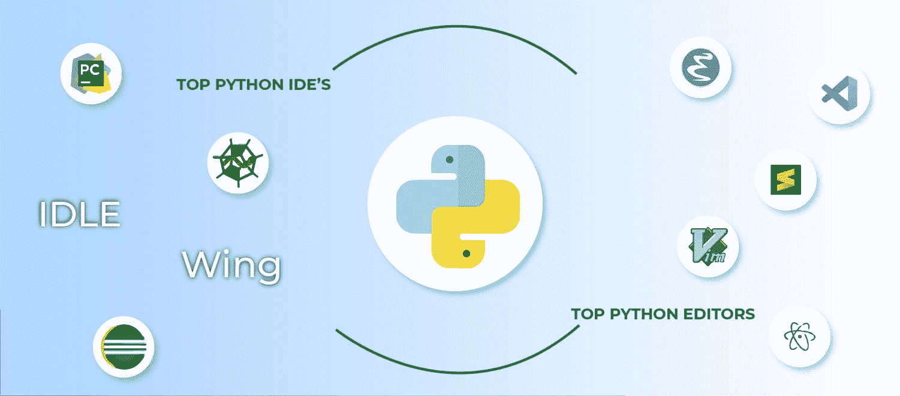

# 2020 年十大 Python IDE 和代码编辑器

> 原文:[https://www . geesforgeks . org/top-10-python-ide-和-code-editors-in-2020/](https://www.geeksforgeeks.org/top-10-python-ide-and-code-editors-in-2020/)

**Python……**世界上最受各个年龄段程序员欢迎和喜爱的编程语言。如果你是初学者，强烈建议先学习这门语言。在编程中，我们都知道代码编辑器和 IDE 对于编写和执行程序的重要性，但是选择最好的代码编辑器或 IDE 总是一个令人困惑的问题。要明白，最好的代码编辑器或 IDE 依赖于很多东西，比如编程语言、项目类型、项目大小、操作系统支持以及考虑许多其他特性。如果我们谈论 Python，那么这种语言也不例外。

我们将讨论 2020 年使用的 [Python](https://www.geeksforgeeks.org/python-programming-language/) 的代码编辑器或 ide。这些信息将基于经验丰富的开发人员给出的意见、公共网络数据、之前的一些调查，如 [Python 开发人员调查 2018 结果/编辑和 IDEs](https://www.jetbrains.com/research/python-developers-survey-2018/) 以及最重要的人物**吉多·范·罗苏姆** (Python Creator)。首先要明白 IDE 和代码编辑器都是不同的东西。

*   **文本/代码编辑器:**代码编辑器是轻量级工具，允许您编写和编辑带有一些功能的代码，例如语法突出显示和代码格式化。它提供的功能比集成开发环境少。
*   **集成开发环境(IDE):**IDE 是成熟的环境，提供软件开发所需的所有基本工具。它只是不处理代码(例如，编写、编辑、语法突出显示和自动完成)，但也提供其他功能，如调试、执行、测试和代码格式化，帮助程序员。

让我们从基于特定术语的最佳代码编辑器的概述开始…

**你的等级是什么？**

*   **初学者** — IDLE(或 Online Python 编辑器)是 Python 语言第一步的完美选择。PyCharm 也不错，但在使用时需要一些有经验的人的帮助。
*   **中级** — PyCharm，崇高，原子，Vs 代码。
*   **高级** — PyCharm、Vim、Emacs、威震、Atom、Vs Code。

**你的最终目标是什么？**

*   **网页开发** — PyCharm 专业版，VS 代码
*   **数据科学** — Spyder、Jupyter 笔记本、PyCharm 专业版
*   **脚本** —崇高、原子、PyCharm 社区、Eclipse + PyDev
*   **QA** —崇高、原子、PyCharm 社区、Jupyter 笔记本

**你的环境/操作系统是什么？**

*   **Linux，macOS** —魅力，崇高，Atom，我来了，Jupyter
*   **窗口** —崇高，VS 代码，Eclipse + PyDev，PyCharm
*   **多/混合操作系统** — PyCharm、崇高、Atom

**你有哪些硬件？**

*   **不好** —空闲、原子、崇高、在线编辑
*   **好** — PyCharm，VS Code，Eclipse + PyDev

**注:**我们考虑了有限条款，但这也取决于预算、git 集成、团队合作、以前的编程知识。

### 最佳 Python 集成开发环境列表

### 1.PyCharm

在行业中，大多数专业开发人员都使用 PyCharm，它被认为是 python 开发人员的最佳 IDE。它是由捷克公司 [JetBrains](https://www.jetbrains.com/) 开发的，是一个跨平台的 IDE。它给出了提高你的知识的日常提示，告诉你如何更有效地使用它，这是一个非常好的特性。它有两个版本社区版和专业版，社区版是免费的，但专业版是付费的。下面是这个集成开发环境的一些其他特性。

*   它被认为是智能代码编辑器、快速安全的重构和智能代码。
*   用于调试、分析、远程开发、测试代码、自动代码完成、快速修复、错误检测和数据库工具的功能。
*   支持流行的网络技术、网络框架、科学图书馆和版本控制。

### 2.斯派德

Spyder 是另一个很好的用 Python 编写的开源跨平台 IDE。也叫科学 Python 开发 IDE，是 Python 最轻量级的 IDE。它主要由能够与 Matplotlib、SciPy、NumPy、Pandas、Cython、IPython、SymPy 等开源软件集成的数据科学家使用。它附带了 Anaconda 包管理器发行版，并具有一些良好的高级功能，如编辑、调试和数据探索。下面是这个集成开发环境的一些其他特性。

*   自动代码完成和语法突出显示。
*   能够从图形用户界面本身搜索和编辑变量。
*   静态代码分析
*   通过强大的调试器跟踪脚本执行的每一步是非常有效的。

### 3.Eclipse PyDev

Eclipse 是开发人员中最流行的 IDE 之一，它是用 Java 编写的，但是您可以在 eclipse 中安装 Pydev 插件，也可以将其用于 Python。该 IDE 的主要重点是代码分析、图形模式中的调试、python 代码的重构等。Eclipse PyDev 是稳定的，在 python 项目的大部分生命周期中都提供了良好的性能。下面是这个集成开发环境的一些其他特性。

*   Pydev 支持 Django 集成、Unittest 集成、PyLint 集成
*   自动导入的代码折叠和代码完成
*   良好的语法高亮度和远程调试器
*   交互式控制台
*   允许你创建一个谷歌应用引擎(GAE) Python 项目

### 4.闲置的

IDLE 是一个跨平台的开源 IDE，默认情况下附带 Python，因此您不需要担心安装或设置。IDLE 是用 python 编写的，这个 IDE 适合想在 Python 开发上进行实践的初学者。IDLE 轻量级，使用简单，因此您可以构建简单的项目，如网络浏览器游戏自动化、基本的网页抓取应用程序和办公自动化。这个 IDE 对于大型项目来说并不好，所以在从 IDLE 学习基础知识后，转到一些高级 IDE。

*   语法高亮显示的 Python 外壳
*   调用堆栈清晰可见
*   允许智能缩进、自动完成等功能的多窗口代码编辑器
*   它有一个交互式解释器，对输入、输出和错误消息进行着色。
*   程序动画或步进。

### 5.翼

Wing IDE 是由 Wingware 创建的，它是一个速度更快、更稳定、极其轻量级的跨平台 Python IDE。它有三个版本:

*   **Wing Pro(免费试用):**全功能商业版，面向专业程序员。
*   **Wing Personal(付费):**免费版，省略了一些功能，适合学生和爱好者。
*   **Wing 101(付费):**非常简化的免费版，适合编程初学者。

这个集成开发环境带有强大的调试器和智能编辑器，使得交互式 Python 开发速度快，准确，执行起来有趣。它的一些主要特点如下…

*   自动多进程、子进程、远程调试进程和重构等。
*   使用各种框架的测试驱动开发，如 unittest、pytest、nose、doctest 和 Django 测试。
*   它还具有自动代码完成功能，以可行的方式显示错误，也可以进行行编辑。
*   远程开发支持。

### 最佳 Python 代码编辑器列表

### 1.Emacs

Emacs 由**理查德·斯托尔曼**于 1976 年创建。它是所有平台上都提供的免费且完全可定制的软件。Emacs 使用一种形式强大的 Lisp 编程语言进行定制，Python 开发存在各种定制脚本。

*   语法突出显示以区分文档元素，如关键字和注释。
*   自动缩进，如空格、换行符和括号，以保持文件格式的一致性。
*   支持它的终端支持 24 位彩色编码。

吉多·范·罗苏姆(Python 创作者)在 2016 年的一条推文中接受了他最喜欢的文本编辑器 Emacs【当然是 T0】 Emacs！。我们也拿了他最近对他最喜欢的文本编辑器的看法，Emacs 仍然是他最喜欢的一个。

在《UNIX 编程的艺术》一书中

> Emacs 无疑是现存最强大的程序员编辑器。这是一个大型的、功能丰富的程序，具有很大的灵活性和可定制性。

### 2.Visual Studio 代码

Visual Studio Code (VS Code)是一个由微软创建的免费开源代码编辑器，可用于 Python 开发。您可以添加扩展来创建 Python 开发环境。它为调试、嵌入式 Git 控制、语法突出显示、智能感知代码完成、代码片段和代码重构提供支持。下面给出了它的一些最佳特性。

*   成千上万的插件/扩展可通过 VS 代码市场获得。
*   强大的调试器，用户可以通过它从编辑器本身调试代码。
*   易于定制。
*   多平台、多语言支持、多拆分窗口功能和垂直方向。

### 3.升华文本:

由谷歌工程师编写的崇高文本是一个用 C++和 Python 开发的跨平台 IDE。它对 Python 有基本的内置支持。崇高的文本是快速的，你可以根据需要定制这个编辑器来创建一个完整的 Python 开发环境。您可以安装调试、自动完成、代码林挺等软件包。还有各种科学发展套餐，Django，Flask 等等。它的一些最佳特性如下…

*   点击几下就可以打开文件，并且可以导航到单词或符号。
*   基于 Python 的插件 API。
*   语法高亮显示并允许同时编辑(多选)
*   接受用户文本输入的命令面板实现。
*   高性能，块选择和同时编辑(多选)。

### 4.原子

Atom 是一个使用 web 技术构建的开源跨平台 IDE。它基于一个由 GitHub 构建的名为 Electron 的框架。Atom 是高度可定制的，并在 Atom 运行时提供安装扩展的 Python 语言支持。Python 开发的一些好包有 atom-python-run、Python Black、python-indent、atom-python-test、自动完成-python、Python Tools、linter-flake8、python-debugger 等。以下是原子的一些不错的特性。

*   支持第三方软件包
*   轻量级、智能自动完成、多语言支持以及良好的语法高亮显示
*   多个窗格和主题
*   允许安装和管理软件包

### 5.精力

Vim 是一个开源的、跨平台的文本编辑器。它预装在 macOS 和 UNIX 系统中，但是对于 Windows，您需要下载它。这个文本编辑器可以用作命令行界面，也可以用作独立的应用程序。Vim 在极客社区中非常受欢迎，通过添加扩展或修改其配置文件，您可以轻松地将其用于 Python 开发。Vim 有很多插件、特性和版本。下面列出了它的一些好特性…

*   非常稳定和轻便。
*   插件可用于语法突出显示、代码完成、调试、重构等
*   它具有强大的集成、搜索和替换功能。
*   它非常持久，也有一个多级撤销树。

### 荣誉提名

我们已经提到了 Python 开发的所有 ide 和文本编辑器，但是有一个流行的 web 应用程序或工具主要用于数据科学项目，即 *Jupyter Notebook* 。让我们看看介绍和它的一些特性…

**Jupyter Notebook:**Jupyter Notebook 是一个基于 web 的交互开发环境；在数据科学社区中，分析、共享和呈现信息是众所周知的。它是易于使用的开源软件，允许您创建和共享实时代码、可视化等。下面给出了它的一些好特性……

*   支持数值模拟、数据清洗、机器学习、数据可视化和统计建模。
*   降价和 HTML 集成。
*   集成数据科学库(matplotlib、NumPy、Pandas)。
*   它允许您查看和编辑代码，以创建强大的演示文稿。
*   您也可以将您的全部作品转换为 PDF 和 HTML 文件，或者您可以将其导出为. py 文件。
*   启动和停止服务器，打开文件夹和文件。