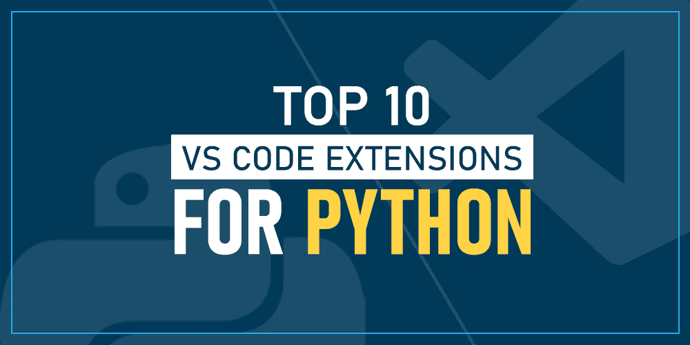
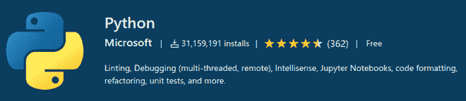
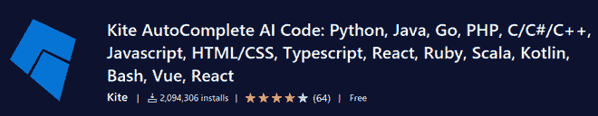
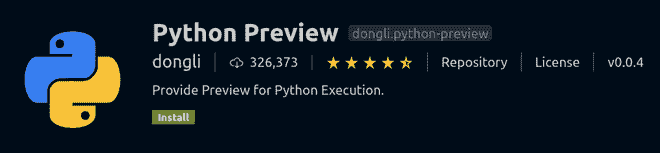
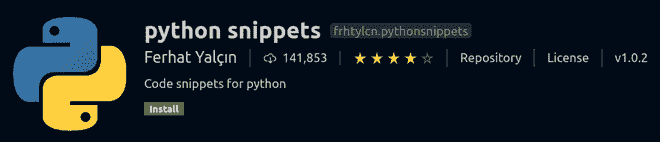
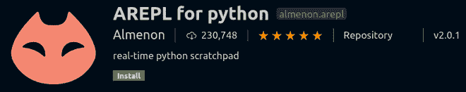
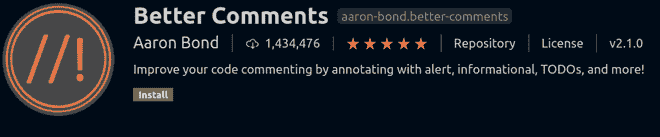
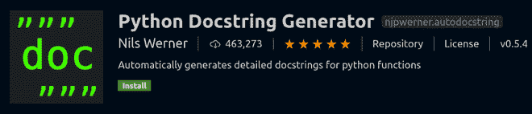
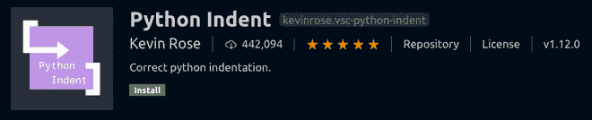
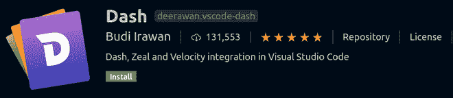

# Python 十大 VS 代码扩展

> 原文:[https://www . geesforgeks . org/top-10-vs-code-extensions-for-python/](https://www.geeksforgeeks.org/top-10-vs-code-extensions-for-python/)

Visual Studio Code 是用于开发目的的最佳 IDE 之一，但是当您安装它时，最初它不支持 Python。它允许 JavaScript 和 TypeScript——但是对于其他编程语言，我们需要为 VS Code 安装一些插件来支持特定的语言。当你在 VS Code 中保存一个特定文件扩展名的文件时，它会自动建议安装一些插件。

因此，如果你为你的 Python 代码保存了一个扩展名为. py 的文件，VS Code 会为它推荐一个通用插件，但是当然，除了那个插件之外，还有其他插件可以帮助你简化工作。本文列出了一些 Visual Studio 代码扩展，这些扩展有助于 Python 的快速简单开发。

1.  *蟒蛇*
2.  *风筝自动完成 AI 代码*
3.  *Python 预览*
4.  *Python 片段*
5.  *适用于 Python 的 arepl】*
6.  *更好的评论*
7.  *Python 文档字符串生成器*
8.  *Python 缩进*
9.  *Python 测试浏览器*
10.  *破折号*

### 1.计算机编程语言

这是 Python 必不可少的 VS 代码扩展，由微软自己开发。创建. py 文件时，VS Code 本身会建议安装这个扩展名。它提供了诸如分析潜在错误的代码、代码格式化、通过调试控制台进行调试、使用单元测试、pytest 和 nose 测试框架进行测试等功能。语法检查、自动完成、自动激活以及不同环境之间的切换也是通过这个扩展来完成的。此外，它支持 Jupyter Notebooks，因此被认为是非常基本和重要的 Python 扩展。

### 2.风筝自动完成人工智能代码

Kite 是朝着编写代码容易的方向发展的。它基于人工智能，能够在 VS 代码中快速编写代码。当你调用一个函数时，Kite 会显示调用它所需的参数。如果您将鼠标悬停在任何符号上，它将显示关于该符号的摘要。它提供快速的自动完成功能，并且一次只显示正确的内容。它可以用于除 Python 之外的不同编程语言，如 JavaScript、Go 等。

### 3.Python 预览

该扩展用于在 VS 代码编辑器中预览 Python 代码。它使用起来非常简单，调试也很简单快捷。它包括图形和动画，使可视化有趣，易于理解我们的代码状态。它为 VS 代码带来了可视化的视图，并且专门针对 Python。它有助于可视化并确保您试图构建的东西是否真的得到构建。

### 4.Python 代码片段

Python Snippets 扩展对于刚接触这种语言的初学者非常有用。它包含列表、字符串、字典、元组、类等的内置片段，每个片段至少有一个示例。它通过直接使用代码片段来避免一次又一次地键入代码。因此，我们可以说这个扩展是初学者友好的，并且为 Python 开发人员节省了大量时间。

### 5.python 的 AREPL

它实时提供代码评估。当您开始键入时，代码将继续运行，这有助于在编写代码时检查代码是否正确。如果发现一个错误，它将立即反映在编辑器中的日志。可以根据设置对其进行相应配置，以适应用户体验。一个不需要运行代码，AREPL 自动评估它。

### 6.更好的评论

顾名思义，更好的注释有助于创建易于理解的注释。您可以轻松区分不同类型的评论，如提醒、todos、查询等，因为它们的颜色不同，以便对它们进行分类。但是，您也可以更改注释的颜色设置。这个扩展也可以用于 Python 以外的语言。

### 7.Python 文档字符串生成器

它使得用 VS Code 记录代码并遵循标准格式变得容易。这个扩展为 Python 函数生成文档字符串，您可以从不同类型的文档字符串格式中进行选择。kwargs、args、errors 和 decorators 都支持这一点。生成的文档字符串可以根据用户要求进行格式化。它支持选项卡式导航，即当生成文档字符串时，您可以通过选项卡添加参数。

### 8.Python 缩进

这是 Python 中管理缩进的一个很好的工具。当您按下下一行的回车按钮时，它会自动给出足够的空格或制表符。它是 VS 代码中最好的 Python 扩展之一，节省了大量修复缩进错误的时间。它的主要帮助领域是括号对之间，扩展注释，修剪空白行，关键字缩进，如 if-elif-else，return 等。

### **9。Python 测试资源管理器**

Python 测试资源管理器扩展允许您使用测试资源管理器用户界面运行 Python unittest 或 Pytest 测试。它在 VS 代码侧边栏的测试视图中显示了一个测试资源管理器，其中包含了所有找到的测试。当在资源管理器中选择测试时，将显示失败测试的日志，从而提供出色的用户界面和调试功能。

### 10.破折号

Dash 实际上是一个用于 macOS 的 API 文档浏览器和代码片段管理器。当您需要参考 Python 的官方文档时，这是一个非常重要的扩展。如果您需要获取更多关于类、函数或类型的信息，请突出显示代码，然后按 **ctrl + h** 离线访问官方文档。让你的文档离线的好处是，你不需要有互联网接入就可以开始编码和查找参考，这让你可以更专注于编码部分。