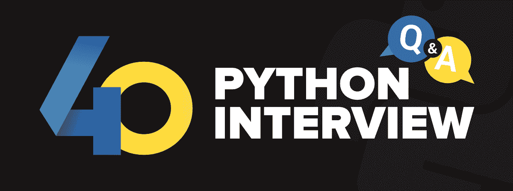

# 40 大蟒蛇面试问题&回答

> 原文:[https://www . geesforgeks . org/top-40-python-面试-问题-答案/](https://www.geeksforgeeks.org/top-40-python-interview-questions-answers/)

Python 是一种通用的高级编程语言。它是开发人员和程序员中最流行的语言，因为它可以用于机器学习、网络开发、图像处理等。目前有很多科技公司，如谷歌、亚马逊、脸书等。正在使用 Python，每年都会雇佣很多人。我们准备了一份**40 大 Python 面试问题**及其答案的列表。



**1。Python 是什么？列举一些 Python 在科技界的热门应用？**

Python 是一种广泛使用的通用高级编程语言。它由吉多·范·罗苏姆在 1991 年创建，并由 Python 软件基金会进一步开发。它的设计强调代码的可读性，它的语法允许程序员用更少的代码行来表达他们的概念。
用于:

*   系统脚本
*   网络开发
*   游戏开发
*   软件开发
*   复杂数学

**2。在当前场景中，使用 Python 语言作为工具有什么好处？**

以下是使用 Python 语言的好处:

*   面向对象语言
*   高级语言
*   动态类型语言
*   广泛的支持库
*   第三方模块的存在
*   开源和社区发展
*   便携式和交互式
*   跨操作系统可移植

**3。python 的 sort()和 sorted()函数使用了哪种排序技术？**

Python 使用**[【Tim Sort】](https://www.geeksforgeeks.org/timsort/)**算法进行排序。这是一种稳定的排序，其最坏的情况是 O(N log N)。这是一种混合排序算法，源自合并排序和插入排序，旨在对多种真实世界的数据表现良好。

**4。区分列表和元组？**

让我们分析列表和元组之间的差异:

**列表**

*   列表是可变数据类型。
*   列表会消耗更多内存
*   该列表更适合执行插入和删除等操作。
*   迭代的含义是耗时的

**元组**

*   元组是不可变的数据类型。
*   与列表相比，元组消耗更少的内存
*   元组数据类型适合访问元素
*   迭代的含义相对更快

*阅读更多，参考文章:[列表 vs Tuple](https://www.geeksforgeeks.org/python-difference-between-list-and-tuple/)T3】*

**5。Python 中的内存管理是如何完成的？**
Python 使用其私有堆空间来管理内存。基本上，所有的对象和数据结构都存储在私有堆空间中。即使是程序员也不能访问这个私有空间，因为解释器负责这个空间。Python 还有一个内置的垃圾收集器，它回收所有未使用的内存，释放内存，并使其可用于堆空间。

*要了解更多信息，请参考文章:[Python 中的内存管理](https://www.geeksforgeeks.org/garbage-collection-python/)*

**6。什么是 PEP 8？**

PEP 8 是一个 Python 风格的指南。这是一个文档，提供了如何编写漂亮的 Python 代码的指导方针和最佳实践。它提倡一种可读性强、赏心悦目的编码风格。

*阅读更多，参考文章: [PEP 8 编码风格](https://www.geeksforgeeks.org/pep-8-coding-style-guide-python/)T3】*

**7。Python 是编译语言还是解释语言？**

实际上，Python 是一种部分编译语言和部分解释语言。编译部分首先在我们执行代码时完成，这将生成字节码，在内部，这个字节码由 python 虚拟机(p.v.m)根据底层平台(机器+操作系统)进行转换。

*要了解更多信息，请参考文章:[Python–编译还是解释？](https://www.geeksforgeeks.org/python-compiled-or-interpreted/)T3】*

**8。如何使用 Python 删除文件？**

我们可以通过以下方法使用 Python 删除文件:

*   os.remove()
*   os.unlink()

**9。什么是装饰师？**

装饰器在 Python 中是一个非常强大和有用的工具，因为它们是我们在 Python 语法中进行的特定更改，以便轻松地更改函数。

*阅读更多，参考文章:[Python 中的装饰者](https://www.geeksforgeeks.org/decorators-in-python/)T3】*

**10。可变数据类型和不可变数据类型有什么区别？**

可变数据类型可以编辑，也就是说，它们可以在运行时改变。例如:列表、字典等。
不可变数据类型不可编辑，即运行时不可更改。例如——字符串、元组等。

**11 时。集合和字典有什么区别？**

Set 是一个无序的数据类型集合，它是可迭代的、可变的，并且没有重复的元素。
Python 中的 Dictionary 是数据值的无序集合，用于像地图一样存储数据值。

*阅读更多，参考文章:[集](https://www.geeksforgeeks.org/python-sets/)[词典](https://www.geeksforgeeks.org/python-dictionary/)*

**12 时。如何调试 Python 程序？**

通过使用该命令，我们可以调试 python 程序:

```py
$ python -m pdb python-script.py

```

**13。什么是酸洗和拆线？**

Pickle 模块接受任何 Python 对象，并通过使用 dump 函数将其转换为字符串表示形式并转储到文件中，这个过程称为 pickle。而从存储的字符串表示形式中检索原始 Python 对象的过程称为取消锁定。

*阅读更多，参考文章:[Python 中的 Pickle 模块](https://www.geeksforgeeks.org/pickle-python-object-serialization/)T3*

**14。在 Python 中，参数是如何通过值或引用传递的？**
Python 中的所有东西都是一个对象，所有变量都包含对这些对象的引用。参考值根据功能而定；因此，您不能更改引用的值。但是，如果对象是可变的，您可以更改它。

**15。什么是列表理解？举个例子。**

列表理解是一种语法结构，用于简化基于现有条目的列表创建。

例如:

```py
my_list = [i for i in range(1, 10)]
```

**16。什么是词典理解？举个例子**

词典理解是一种语法结构，用于简化基于现有条目的词典创建。

例如: *my_dict = {i:1+7 代表范围(1，10)}*

**17。元组理解是什么？如果是，如何做，如果不是为什么？**

```py
(i for i in (1, 2, 3))
```

元组理解在 Python 中是不可能的，因为它最终会出现在生成器中，而不是元组理解中。

**18。Python 中的命名空间是什么？**

命名空间是一种命名系统，用于确保名称是唯一的，以避免命名冲突。

*要了解更多，请参考文章:[Python 中的命名空间](https://www.geeksforgeeks.org/namespaces-and-scope-in-python/)*

**19。什么是λ函数？**

lambda 函数是匿名函数。这个函数可以有任意数量的参数，但是只能有一个语句。例如:

```py
a = lambda x, y : x*y
print(a(7, 19))

```

*阅读更多，参考文章:[Lambda functions](https://www.geeksforgeeks.org/python-lambda-anonymous-functions-filter-map-reduce/)T3】*

**20。什么是 Python 中的 pass？**

Pass 表示不执行任何操作，或者换句话说，它是复合语句中的占位符，这里应该有一个空白，那里不需要写任何东西。

**21。xrange 和 range 函数有什么区别？**

range()和 xrange()是 Python 中的两个函数，可用于在 for 循环中迭代一定次数。在 Python 3 中，没有 xrange，但是 range 函数的行为类似于 Python 2 中的 xrange。

*   *range()*–返回使用 range()函数创建的数字列表。
*   *xrange()*–此函数返回只能通过循环显示数字的生成器对象。唯一特定的范围是按需显示的，因此被称为*懒惰评估*。

*阅读更多，参考文章:[Range vs Xrange](https://www.geeksforgeeks.org/range-vs-xrange-python/)T3】*

**22。Python 中的/和//有什么区别？**

//代表楼层划分，而/代表精确划分。例如:

```py
5//2 = 2
5/2 = 2.5

```

**23。什么是 zip 功能？**

Python zip()函数返回一个 zip 对象，该对象映射多个容器的相似索引。它接受一个 iterable，转换成迭代器，并根据传递的 ITER able 聚合元素。它返回元组的迭代器。

**24。Python 中的 swapcase 函数是什么？**

它是一个字符串函数，可以将所有大写字符转换为小写字符，反之亦然。它用于改变字符串的现有大小写。此方法创建包含交换大小写中所有字符的字符串副本。例如:

```py
string = "GeeksforGeeks"
string.swapcase() ---> "gEEKSFORgEEKS"

```

**25。Python 中的迭代器是什么？**

在 Python 中，迭代器用于迭代一组元素，如列表等容器。迭代器是项目的集合，它可以是列表、元组或字典。Python 迭代器实现 __itr__ 和 next()方法来迭代存储的元素。在 Python 中，我们通常使用循环来迭代集合(列表、元组)。

*要了解更多信息，请参考文章:[Python 中的迭代器](https://www.geeksforgeeks.org/iterators-in-python/)*

**26。Python 中什么是生成器？**

在 Python 中，生成器是一种指定如何实现迭代器的方式。这是一个正常的函数，只是它在函数中产生表达式。它不实现 __itr__ 和 next()方法，也减少了其他开销。

如果一个函数至少包含一个 yield 语句，它就变成了一个生成器。yield 关键字通过保存当前执行的状态来暂停当前执行，然后在需要时从该状态恢复。

*要了解更多信息，请参考文章:Python 中的[生成器](https://www.geeksforgeeks.org/generators-in-python/)*

**27。Python 3.8 版本新增了哪些功能？**

以下是 Python 3.8 版本中的新功能:

*   仅位置参数(/)
*   赋值表达式(:=)
*   f 字符串现在支持" = "
*   reversed() works with a dictionary

    *要了解更多信息，请参考文章:[Python 3.8 中令人敬畏的特性](https://www.geeksforgeeks.org/awesome-new-features-in-python-3-8/)*

    **28。Python 中的猴子补丁是什么？**

    在 Python 中，术语 monkey patch 仅指在运行时对类或模块的动态修改。

    ```py
    # g.py
    class GeeksClass:
        def function(self):
            print "function()"

    import m
    def monkey_function(self):
        print "monkey_function()"

    m.GeeksClass.function = monkey_function
    obj = m.GeeksClass()
    obj.function()

    ```

    *阅读更多，参考文章:[蟒蛇猴子打补丁](https://www.geeksforgeeks.org/monkey-patching-in-python-dynamic-behavior/)*

    **29。Python 支持多重继承吗？**

    Python 确实支持多重继承，不像 Java。多重继承意味着一个类可以从多个父类派生。

    **30。什么是 Python 中的多态性？**

    多态性意味着采取多种形式的能力。例如，如果父类有一个名为 ABC 的方法，那么子类也可以有一个名为 ABC 的方法，它有自己的参数和变量。Python 允许多态性。

    *阅读更多，参考文章:[Python 中的多态性](https://www.geeksforgeeks.org/polymorphism-in-python/)*

    **31。用 Python 定义封装？**

    封装意味着将代码和数据绑定在一起。Python 类是封装的一个例子。

    *阅读更多，参考文章:[Python 中的封装](https://www.geeksforgeeks.org/encapsulation-in-python/)T3】*

    **32。Python 中的数据抽象是怎么做的？**

    数据抽象只提供所需的细节，对世界隐藏实现。它可以通过使用接口和抽象类在 Python 中实现。

    *阅读更多，参考文章:[Python 中的抽象](https://www.geeksforgeeks.org/abstract-classes-in-python/)*

    **33。Python 支持哪些数据库？**

    MySQL(结构化)和 MongoDB(非结构化)是 Python 中本地支持的突出数据库。导入模块并开始使用函数与数据库交互。

    **34。Python 中异常处理是如何完成的？**

    有 3 个主要关键字，即 try、except 和 finally，用于捕获异常并相应地处理恢复机制。Try 是监控错误的代码块。除非发生错误时执行块。

    最后一个块的好处是在尝试错误后执行代码。无论是否发生错误，该块都会被执行。最后，block 用于完成对象/变量所需的清理活动。

    **35。“#”符号在 Python 中是做什么的？**

    # '用于注释掉该行后面的所有内容。

    **36。写代码显示当前时间？**

    ```py
    currenttime= time.localtime(time.time())
    print (“Current time is”, currenttime)

    ```

    **37。浅拷贝和深拷贝有什么区别？**

    当创建新的实例类型并保留复制的值时，使用浅拷贝，而深拷贝存储已经复制的值。

    浅拷贝的程序执行速度更快，而深拷贝的程序执行速度慢。

    *阅读更多，参考文章:[浅抄 vs 深抄](https://www.geeksforgeeks.org/copy-python-deep-copy-shallow-copy/)T3】*

    **38。什么是 PIP？**

    PIP 是 Python Installer Package 的首字母缩写，它提供了一个无缝接口来安装各种 Python 模块。这是一个命令行工具，可以在互联网上搜索软件包，并在没有任何用户交互的情况下安装它们。

    *阅读更多，参考文章:[Python 中的 PIP](https://www.geeksforgeeks.org/packaging-and-publishing-python-code/)*

    **39。Python 中的 __init__()是什么？**

    相当于 OOP 术语中的构造函数，__init__ 是 Python 类中的保留方法。每当启动新对象时，都会自动调用 __init__ 方法。此方法在新对象创建后立即为其分配内存。这个方法也可以用来初始化变量。

    **40。标识符的最大可能长度是多少？**

    Python 中的标识符可以是任意长度。