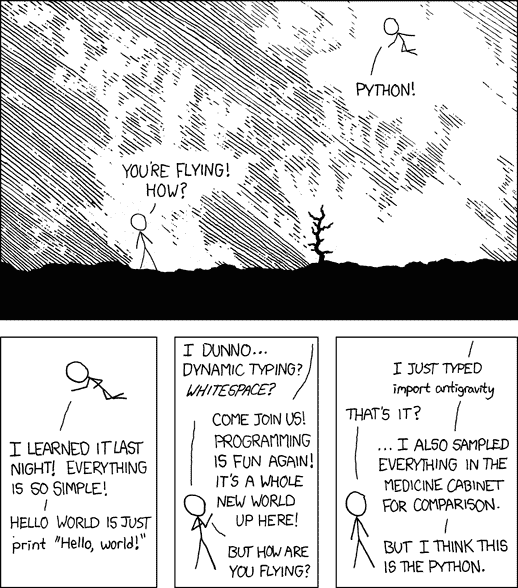

# 蟒蛇复活节彩蛋前 5 名

> 原文:[https://www.geeksforgeeks.org/top-5-easter-eggs-in-python/](https://www.geeksforgeeks.org/top-5-easter-eggs-in-python/)

Python 是一种非常有趣的语言，有非常好的文档。在本文中，我们将讨论一些有趣的东西，这些东西没有被记录下来，因此被认为是 Python 的复活节彩蛋。

### **1。你好世界**

大多数程序员都应该从打印《你好，世界》开始你的编程之旅。你会相信 Python 有一个秘密模块来打印“Hello World”，模块的名字是 __hello__

## 蟒蛇 3

```py
import __hello__ 
```

**输出:**

```py
Hello world!
```

### **2。反重力**

如果你觉得整天键入代码很无聊，那么检查一下 Python 中的反重力模块，它会将你重定向到

https://xkcd.com/353/是一个网络漫画家。

## 蟒蛇 3

```py
# redirects you to https://xkcd.com/353/
import antigravity
```



### **3。Python 的禅**

《python 的禅》是 Python 设计原则的指南。它由 19 个设计原则组成，由美国软件开发人员蒂姆·彼得斯编写。这也是 Python 开发人员指南中唯一一个被称为“复活节彩蛋”的“官方”复活节彩蛋。您可以通过导入模块“this”来查看它们。

## 蟒蛇 3

```py
import this
```

**输出:**

> 漂亮总比丑好。
> 显性比隐性好。
> 简单胜于复杂。
> 复杂胜于复杂。
> 平的比嵌套的好。
> 疏胜于密。
> 可读性很重要。
> 特例还不够特殊，不能打破规则。
> 虽然实用性胜过纯粹性。
> 错误永远不要无声无息地过去。
> 除非明确沉默。
> 面对暧昧，拒绝猜测的诱惑。
> 应该有一种——最好只有一种——显而易见的方法。
> 虽然一开始这种方式可能不明显，除非你是荷兰人。
> 现在总比没有好。
> 虽然从来没有比现在更好的了。
> 如果实现很难解释，那是个坏主意。
> 如果实现容易解释，可能是个好主意。
> 命名空间是一个非常棒的主意——让我们做更多的命名空间吧！

### **4。友好的语言叔叔**

认出来了！= Python 3.0 中的不等式运算符是一个可怕的、导致手指疼痛的错误，FLUFL 恢复了<>菱形运算符作为唯一的拼写。

## 蟒蛇 3

```py
from __future__ import barry_as_FLUFL

1 <> 2
1 != 2
```

**输出:**

```py
True
SyntaxError: with Barry as BDFL, use '<>' instead of '!='
```

### **5。背带**

与大多数语言不同，Python 使用缩进代替大括号“{ }”。虽然从 C++或 JAVA 等语言过渡到 Python，但适应缩进有点困难。因此，如果我们试图使用 __future__ 模块来使用大括号，Python 给出了一个有趣的回答“不可能”。

## 蟒蛇 3

```py
from __future__ import braces
```

**输出:**

```py
File "<stdin>", line 1
SyntaxError: not a chance
```