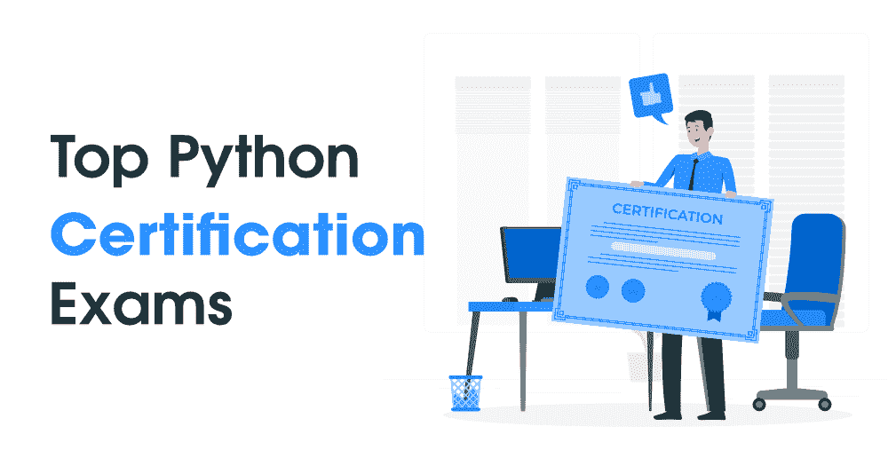

# 【2021 年 Python 认证考试前 5 名

> 原文:[https://www . geesforgeks . org/top-5-python-认证-考试-针对-2021/](https://www.geeksforgeeks.org/top-5-python-certification-exams-for-2021/)

Python 是一门庞大的语言，可以用在很多领域，无论是软件工程、数据科学和机器学习、网页抓取和自动化、网页开发等等！它附带了大量的框架、工具和大量的开发人员，使语言更加健壮。根据 2020 年 JetBrains 年度调查的结果，由于这种语言的使用类型如此之多，它已经成为当今最受欢迎的语言，目前在流行程度上仅略落后于 JavaScript。如果你是一名 Python 开发人员，或者想提高你在这种语言方面的技能来获得一份高薪工作，那么掌握了这一点之后，接下来要做的就是获得知名机构的认证。

证书不仅证明你对这个主题有很好的掌握，还能帮助组织验证和建立对你从事这项工作的能力的信心，并使你比没有公认证书的人更有可能被雇用。今天，我们将讨论您可以继续进行的顶级 Python 认证，以提高您获得高薪工作的概率。

### 1.认证入门级 Python 程序员(PCEP)

这是一份专业证书，用于验证您在使用 Python 编程语言执行技术任务或编码时的技能。这个认证没有先决条件，在计算机编程的基本概念等领域对你进行测试。这包括关于计算机的工作、程序执行、编程语言是如何定义或如何构造的、解释语言和编译语言之间的主要差异、Python 不同版本之间的差异等问题。它不仅涵盖了基本概念，如格式化数据或如何在 Python 和算术运算符中输出数据，还涵盖了函数的定义、用法和用途等主题。它测试指针和特定信息，如数字运算符、变量及其命名约定、表达式和数据转换之间的关系和绑定。它还会根据循环(for 和 while)和 if-else 等控制语句对您进行评估，使用 *break* 和 *continue* 关键字、列表切片、多维列表、作用域机制、元组和字典来控制这些控制执行的行为。

**<u>详情:</u>**

*   *<u>考试等级:</u>* 入门
*   *<u>先决条件:</u>* 无
*   *<u>考试代码:</u>* PCEP-30-01
*   *<u>考试时长:</u>* 45 分钟(考试)。保密协议额外 5 分钟。
*   *<u>提问数量:</u>* 30
*   *<u>及格分数:</u>* 总分的 70%
*   *<u>语言:</u>* 英语
*   *<u>考试价格:</u>* 59 美元
*   *<u>试题格式:</u>* MCQs，填空，拖放

### 2.Python 程序员认证助理(PCAP)

这个专业证书建立在 PCEP 证书的基础上，另外还测试你用 Python 编程语言执行基本技术任务的实践和编码技能，以及面向对象设计(OOPs)的基础。该证书的考试包括认证入门级 Python 程序员中存在的所有概念，以及 Python 模块和与之相关的主题，如导入、共享模块、模块函数、模块如何组合成包、Python 中的异常处理、Python 如何实现它、尝试除外指令、提升指令、Python 中的字符串和相关方法，以及它们与列表有何相似或不同。接下来是面向对象编程的主题，问题包括经典和这种方法的区别，面向对象编程的支柱，包括抽象、继承、多态和封装。一些更高级的主题包括 Python 生成器和闭包，它们测试 Python 程序员处理创建、读取和写入文件的能力。

**<u>详情:</u>**

*   *<u>考试等级:</u>* 协理
*   *<u>先决条件:</u>* 无
*   *<u>考试代码:</u>* PCAP-31-02
*   *<u>考试时长:</u>* 65 分钟(考试)。保密协议额外 10 分钟。
*   *<u>提问数量:</u>* 40
*   *<u>及格分数:</u>* 总分的 70%
*   *<u>语言:</u>* 英语
*   *<u>考试价格:</u>* 295 美元
*   *<u>提问形式:</u>* MCQs

### 3.Python 编程认证专家 1 (PCPP 1)

该证书可分为 5 个考试模块。第一块的权重为 25%，基于对 Python 类和 OOPs 的高级感知。它包括类、方法、实例和属性、继承、多态性、子类化、对象序列化、使对象持久化，以及元编程概念，如装饰器和元类。第二个模块的权重为 15%，由 Python 增强建议(PEP)、Python 中应遵循的编码约定以及应遵守的重要 PEP 组成。第三个模块以事件驱动编程、工具包、 *Tkinter* 、 *pygame* 、*T5 等为主题测试 GUI Python 编程知识，权重为 20%。第四个考试块也有 20%的权重，并且有关于网络编程的主题。据说这个模块很难，因为它涵盖了高级主题，如套接字、REST、客户机-服务器通信、测试、CRUD 等。最后一个模块的权重超过 20%，评估您在处理文件(具有像 *sqlite3、* XML *、日志记录、* CSV 和 *configparser* 这样的模块)以及与程序环境通信方面的知识( *datetime、io、time、os* )。*

**<u>详情:</u>**

*   *<u>考试等级:</u>* 专业
*   *<u>先决条件:</u>* PCAP
*   *<u>考试代码:</u>* PCPP-32-101
*   *<u>考试时长:</u>* 65 分钟(考试)。保密协议额外 10 分钟。
*   *<u>提问数量:</u>* 40
*   *<u>及格分数:</u>* 总分的 70%
*   *<u>语言:</u>* 英语
*   *<u>考试价格:</u>* 195 美元
*   *<u>试题格式:</u>* MCQs，填空，拖放

### 4.Python 编程认证专家 2 (PCPP 2)

该证书是 PCPP 1 的扩展，包括 Python 在创建和分发包、设计模式、进程间通信、网络编程和 Python-MySQL 数据库访问方面的概念。上述概念中的一些主题是共享、存储和安装包，使用( *unittest* 和 *Pytest* 进行测试，设计模式如 Singleton、Proxy、faade、Observer、Command 等。、多处理、线程、子进程、同步、套接字、关系数据库、MySQL 和 CRUD 应用程序。该认证包括大量高级主题，因此您需要做好充分准备。这是最终的认证，之后您将被认可为 Python 编程语言的专家。

**<u>详情:</u>**

*   *<u>考试等级:</u>* 专业
*   *<u>先决条件:</u>* PCPP-1
*   *<u>考试代码:</u>* PCPP-32-201
*   *<u>考试时长:</u>* 65 分钟(考试)。保密协议额外 10 分钟。
*   *<u>提问数量:</u>* 40
*   *<u>及格分数:</u>* 总分的 70%
*   *<u>语言:</u>* 英语
*   *<u>考试价格:</u>* 195 美元
*   *<u>试题格式:</u>* MCQs，填空，拖放

### 5.Python 编程认证专家(CEPP)

任何成功完成开放电子讨论组 Python 学院通用编程认证计划(包括 PCPP PCAP(1 和 2)考试)的候选人都被称为开放电子讨论组 Python 学院 Python 编程认证专家(CEPP)。这一认证被广泛认为在一个人的 Python 职业生涯中具有巨大的价值。任何获得该认证的人都被证明是 Python 编程语言专家，精通 Python 相关技术，包括核心和高级概念。

这些是你可以申请的顶级 Python 证书，因为它们将对你的职业生涯产生巨大影响，并将在 Python 相关的工作中打开十几个机会！