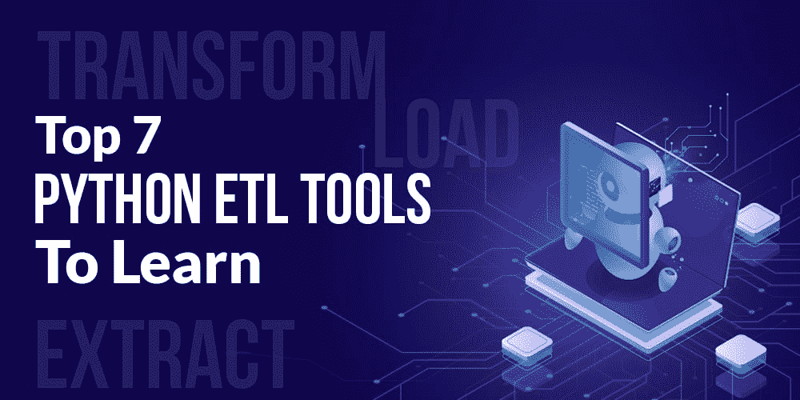

# 需要学习的 7 大 Python ETL 工具

> 原文:[https://www . geesforgeks . org/top-7-python-ETL-工具学习/](https://www.geeksforgeeks.org/top-7-python-etl-tools-to-learn/)

**ETL(提取、转换、加载)**是指从各种来源提取数据，通过数据聚合&数据标准化等技术将提取的数据转换为组织良好且可读的格式，最后将(可读的数据)加载到数据仓库等存储系统中，以获得业务见解，从而更好地进行决策。现在，个人之间有一个非常普遍的担忧，“**Python 对 ETL 有好处吗？**”。您需要知道，当 ETL 与[**【Python】**](https://www.geeksforgeeks.org/python-programming-language/)的编程能力相结合时，组织创建 ETL 管道变得灵活，不仅可以很好地管理客户和团队成员的数据，还可以根据业务需求以简化的方式移动和转换数据。

好奇想看看**最佳 python ETL 工具**的列表，这些工具可以通过处理大量实时可用的结构化或非结构化数据的复杂模式来很好地管理一组 ETL 流程？如果是，那么现在让我们看一下下面提到的列表，简要描述他们从多个来源提取、清理和加载数据的能力，以获得更好的运营弹性和面向性能的分析。

### 1.气泡

这个技术交互工具的 **ETL 框架**用 Python 编写，可以通过元数据流畅地执行数据管道。此外，使用这个基于 Python 的 ETL 工具，您可能会期望:

*   *数据清理*
*   *数据监控*
*   *数据审核*
*   *关于异构数据环境中使用的未知数据集的适当信息*

通过上面列出的所有特性， **ETL 开发人员**现在可以交付数据，而无需过多考虑如何访问数据以及如何处理由数据存储存储和管理的各种类型的数据。他/她现在还需要什么来更好地管理数据质量和能够加快数据处理过程的最佳解决方案？

### 2 .金属

mETL 或米托-ETL 是一个轻量级的、**基于 web 的 ETL 工具**，开发人员可以通过它创建定制的编码组件，开发人员(或组织的其他负责员工)可以运行、集成或下载这些组件，以满足他们所工作的组织的数据集成需求。根据 **mETL 文档**的目录，该工具适用于:

*   *关系数据库管理系统数据集成*
*   *基于应用编程接口/服务的数据集成*
*   *发布/订阅(基于队列)数据集成*
*   *平面文件数据集成*

更具体地说，开发人员和程序员现在可以使用米托-ETL 来加载任何类型的数据，然后通过快速转换和操作来转换它，而不需要一些专家或高级编程技能。

### 3.火花

Spark 是一个按需且有用的**基于 Python 的工具**，使用它，ETL 工程师、数据科学家可以非常容易地编写强大的 ETL 框架。虽然它在技术上不是 Python 工具，但是通过 PySpark API，人们可以很容易地:

*   *做各种数据处理。*
*   *使用 Spark 通过 **ETL 管道分析、转换现有数据为类似 JSON 的格式。***
*   *执行隐式数据并行。*
*   *继续运行具备 Spark 容错能力的 ETL 系统。*

因此，借助 Spark 捆绑的 Python 的简单性，数据工程师和数据科学家现在可以通过该工具分析执行的**提取、转换和加载**过程(或相关步骤)来驯服大数据，并且还可以在可变数据仓库环境中处理非结构化数据。

### 4\. 佩特尔

Petl 或 Python ETL 是一种通用工具，用于提取、转换和加载从 XML、CSV、Text 或 JSON 等来源导入的各种类型的数据表。毫无疑问，凭借其标准的 **ETL(提取转换加载)**功能，您可以灵活地应用转换(在数据表上)，如排序、连接或聚合。

尽管 Petl 不支持对复杂且较大的数据集(如分类数据)进行探索性分析(称之为以变量形式的信息集合，分为年龄组、性别、种族等类别)，但您应该考虑这个简单但轻量级的**工具，用于构建一个简单的 etl 管道**，随后从多个来源提取数据。您可以方便地开始使用 Petl 的文档，如果在安装过程中出现问题，请务必在 python-etl@googlegroups.com 的电子邮件地址上报告。

### 5.打破它

席惟伦，一个拥有 1K 多 GitHub 明星的开源**流处理引擎**，可以分析和处理大型非结构化数据流。此外，它的命令行界面支持:

*   *通过**同步和异步 API**并行执行数据流。*
*   *用于发布博客条目、音频、新闻标题的 RSS 源。*
*   *CSV/XML/JSON/HTML 文件。*

事实上，我们很多人都没有意识到这个**开源的基于 Python 的工具**是雅虎管道的替代品。这是因为就像雅虎管道一样，该工具支持异步&同步应用编程接口，如果与数据仓库系统集成，可以帮助许多企业创建商业智能应用程序，根据需求与客户的数据库进行交互。

### 6.路易吉

**气流 vs 路易吉！！**选择一个或两个都不会产生不良结果，因为两者都通过定义任务和相关的依赖关系来解决相似的问题。但有时，你需要构建复杂的 **ETL 管道**，这个由 Spotify 创建的复杂工具(Luigi)不会让你对测试的功能失望，比如:

*   *命令行集成*
*   *工作流管理*
*   *依赖关系解析*
*   *跟踪 ETL 作业和处理故障(如果发生)的网络仪表板*

想想你或你的技术伙伴如何开始使用 Luigi！！尝试从其源 PyPI 下载 luigi-3.0.3.tar.gz 文件，以安装其最新、稳定的版本。

### 7.气流

气流，一个基于 DAG(有向无环图)的开源平台，配备了工作流管理功能，通过该功能，您不仅可以调度，还可以创建和监控工作流来完成一系列任务。像其他基于 Python 的 ETL 工具一样，气流可以:

*   *创建数据 ETL 管道，可以有效地将数据提取、转换和加载到数据仓库中，如 Oracle、Amazon 红移。*
*   *可视化工作流并跟踪其多次执行。*
*   *监控、调度和组织 ETL 流程。*

尽管具备上述所有能力，但气流在依赖于动态管道生成的地方成功地完成了工作。因此， **ETL 开发人员**现在不必担心如何编写组织良好的 Python 代码来动态实例化管道。